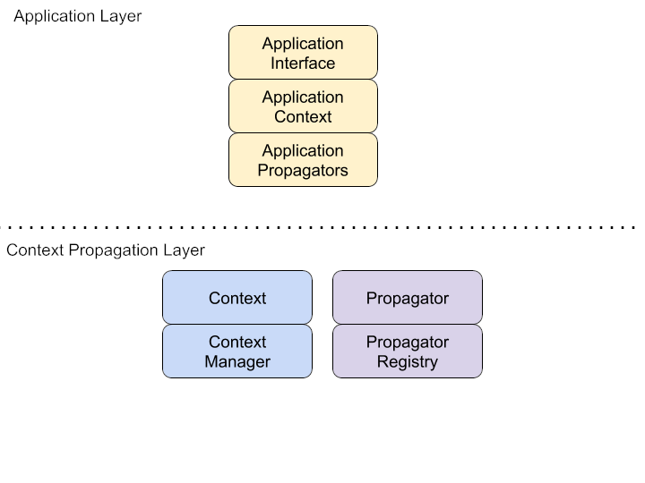
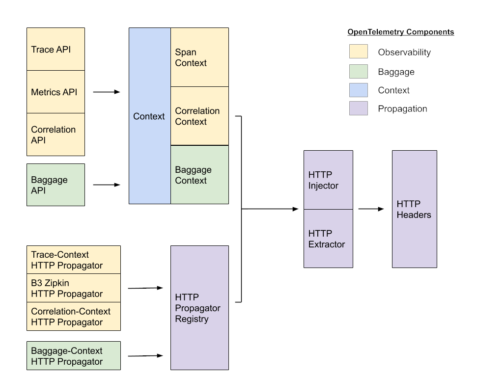

# Proposal: Separate Layer for Context Propagation 

Status: `proposed`

Design OpenTelemetry as a set of separate applications which operate on a shared context propagation mechanism.

## Motivation

Based on prior art, we know that fusing the observability system and the context propagation system together creates issues. Observability systems have special rules for propagating information, such as sampling, and may have different requirements from other systems which require non-local information to be sent downstream.  
* Separation of concerns
  *   Remove the Tracer dependency from context propagation mechanisms.
  *   Separate distributed context into Baggage and Correlations
* Extensibility
  *   Allow users to create new applications for context propagation.
  *   For example: A/B testing, encrypted or authenticated data, and new, experimental forms of observability.

## Explanation

# OpenTelemetry Layered Architecture

OpenTelemetry is a distributed program, which requires non-local, transaction-level context in order to execute correctly. Transaction-level context can also be used to build other distributed programs, such as security, versioning, and network switching programs.

To allow for this extensibility, OpenTelemetry is separated into **application layer** and a **context propagation layer**.  In this architecture, multiple distributed applications - such as the observability and baggage systems provided by OpenTelemetry - simultaneously share the same underlying context propagation system in order to execute their programs.

# Application Layer

## Observability API

OpenTelemetry currently contains two observability systems - Tracing and Metrics – and may be extended over time. These separate systems are bound into a unified Observability API through sharing labels – a mechanism for correlating independent observations – and through sharing propagators.

**Observe(context, labels…, observations...) -> context**  
The general form for all observability APIs is a function which takes a Context, label keys, and observations as input, and returns an updated Context.

**Correlate(context, label, value, hoplimit) -> context**  
To set the label values used by all observations in the current transaction, the Observability API provides a function which takes a context, a label key, a value, and a hoplimit, and returns an updated context. If the hoplimit is set to NO_PROPAGATION, the label will only be available to observability functions in the same process. If the hoplimit is set to UNLIMITED_PROPAGATION, it will be available to all downstream services.

**GetPropagator(type) -> (inject, extract)**  
To register with the propagation system, the Observability API provides a set of propagation functions for every propagation type. 

## Baggage API

In addition to observability, OpenTelemetry provides a simple mechanism for propagating arbitrary data, called Baggage. This allows new distributed applications to be implemented without having to create new propagators.

To manage the state of a distributed application, the Baggage API provides a set of functions which read, write, and remove data.

**SetBaggage(context, key, value) -> context**  
To record the distributed state of an application, the Baggage API provides a function which takes a context, a key, and a value as input, and returns an updated context which contains the new value.

**GetBaggage(context, key) -> value**  
To access the distributed state of an application, the Baggage API provides a function which takes a context and a key as input, and returns a value.

**RemoveBaggage(context, key) -> context**  
To delete distributed state from an application, the Baggage API provides a function which takes a context, a key, and a value as input, and returns an updated context which contains the new value.

**ClearBaggage(context) -> context**  
To avoid sending baggage to an untrusted downstream process, the Baggage API provides a function remove all baggage from a context, 

**GetPropagator(type) -> (inject, extract)**  
To register with the propagation system, the Baggage API provides a set of propagation functions for every propagation type.

## Additional APIs

Because the application and context propagation layers are separated, it is possible to create new distributed applications which do not depend on either the Observability or Baggage APIs.

**GetPropagator(type) -> (inject, extract)**  
To register with the propagation system, additional APIs provide a set of propagation functions for every propagation type.

# Context Propagation Layer

## Context API

Distributed applications access data in-process using a shared context object. Each distributed application sets a single key in the context, containing all of the data for that system.

**SetValue(context, key, value) -> context**  
To record the local state of an application, the Context API provides a function which takes a context, a key, and a value as input, and returns an updated context which contains the new value.

**GetValue(context, key) -> value**  
To access the local state of an application, the Context API provides a function which takes a context and a key as input, and returns a value.

### Optional: Automated Context Management
When possible, context should automatically be associated with program execution . Note that some languages do not provide any facility for setting and getting a current context. In these cases, the user is responsible for managing the current context. 

**SetCurrent(context)**  
To associate a context with program execution, the Context API provides a function which takes a Context.

**GetCurrent() -> context**  
To access the context associated with program execution, the Context API provides a function which takes no arguments and returns a Context.

## Propagation API

Distributed applications send data to downstream processes via propagators, functions which read and write application context into RPC requests. Each distributed application creates a set of propagators for every type of supported medium - currently HTTP and Binary.

**Inject(context, request)**  
To send the data for all distributed applications downstream to the next process, the Propagation API provides a function which takes a context and a request, and mutates the request to include the encoded context. The canonical representation of a request is as a map.

**Extract(context, request) -> context**  
To receive data injected by prior upstream processes, the Propagation API provides a function which takes a context and a request, and returns an updated context.

**RegisterPropagator(type, inject, extract)**  
In order for the application layer to function correctly, Propagation choices must be syncronized between all processes in the distributed system, and multiple applications must be able to inject and extract their context into the same request. To meet these requirements, the Propagation API provides a function which registers a set of propagators, which will all be executed in order when the future calls to inject and extract are made. A canonical propagator consists of an inject and an extract function.

OpenTelemetry currently contains two types of Propagators:

* **HTTP** - context is written into and read from a map of HTTP headers.
* **Binary** - context is serialized into and deserialized from a stream of bytes.

# Internal details

## Context details
OpenTelemetry currently implements three context types of context propagation.

**Span Context -** The serializable portion of a span, which is injected and extracted. The readable attributes are defined to match those found in the  W3C **traceparent** header. 

**Correlation Context -** Correlation Context contains a map of labels and values, to be shared between metrics and traces. This allows observability data to be indexed and dimensionalized in a variety of ways. Note that correlations can quickly add overhead when propagated in-band. But because this data is write-only, it may be possible to optimize how it is transmitted.

**Baggage Context -** Transaction-level application data, meant to be shared with downstream components. This data is readable, and must be propagated in-band. Because of this, Baggage should be used sparingly, to avoid ballooning the size of RPC requests.

Note that when possible, OpenTelemetry APIs calls are given access to the entire context object, and not a specific context type.

## Context Management and in-process propagation

In order for Context to function, it must always remain bound to the execution of code it represents. By default, this means that the programmer must pass a Context down the call stack as a function parameter.  However, many languages provide automated context management facilities, such as thread locals.  OpenTelemetry should leverage these facilities when available, in order to provide automatic context management.

## Pre-existing Context implementations

In some languages, a single, widely used Context implementation exists. In other languages, there many be too many  implementations, or none at all. For example, Go has a the context.Context object, and widespread conventions for how to pass it down the call stack.

In the cases where an extremely clear, pre-existing option is not available, OpenTelemetry should provide its own Context implementation.

## Default Propagators

When available, OpenTelemetry defaults to propagating via HTTP header definitions which have been standardized by the W3C.

# Trade-offs and mitigations

## Why separate Baggage from Correlations?

Since Baggage Context and Correlation Context appear very similar, why have two? 

First and foremost, the intended uses for Baggage and Correlations are completely different. Secondly, the propagation requirements diverge significantly.

Correlation values are solely to be used as labels for metrics and traces. By making Correlation data write-only, how and when it is transmitted remains undefined. This leaves the door open to optimizations, such as propagating some data out-of-band, and situations where sampling decisions may cease the need to propagate correlation context any further.

Baggage values, on the other hand, are explicitly added in order to be accessed by downstream by other application code. Therefore, Baggage Context must be readable, and reliably propagated in-band in order to accomplish this goal.

There may be cases where a key-value pair is propagated as TagMap for observability and as a Baggage for application specific use. AB testing is one example of such use case. There is potential duplication here at call site where a pair is created and also at propagation. 

Solving this issue is not worth having semantic confusion with dual purpose. However, because all observability functions take the complete context as input, it may still be possible to use baggage values as labels.

## What about complex propagation behavior?

Some OpenTelemetry proposals have called for more complex propagation behavior. For example, falling back to extracting B3 headers if W3C Trace-Context headers are not found. Chained propagators and other complex behavior can be modeled as implementation details behind the Propagator interface. Therefore, the propagation system itself does not need to provide chained propagators or other additional facilities.

## Did you add a context parameter to every API call because Go has infected your brain?

No. The concept of an explicit context is fundamental to a model where independent distributed applications share the same context propagation layer. How this context appears or is expressed is language specific, but it must be present in some form.

# Prior art and alternatives

Prior art:  
* OpenTelemetry distributed context
* OpenCensus propagators
* OpenTracing spans
* gRPC context

# Open questions

Related work on HTTP propagators has not been completed yet.

* [W3C Trace-Context](https://www.w3.org/TR/trace-context/) candidate is not yet accepted
* Work on [W3C Correlation-Context](https://w3c.github.io/correlation-context/) has begun, but was halted to focus on Trace-Context. 
* No work has begun on a theoretical W3C Baggage-Context.

Given that we must ship with working propagators, and the W3C specifications are not yet complete, how should we move forwards with implementing context propagation?

# Future possibilities

Cleanly splitting OpenTelemetry into an Application and  Context Propagation layer may allow us to move the Context Propagation layer into its own, stand-alone project. This may facilitate adoption, by allowing us to share Context Propagation with gRPC and other projects.
