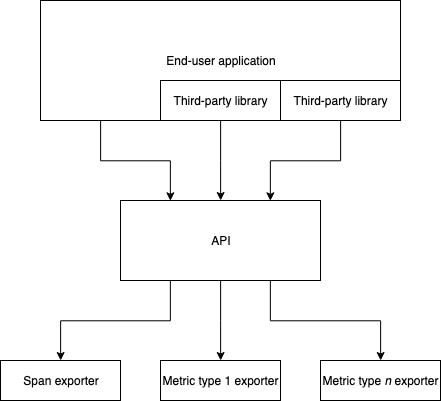

# Support single implementation

Support only a single implementation, rather than an interface implemented separately by the SDK, the "minimal implementation", vendors, etc.

## Motivation

The [current OpenTelemetry architecture](https://github.com/open-telemetry/opentelemetry-specification/blob/893a1dc621798cfc301f05bfb46cc0786332050a/specification/library-guidelines.md#language-library-generic-design) requires a split between the "API" - essentially the interface with which code may be instrumented - and its actual implementations, including both the two that are canonical (the ["minimal implementation"](https://github.com/open-telemetry/opentelemetry-specification/blob/893a1dc621798cfc301f05bfb46cc0786332050a/specification/library-guidelines.md#language-library-generic-design) and the ["SDK implementation"](https://github.com/open-telemetry/opentelemetry-specification/blob/893a1dc621798cfc301f05bfb46cc0786332050a/specification/library-guidelines.md#language-library-generic-design)) as well as any [alternate implementations](https://github.com/open-telemetry/opentelemetry-specification/blob/893a1dc621798cfc301f05bfb46cc0786332050a/specification/library-guidelines.md#language-library-generic-design) that might be provided by another party.

This separation between the API and its implementations solves the critical problem of ensuring that OpenTelemetry is sufficiently flexible to fulfill the specific needs of vendors and other third parties. However, the solution comes at a significant cost: it seems to be both confusing to users as well as cumbersome for anyone implementing or otherwise working on OpenTelemetry [1](#footnote-1), in addition to whatever technical downsides (such as duplication of code across implementations) there may be.

The goal of this RFC is to consolidate the architecture such that there is only a single implementation, while still providing sufficient flexibility.

## Explanation

This RFC proposes that OpenTelemetry adopt the following architecture:

This RFC is a substantial departure from the [current architecture](https://github.com/open-telemetry/opentelemetry-specification/blob/893a1dc621798cfc301f05bfb46cc0786332050a/specification/language-library-design.png). In particular, it proposes that:

* The API will become "the" implementation, rather than providing some sort of interface (or the language-specific equivalent, as appropriate) that is then implemented through the minimal implementation, the SDK, third-party implementations, etc.
* The API **does not hold onto any state** beyond whatever is minimally necessary, e.g., the current span
* All data is sent **directly to exporters**, rather than channeled through an implementation and then, in the case of the SDK, to an exporter
* OpenTelemetry should not select a default exporter, so as to limit resource overhead and prevent surprises to application developers using instrumented libraries. (Exceptions may be made for no-op exporters, if and when they simplify internal implementation.)

In other words, the API should be as minimal as possible to ensure that the right data (as defined by an arbitrary OpenTelemetry user/backend combo) may be shuttled out from an application.

Most logic, then, moves into the exporters. As proposed here, **exporters** should be specific to a particular data type, e.g., `SpanExporter` or `MeasureExporter`. (This RFC is unopinionated about what exporter types should be supported so long as a) users are able to choose differently for trace and metric data and b) the addition of another type or subtype, such as a new metric, does not break existing exporters.)

Logic that is considered "core" but exceeds the requirements of a "minimal" implementation - e.g. batching and other functionality that is, or is proposed as, part of the SDK instead of the API - should be provided through **transformers**. These transformers may then be used (internally or otherwise) by exporters. As with exporter types, this RFC is unopinionated about what standard transformers OpenTelemetry should provide.

## Internal details

### Proposed API

This RFC proposes that the API should be both **concrete** and (nearly) **stateless**. What does this actually entail?

* The API's `Span` implementation must provide some minimal set of properties:
  * Span context: trace ID, span ID, and parent span ID
  * Start and finish time
  * User-provided data, such as tags/attributes, logs/events, etc.
    * This RFC is unopinionated about what data should be supported
  * Any vendor-specific data
    * This should be differentiated somehow (e.g., under a different field) from user-provided data so that it is not accidentally broken
  * Sampling decisions
    * This could possibly be part of the above vendor-specific data
* IDs should be generated by the API unless overridden
  * Users must be able to provide a trace and/or span ID at construction time, e.g., for compatibility with existing instrumentation
* The API should not explicitly track any non-current state, such as finish spans or batched metrics
  * Data should be sent to the exporters as soon as doing so is viable

### Data type-specific exporters

The allowance of data type-specific exporters is particular significant in order to:

* Facilitate forwards compatibility: as new data types (or subtypes) get added, existing exporters will still be supported
* Allow users to use different exporters for different purposes, e.g., Jaeger for trace data and Prometheus for metric data

Each "data type" - e.g., trace data or metric data - should have a corresponding exporter type. If an exporter type supports subtypes, such as multiple metrics types, the list of subtypes should somehow be indicated as non-exhaustive so that new subtypes don't break old exporters.

Particular exporter *implementations* may support multiple data types, but are not required to; multi-purpose exporters must still be registered with OpenTelemetry as though they were single-purpose.

### Out of the box behaviour

As mentioned above, OpenTelemetry should discard data for which the user has not explicitly provided an exporter.

This may be implemented through some sort of default no-op exporter, null check, "optional" exporter that defaults to "none", or whatever else is idiomatic to the particular language.

This enables the default behaviour to:

* Not error due to the lack of a user-provided exporter
* Be lightweight, i.e., have minimal memory or CPU overhead

### Supporting third-party needs

Most third-party requirements should be addressable through either exporters or by extending the core API, depending on the particular requirement.

For example, adding an extra ID to every span could be done by the exporter, whereas allowing the user to add attributes to spans must be done through the API itself.

Exporters could possibly be extended to some sort of callback for relevant events (particularly span creation).

### Migrating from the current architecture

To the extent that the current architecture has already been implemented, a migration path may look something like:

1. Start with the "minimal implementation"
1. Send data to the particular event's exporter
1. Make the "SDK" conform to the new exporter implementation
1. Break out "transformer" logic from the SDK

## Trade-offs and mitigations

### Providing enough flexibility for vendors

The biggest risk with this RFC is probably the question of whether it supports the needed flexibility.

For potential future third-party needs that cannot be addressed with an exporter (or even a hook-supplemented exporter), the solution is likely to **add the functionality into the API** - particularly where multiple parties have the same or a similar need.

See, for example, the [request for "transaction" support in OpenCensus](https://github.com/census-instrumentation/opencensus-specs/issues/229). A feature like this would be a strong candidate for getting added directly into the OpenTelemetry core.

### Migration costs

Given that OpenTelemetry is still very young and not yet production-ready, migration costs should be relatively small for both end users and implementors - particularly to the extent that the ambiguity between the API and SDK has slowed down implementation.

## Prior art and alternatives

### Prior art

The three main prior art examples are OpenTracing, OpenCensus, and the existing OpenTelemetry architecture.

**OpenTracing** handles export functionality by having each vendor (or other party) reimplement the whole API. While this maximizes the flexibility for vendors, it also means that everyone must redo a lot of the same logic - including any logic that may be considered vendor-agnostic.

**OpenCensus** handles it by having a single implementation which then sends data to tracing and stats exporters. _(**Note:** While architecturally this is very similar to the RFC's proposal, key differences include OpenCensus itself being quite opinionated and sometimes stateful, depending on the implementation.)_

The **existing OpenTelemetry architecture** essentially combines the OpenTracing and OpenCensus approaches. As with OpenTracing, the core API provides an interface that can then have multiple implementations. The equivalent to the OpenCensus "opinionated implementation" is then provided as a *particular* implementation (the SDK), which in turn supports exporters.

### Alternatives

What are some prior and/or alternative approaches? For instance, is there a corresponding feature in OpenTracing or OpenCensus? What are some ideas that you have rejected?

## Open questions

What are some questions that you know aren't resolved yet by the RFC? These may be questions that could be answered through further discussion, implementation experiments, or anything else that the future may bring.

## Future possibilities

What are some future changes that this proposal would enable?

## Footnotes

* <a name="footnote-1">(1)</a> See issues such as [opentelemetry-specification#185](https://github.com/open-telemetry/opentelemetry-specification/issues/185), [opentelemetry-specification#183](https://github.com/open-telemetry/opentelemetry-specification/issues/183), [opentelemetry-go#23](https://github.com/open-telemetry/opentelemetry-go/issues/23), and [opentelemetry-specification#19](https://github.com/open-telemetry/opentelemetry-go/issues/19).
