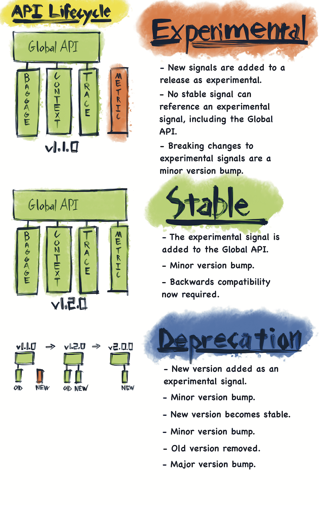

# OpenTelemetry versioning and stability

OpenTelemetry is a large project with strict compatibility requirements. This proposal defines the stability gurantees offered by OpenTelemetry, along with a versioning and lifecycle proposal which defines how we meet those requirements.

Language implementations are expected to follow this proposal exactly, unless a langague or package manager convention interferes significantly. Implementations must take this cross-language proposal, and produce a language-specific proposal which details how these requirements will be met.

## Design goals

**Provide end users with coherent, tested releases.**  
We do not want users to run untested combinations of core packages. Users must be able to say “I am using OpenTelemetry v1.2.0 for Python” and have a shared understanding as to what that means.

**Ensure that end users stay up to date with the latest release.**  
We want all users to  stay up to date with the latest version of OpenTelemetry. We do not want to create hard breaks in support, of any kind, which leave users stranded on older versions. It must always be possible to upgrade to the latest minor version of OpenTelemetry, without creating compilation or runtime errors.

**Never create a dependency conflict between packages which rely on different versions of OpenTelemetry. Avoid breaking all stable public APIs.**  
Backwards compatibility is a strict requirement. Instrumentation APIs cannot create a version conflict, ever. Otherwise, OpenTelemetry cannot be embedded in widely shared libraries, such as web frameworks. Theoretically, APIs can be deprecated and eventually removed, but this is a process measured in years.

**Allow for multiple levels of package stability within the same release.**  
Provide maintainers a clear process for developing new, experimental APIs alongside stable APIs. DIfferent packages within the same release will have different levels of stability.

## Relevant architecure

OpenTelemetry is split into signals. Each signal provides a specialized form of observability.

Each signal consists of four types of packages:

**API -** Public interfaces depended upon by 3rd-party libraries and application code instrumented with  OpenTelemetry. Every signal has its own, independent API package. These individual APIs are then bundled up into a Global API for convenience.

**SDK -** The implemention the API. The SDK is only referenced during setup and teardown of an application. SDKs include additional interfaces, such as plugin and lifecycle interfaces, which are not considered part of the API package as they are not imported by shared libraries and application code.

**Semantic Conventions -** A schema defining the attributes which describe common concepts and operations which the signal observes. Note that unlike the API or SDK, stable conventions for all signals may be placed in the same package, as they are often useful across different signals.

**Contrib –** plugins and instrumentation that make use of the API or SDK interfaces, but are not part of the core packages necessary for running OTel. The term contrib specifically refers to the plugins and instrumentation maintained by the OpenTelemetry SIG; it does not refer to third party plugins hosted elsewhere.

## Signal lifecycle

OpenTelemetry is structured around signals. Each signal represents a coherent, stand-alone set of functionality. Each signal follows a lifecycle.

### Lifecycle stages

**Experimental –** Bugs, breaking changes and performance issues may occur.

**Stable –**  Stability guarantees apply, based on component tpye (API, SDK, Conventions, and Contrib). Long term dependencies may now be taken against these packages.

**Deprecated –** this signal has been replaced but is still supported under LTS.

**Removed -** a deprecated signal is no longer supported, and is removed.

All signal components may become stable together, or one by one in the following order: API, SDK, Semantic Conventions, Contrib.

### Stability

Once a signal component is marked as stable, the following rules apply until the end of that signal’s existence.

**API Stability -**
No backward-incompatible changes to the API are allowed unless the major version number is incremented. All existing API calls must continue to compile and function against all future minor versions of the same major version. ABI compatibility is offered in languages which require it.

**SDK Stability -**
Public portions of the SDK (constructors, configuration, end-user interfaces) must remain backwards compatible. Internal interfaces are allowed to break; ABI compatibility is not required.

**Semantic Conventions Stability -**
Semantic Conventions may not be removed once they are stable. New conventions may be added to replace usage of older conventions, but the older conventions are never removed, they will only be marked as deprecated in favor of the newer ones.

**Contrib Stability -**
Plugins and instrumentation are kept up to date, and are released simultaneously (or shortly after) the latest release of the API. The goal is to ensure users can update to the latest version of opentelemetry, and not be held back by the plugins that they depend on.

Public portions of contrib packages (constructors, configuration, interfaces) must remain backwards compatible. ABI compatibility not required.

Telemetry produced by contrib instrumentation must also remain stable and backwards compatible, to avoid breaking alerts and dashboard.

### Deprecation

In theory, signals could be replaced. When this happens, they are marked as deprecated.

Code is only marked as deprecated when the replacement becomes stable. Deprecated code still abides by the same support guarantees as stable code. Deprecated APIs remain stable and backwards compatible.

### Removal

Packages are end-of-life’d by being removed, along with a major version bump.

We currently have no plans for deprecating signals or creating a major version past v1.0.

## Version Numbers

OpenTelemetry follows [semver 2.0](https://semver.org/) conventions, with the following distinction.

For the purposes of versioning, all code within a release is treated as if it were part of a single package. All packages within a release receive the same version number. By keeping version numbers in lockstep, end users can understand which packages belong to which release.

Note that contrib packages are released separately from core packages. Contrib releases are not required to match version numbers with the core releases.

In some languages, package managers react poorly to experimental packages having a version higher than 0.X. In these cases, a language-specific workaround is required.

Note: different languages implementations do not need to have matching version numbers, nor do implementations have to match the version of the specification they implement. For example, it is fine to have Python at 1.2.8, Java at 1.3.2, and the spec at 1.1.1. Within python, all packages in the 1.2.8 release have the version number 1.2.8, even if they are experimental.

**Major version bump**  
Major version bumps only occur when there is a breaking change to a stable interface, or the removal of deprecated signals.

OpenTelemetry values long term support. The expectation is that we will version to v1.0 once the first set of packages are declared stable. OpenTelemetry will then remain at v1.0 for years. THere are no plans for a v2.0 of OpenTelemetry at this time. Additional stable packages, such as metrics and logs, will be added as minor version bumps.

**Minor version bump**  
Most changes to OpenTelemetry result in a minor version bump.

* New backward-compatible functionality added to any component.
* Breaking changes to internal SDK components.
* Breaking changes to experimental signals.
* New experimental packages are added.
* Experimental packages become stable.

**Patch version bump**  
Patch versions make no changes which would require recompilation or potentially break application code. The following are examples of patch fixes. 

* Bugs
* Security fixes
* Documentation

Currently, OpenTelemetry does have plans to backport bug and security fixes to prior minor versions. Security and bug fixes are only applied to the latest minor version. We are committed to making it feasible for end users to stay up to date with the latest version of OpenTelemetry.

## Open questions

### “OpenTelemetry GA” aka v1.0

In theory, we have assumed that tracing and metrics would be released together as a v1.0, which we refer to as “OpenTelemetry GA.”

However, in practice, it appears that tracing will be ready to GA before metrics. Tracing is ready today in .NET, and metrics are still months away from being finished.

While we can continue to use the term OpenTelemetry GA to mean the release of both tracing and metrics, we should decouple this from our versioning and support terminology.  That allows us to announce stable tracing this month.
