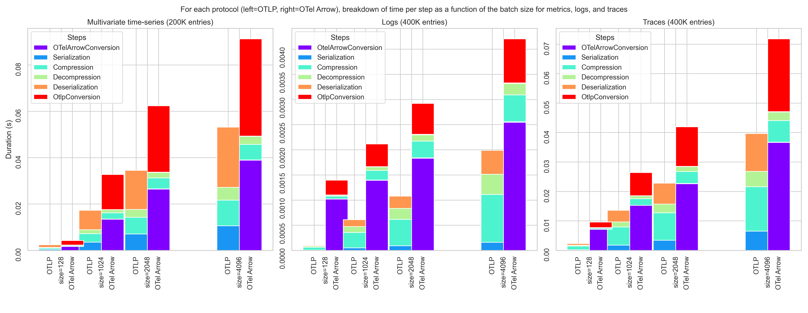
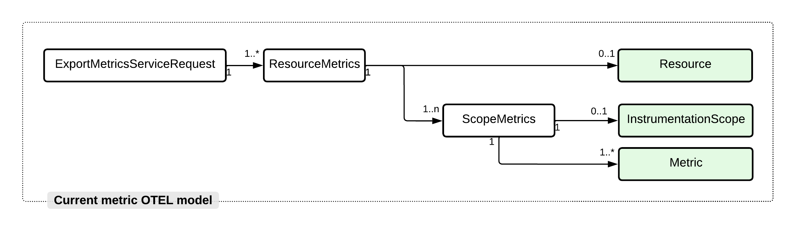

# OTLP Arrow Protocol Specification

**Author**: Laurent Querel, F5 Inc.

**Keywords**: OTLP, Arrow Columnar Format, Bandwidth Reduction, Multivariate Time-series, Logs, Traces.

**Abstract**: This OTEP extends, in a compatible way,
the [OpenTelemetry protocol (OTEP 0035)](https://github.com/open-telemetry/oteps/blob/main/text/0035-opentelemetry-protocol.md)
with a **generic columnar representation for metrics, logs and traces**. This extension significantly improves the
efficiency of the protocol for scenarios involving the transmission of large batches of metrics, logs, traces, and also
provides a better representation for [multivariate time-series](#multivariate-time-series).

**Reference implementation**: The [OTEL Arrow Adapter](https://github.com/f5/otel-arrow-adapter) Go library specifies
the protobuf spec, and implements the OTLP Arrow Encoder/Decoder (main contributor [Laurent Querel](https://github.com/lquerel)).
An [experimental OTEL Collector](https://github.com/open-telemetry/experimental-arrow-collector) has been implemented to
expose the new gRPC endpoint and to provide OTLP Arrow support via the previous library (main contributor [Joshua MacDonald](https://github.com/jmacd)).

## Table of contents

* [Introduction](#introduction)
  * [Motivation](#motivation)
  * [Validation](#validation)
  * [Why Apache Arrow and How to Use It?](#why-apache-arrow-and-how-to-use-it)
  * [Integration Strategy and Phasing](#integration-strategy-and-phasing)
* [Protocol Details](#protocol-details)
  * [ArrowStreamService](#arrowstreamservice)
  * [Mapping OTEL Entities to Arrow Records](#mapping-otel-entities-to-arrow-records)
    * [Attribute Representation](#attribute-representation)
    * [Metrics Payload](#metrics-payload)
    * [Logs Payload](#logs-payload)
    * [Spans Payload](#spans-payload)
* [Implementation Recommendations](#implementation-recommendations)
  * [Protocol Extension and Fallback Mechanism](#protocol-extension-and-fallback-mechanism)
  * [Batch ID Generation](#batch-id-generation)
  * [Substream ID Generation](#substream-id-generation)
  * [Schema ID Generation](#schema-id-generation)
  * [Traffic Balancing Optimization](#traffic-balancing-optimization)
  * [Throttling](#throttling)
  * [Best Effort Delivery Guarantee](#best-effort-delivery-guarantee)
* [Risks and Mitigation](#risks-and-mitigations)
* [Trade-offs and Mitigations](#trade-offs-and-mitigations)
  * [Duplicate Data](#duplicate-data)
  * [Incompatible Backends](#incompatible-backends)
  * [Small Devices/Small Telemetry Data Stream](#small-devicessmall-telemetry-data-stream)
* [Future Versions and Interoperability](#future-versions-and-interoperability)
* [Prior Art and Alternatives](#prior-art-and-alternatives)
* [Open Questions](#open-questions)
* [Appendix A - Protocol Buffer Definitions](#appendix-a---protocol-buffer-definitions)
* [Appendix B - Performance Benchmarks](#appendix-b---performance-benchmarks)
* [Appendix C - Parameter Tuning and Design Optimization](#appendix-c---parameter-tuning-and-design-optimization)
* [Glossary](#glossary)
* [Acknowledgements](#acknowledgements)

## Introduction

### Motivation

As telemetry data becomes more widely available and volumes increase, new uses and needs are emerging for the OTLP
ecosystem: cost-effectiveness, advanced data processing, data minimization. This OTEP aims to extend the OTLP
protocol to better address them while maintaining the compatibility with the existing ecosystem.

Currently, the OTLP protocol uses a "row-oriented" format to represent all the OTEL entities. This representation works
well for small batches (<50 entries) but, as the analytical database industry has shown, a "column-oriented"
representation is more optimal for the transfer and processing of *large batches* of entities. The term "row-oriented"
is used when data is organized into a series of records, keeping all data associated with a record next to each other in
memory. A "column-oriented" system organizes data by fields, grouping all the data associated with a field next to each
other in memory. The main benefits of a columnar approach are:

* **better data compression rate** (arrays of similar data generally compress better),
* **faster data processing** (see diagram below),
* **faster serialization and deserialization** (few arrays vs many in-memory objects to serialize/deserialize),
* **better IO efficiency** (less data to transmit).


This OTEP proposes to extend the [OpenTelemetry protocol (OTEP 0035)](https://github.com/open-telemetry/oteps/blob/main/text/0035-opentelemetry-protocol.md)
with a **generic columnar representation for metrics, logs and traces based on Apache Arrow**. Compared to the existing
OpenTelemetry protocol this compatible extension has the following improvements:

* **Reduce the bandwidth requirements** of the protocol. The two main levers are: 1) a better representation of the
  telemetry data based on a columnar representation, 2) a stream-oriented gRPC endpoint that is more efficient to
  transmit batches of OTLP entities.
* **Provide a more optimal representation for multivariate time-series data**.
  With the current version of the OpenTelemetry protocol, users have to transform multivariate time-series (i.e multiple
  related metrics sharing the same attributes and timestamp) into a collection of univariate time-series resulting in a
  large amount of duplication and additional overhead covering the entire chain from exporters to backends.
* **Provide more advanced and efficient telemetry data processing capabilities**. Increasing data volume, cost
  efficiency, and data minimization require additional data processing capabilities such as data projection,
  aggregation, and filtering.

These improvements not only address the aforementioned needs but also answer the [open questions](https://github.com/open-telemetry/oteps/blob/main/text/0035-opentelemetry-protocol.md#open-questions)
cited in OTEP 035 (i.e. cpu usage, memory pressure, compression optimization).

**It is important to understand that this proposal is complementary to the existing protocol. The row-oriented version
is still suitable for some scenarios. Telemetry sources that generate a small amount of telemetry data should continue
to use it. On the other side of the spectrum, sources and collectors generating or aggregating a large amount of
telemetry data will benefit from adopting this extension to optimize the resources involved in the transfer and
processing of this data. This adoption can be done incrementally.**

Before detailing the specifications of the OTLP Arrow protocol, the following two sections present: 1) a validation of
the value of a columnar approach based on a set of benchmarks, 2) a discussion of the value of using Apache Arrow as a
basis for columnar support in OTLP.

### Validation

A series of tests were conducted to compare compression ratios between OTLP and a columnar version of OTLP called OTLP
Arrow. The two key results are:

* For multivariate time series, OTLP Arrow is **4 times better in terms of bandwidth reduction while improving by
  3 the speed** of creation + serialization + compression + decompression + deserialization.
* For logs and traces, OTLP Arrow is **2 times better in terms of bandwidth reduction** while having only a very slight
  speed drop for the creation + serialization + compression + decompression + deserialization steps.


Bandwidth gains between *OTLP* and *OTLP Arrow* in a multivariate time series context are represented in the left column.
Similarly, logs are represented in the right column. For both protocols, the baseline is the size of the uncompressed
OTLP messages. The reduction factor is the ratio between this baseline and the compressed message size for each
protocol.

The following two stacked bar graphs compare side-by-side the distribution of time spent for each step and for each
version of the protocol. The 3x speed-up for the multivariate metrics is visible in the left column. The two protocols
are on par for logs, as shown in the right column.


[Zoom on the chart](https://github.com/F5Networks/otlp-arrow-collector/raw/main/docs/img/summary_time_spent.png)

A more detailed presentation of the benchmarks comparing *OTLP* and *OTLP Arrow* can be found in the following
sections:

* [Performance benchmark](#appendix-b---performance-benchmarks)
* [Parameter tuning and design optimization](#appendix-c---parameter-tuning-and-design-optimization)

> In conclusion, these benchmarks demonstrate the interest of integrating a column-oriented telemetry data protocol to
> optimize bandwidth and processing speed in a batch processing context.

### Why Apache Arrow and How to Use It?

[Apache Arrow](https://arrow.apache.org/) is a versatile columnar format for flat and hierarchical data, well
established in the industry. Arrow is optimized for:

* column-oriented data exchange based on an in-memory format common among implementations, regardless of the language.
The use of a serialization and deserialization mechanism is thus eliminated, allowing the Zero-copy.
* in-memory analytic operations using modern hardware optimizations (e.g. SIMD)
* integration with a large ecosystem (e.g. data pipelines, databases, stream processing, etc.)
* language-independent

All these properties make Arrow a great choice for a general-purpose telemetry protocol. Efficient implementations of
Apache Arrow exist for most of the languages (Java, Go, C++, Rust, ...). Connectors with Apache Arrow buffer exist for
well-known file format (e.g. Parquet) and for well-known backend (e.g. BigQuery).
By reusing this existing infrastructure (see [Arrow ecosystem](https://arrow.apache.org/powered_by/)), we are accelerating the development and
integration of the OpenTelemetry protocol while expanding its scope of application.

Adapting the OTLP data format to the Arrow world (see below) is only part of the problem this proposal aims to describe.
Many other design choices and trade-offs have been made, such as:

- the organization of the data (i.e. schema) and the selection of the compression algorithm to optimize the compression ratio.
- the way to serialize the Arrow data, the metadata, the dictionaries, and the selection of the transfer mode (reply/reply vs. bi-dir stream).
- optimization of many parameters introduced in the system.


For a more detailed presentation of the approach used, please refer to this section ["Parameter tuning and design optimization"](#appendix-c---parameter-tuning-and-design-optimization).

### Integration Strategy and Phasing

This OTEP enhances the existing OTEL eco-system with an additional representation of telemetry data in columnar form to
better support certain scenarios (e.g. cost-effectiveness to transmit large batch, multivariate time-series, advanced
data processing, data minimization). All existing components will continue to be compatible and operational.

A two-phase integration is proposed to allow incremental benefits.

#### Phase 1

This proposal is designed as a protocol extension compatible with the existing OTLP protocol. As illustrated in the
following diagram, a new OTLP-Arrow to OTLP receiver will be responsible for translating the protocol extension to the
existing protocol. Similarly, a new exporter will be responsible for translating the OTLP messages into this new Arrow-based
format.


This first step is intended to address the specific use cases of **traffic reduction** and native support of
**multivariate time-series**. Based on community feedback, many companies want to reduce the cost of transferring
telemetry data over the Internet. By adding a collector that acts as a point of integration and traffic conversion at
the edge of a client environment, we can take advantage of the columnar format to eliminate redundant data and optimize
the compression ratio. This is illustrated in the following diagram.


> Note 1: A fallback mechanism can be used to handle the case where the new protocol is not supported by the target.
> More on this mechanism in this [section](#protocol-extension-and-fallback-mechanism).

#### Phase 2

Phase 2 aims to extend the support of Apache Arrow end-to-end and more specifically inside the collector to better
support the following scenarios: cost efficiency, advanced data processing, data minimization. New receivers, processors,
and exporters supporting Apache Arrow natively will be developed. A bidirectional adaptation layer OTLP / OTLP Arrow
will be developed within the collector to continue supporting the existing ecosystem. The following diagram is an
overview of a collector supporting both OTLP and an end-to-end OTLP Arrow pipeline.


Implementing an end-to-end column-oriented pipeline will provide many benefits such as:

- **Accelerate stream processing**,
- **Reduce CPU and Memory usage**,
- **Improve compression ratio end-to-end**,
- **Access to the Apache Arrow ecosystem** (query engine, parquet support, ...).

## Protocol Details

The protocol specifications are composed of two parts. The first section describes the new gRPC service supporting
column-oriented telemetry data. The second section presents the mapping between the OTLP entities and their Apache
Arrow counterpart.

### ArrowStreamService

OTLP Arrow defines the columnar encoding of telemetry data and the gRPC-based protocol used to exchange data between
the client and the server. OTLP Arrow is a bi-directional stream oriented protocol leveraging Apache Arrow for the
encoding of the telemetry data.

OTLP and OTLP Arrow protocols can be used together and can use the same TCP port. To do so, in addition to the 3
existing
services (`MetricsService`, `LogsService` and `TraceService`), we introduce the service `ArrowStreamService`
(see [this protobuf specification](#appendix-a---protocol-buffer-definitions) for more details) exposing a single API endpoint named `ArrowStream`.
This endpoint is based on a bidirectional streaming protocol. The ingress side is a `BatchArrowRecords` stream encoding a
batch of Apache Arrow buffers (more specifically [Arrow IPC format](#arrow-ipc-format)). The egress
side is a `BatchStatus` stream reporting asynchronously the status of each `BatchArrowRecords` previously sent.

After establishing the underlying transport the client starts sending telemetry data using the `ArrowStream` request.
The
client continuously sends `BatchArrowRecords`'s messages over the opened stream to the server and expects to receive
continuously
`BatchStatus`'s messages from the server as illustrated by the following sequence diagram:


> Multiple streams can be simultaneously opened between a client and a server to increase the maximum achievable
throughput.

If the client is shutting down (e.g. when the containing process wants to exit) the client will optionally wait until
all pending acknowledgements are received or until an implementation specific timeout expires. This ensures reliable
delivery of telemetry data. The client implementation should expose an option to turn on and off the waiting during shutdown.
This behavior is described in more details in the section [Best effort delivery guarantee](#best-effort-delivery-guarantee).

The protobuf definition of this service is:

```protobuf
service ArrowStreamService {
  // The ArrowStream endpoint is a bi-directional stream used to send batch of `BatchArrowRecords` from the exporter
  // to the collector. The collector returns `BatchStatus` messages to acknowledge the `BatchArrowRecords` messages received.
  rpc ArrowStream(stream BatchArrowRecords) returns (stream BatchStatus) {}
}
```

> **Unary RPC vs Stream RPC**: We use a stream-oriented protocol **to get rid of the overhead of specifying the schema
> and dictionaries for each batch.** A state will be maintained receiver side to keep track of the schemas and
> dictionaries. The [Arrow IPC format](#arrow-ipc-format) has been designed to follow this pattern and also allows the
> dictionaries to be sent incrementally. Similarly, ZSTD dictionaries can also be transferred to the RPC stream to
> optimize the transfer of small batches (for more details see the description of the compression field in the
> following paragraphs). To mitigate the usual pitfalls of a stream-oriented protocol please see this [paragraph](#traffic-balancing-optimization) in the
> implementation recommendations section.

A `BatchArrowRecords` message is composed of 3 attributes. The protobuf definition is:

```protobuf
message BatchArrowRecords {
  // [mandatory] Batch ID. Must be unique in the context of the stream.
  string batch_id = 1;

  // [mandatory] A collection of payloads containing the data of the batch.
  repeated OtlpArrowPayload otlp_arrow_payloads = 2;
}
```

The `batch_id` attribute is a unique identifier for the batch inside the scope of the current stream. It is used to
uniquely
identify the batch in the egress `BatchStatus` stream. See the [Batch Id generation](#batch-id-generation) section for
more information on the implementation of this identifier.

The `otlp_arrow_payloads` attribute is a list of `OtlpArrowPayload` messages. Each `OtlpArrowPayload` message represents
a table of data encoded in a columnar format (e.g. metrics, logs, traces, and future OTLP entities). Several correlated
IPC Arrow messages of different nature and with different schemas can be sent in the same OTLP batch identified by
`batch_id` and thus be processed as one unit without complex logic in the collector or any other processing systems.
More details on the `OtlpArrowPayload` columns in the section [Mapping OTEL entities to Arrow records](#mapping-otel-entities-to-arrow-records).

More specifically, an `OtlpArrowPayload` protobuf message is defined as:

```protobuf
message OtlpArrowPayload {
  // [mandatory] A unique id assigned to a sub-stream of the batch sharing the same schema, and dictionaries.
  string sub_stream_id = 1;

  // [mandatory] Type of the OTLP Arrow payload.
  OtlpArrowPayloadType type = 2;

  // [mandatory] Serialized Arrow Record Batch
  // For a description of the Arrow IPC format see: https://arrow.apache.org/docs/format/Columnar.html#serialization-and-interprocess-communication-ipc
  bytes record = 4;

  // [mandatory]
  CompressionMethod compression = 5;
}

enum OtlpArrowPayloadType {
  METRICS = 0;
  LOGS = 1;
  SPANS = 2;
}

message EncodedData {
  bytes ipc_message = 1;
  bytes arrow_data = 2;
}

enum CompressionMethod {
  NO_COMPRESSION = 0;
  ZSTD = 1;
}
```

The `sub_stream_id` attribute is a unique identifier for a sub-stream of `BatchArrowRecords` sharing the same schema inside
the
scope of the current stream. This id will be used receiver side to keep track of the schema and dictionaries for a
specific
type of Arrow Records. See the [Substream Id generation](#substream-id-generation) section for more information on the
implementation
of this identifier.

The `OtlpArrowPayloadType` enum specifies the `type` of the payload.

The `record` attribute is a binary representation of the Arrow RecordBatch.

The `compression` attribute is a mandatory attribute that is used to define the compression algorithms for the different
bytes buffer.

ZSTD offers a training mode, which can be used to tune the algorithm for a selected type of data. The result of this
training is a dictionary that can be used to compress the data. Using this [dictionary](http://facebook.github.io/zstd/#small-data)
can dramatically improve the compression rate for small batches. This future development will build on both the gRPC
stream approach used in this proposal and the ability to send a ZSTD dictionary over the OTLP Arrow stateful protocol,
allowing us to train the ZSTD algorithm on the first batches and then update the configuration of the ZSTD
encoder/decoder with an optimized dictionary.

This type of optimization, combined with the fact that we can use schema awareness at the arrow level to further improve
the compression ratio, are the main motivations for this design. If we rely solely on the standard collector compression
configuration, the level of awareness and optimization options will not be the same.

> Note: By storing Arrow buffers in a protobuf field of type 'bytes' we can leverage the zero-copy capability of some
> Protobuf implementations (e.g. C++, Java, Rust) in order to get the most out of Arrow (relying on zero-copy ser/deser
> framework).

On the egress stream, a `BatchStatus` message is a collection of `StatusMessage`. A `StatusMessage` is composed of 5
attributes. The protobuf definition is:

```protobuf
message BatchStatus {
  repeated StatusMessage statuses = 1;
}

message StatusMessage {
  string batch_id = 1;
  StatusCode status_code = 2;
  ErrorCode error_code = 3;
  string error_message = 4;
  RetryInfo retry_info = 5;
}

enum StatusCode {
  OK = 0;
  ERROR = 1;
}

enum ErrorCode {
  UNAVAILABLE = 0;
  INVALID_ARGUMENT = 1;
}

message RetryInfo {
  int64 retry_delay = 1;
}
```

The `BatchStatus` message definition is relatively simple and essentially self-explanatory.

The server may respond with either a success ('OK') or an error ('ERROR') status. Receiving an `OK` means that the
message received by the collector has been processed by the collector. If the server receives an empty `BatchEvent`
the server should respond with success.

When an error is returned by the server it falls into 2 broad categories: retryable and not-retryable:

* Retryable errors indicate that processing of telemetry data failed and the client should record the error and may
  retry exporting the same data. This can happen when the server is temporarily unable to process the data.
* Not-retryable errors indicate that processing of telemetry data failed and the client must not retry sending the same
  telemetry data. The telemetry data must be dropped. This can happen, for example, when the request contains bad data
  and
  cannot be deserialized or otherwise processed by the server. The client should maintain a counter of such dropped
  data.

The server should indicate retryable errors using code UNAVAILABLE and may supply additional details via `error_message`
and `retry_info`.

To indicate not-retryable errors the server is recommended to use code INVALID_ARGUMENT and may supply additional
details
via `error_message`.

> Note: [Appendix A](#appendix-a---protocol-buffer-definitions) contains the full protobuf definition.

### Mapping OTEL Entities to Arrow Records

OTEL entities are batched into Apache Arrow RecordBatch. An Apache Arrow RecordBatch is a combination of two things:
a schema and a collection of Arrow Arrays. Individual Arrow Arrays or their nested children may be dictionary encoded,
in which case the Array that is dictionary encoded contains a reference to its dictionary. The Arrow IPC
implementations, in general, will recognize when one dictionary is referenced by multiple Arrays and only send it
across the wire once, allowing the receiving end to maintain the memory usage benefits of reusing a dictionary. In this
proposal dictionary encoded arrays are used to encode string (or binary) columns that have low cardinality. The
stream-oriented API is leverage to amortize the schema and dictionary overheads across multiple batches.

An Apache Arrow schema can define columns of different [types](https://arrow.apache.org/docs/python/api/datatypes.html)
and with or without nullability property. For more details on the Arrow Memory Layout see this
[document](https://arrow.apache.org/docs/format/Columnar.html).

A specific and well-defined Arrow Schema is used for each OTEL entity type (metrics, logs, traces).

The current metric model can be summarized by this UML diagram:



The leaf nodes (in green in this diagram) are where the data are actually defined as list of attributes and metrics.
Basically the relationship between the metric and resource nodes is a many-to-one relationship. Similarly, the
relationship between the metric and instrumentation scope nodes is also a many-to-one relationship.

Several approaches have been explored to transform this row-oriented representation into a column-oriented
representation (see the section [Design optimization](#appendix-c---parameter-tuning-and-design-optimization)).
The selected approach is to use nested lists of structures to represent the general hierarchy and to use sparse unions
to represent the highly dynamic attributes of the different levels. As the [benchmarks](#appendix-b---performance-benchmarks)
show, this representation offers a good compromise between speed and compression ratio.

> Note: Historically this specification used a representation that flattened these three groups of fields (i.e. resource,
instrumentation scope, and metrics) into a single entity. Although efficient when compressed, this representation had
the drawback, on real production data, of significantly duplicating the first levels of the hierarchy implying a higher
CPU and memory consumption during the batch construction phase.

More specifically for the metrics, it is possible to perform an additional transformation to significantly increase the
compression
ratio. The current version of OTLP does not allow to represent multivariate time-series, which leads to an important
duplication of data (the same attributes are repeated for each univariate time-series). This type of time-series is
nevertheless more common than one might think. The CPU and Memory system metrics are a good example of such multivariate
time-series.

`system.memory.usage` is currently separated into several univariate time-series, the attribute `state` is used to
qualify each metric.

* state = used
* state = free
* state = inactive
* ...

For each of these states, the metrics share the same attributes, timestamp, ... Taken individually, these metrics don't
make much sense. Knowing the free memory without knowing the used memory or the total memory is not very informative.

OTLP Arrow proposes to support multivariate time series in two different ways depending on the context of use:

* For standard OTLP streams containing univariate metrics that follow a model equivalent to that used by `system.memory.usage`,
an automatic deduplication of data point attributes is performed. These shared data point attributes are moved to the
definition of the metric itself.
* For native Arrow OTLP streams issued by client SDKs supporting multivariate metrics declaration, a more optimal native
representation is used (see the arrow schema for multivariate metrics).

To take full advantage of this columnar representation, OTLP Arrow can optionally sort a subset of the text or binary columns to
optimize the locality of identical data, thus increasing the compression ratio. More details on this aspect in the
[Parameter tuning and Design optimization section](#appendix-c---parameter-tuning-and-design-optimization).

Span objects require a more complex model to represent links and events. Apache Arrow allows to represent lists of
structures. We use this capability to represent links and events.

Finally, to mitigate the overhead of defining schemas and dictionaries, we use the Arrow IPC format. RecordBatches sharing the
same schema are grouped in a homogeneous stream. The first message sent contains in addition to the columns data,
the schema definition and the dictionaries. The following messages will not need to define the schema anymore.
The dictionaries will only be sent again when their content change. The following diagram illustrates this process.


The next sections describe the schema of each type of `OtlpArrowPayload`. We start with a description of the
attribute-to-column mapping because the concept of attribute is common to all payload types. The mapping of OTLP entities
to `OtlpArrowPayload` has been designed to be reversible in order to be able to implement an OTLP Arrow -> OTLP
receiver.

> **Interpretation of the Arrow Schema representation** used in the next section: As there is no standard textual
> representation of schema arrows, we use a relatively simple YAML representation. The name of the Arrow columns are
> represented as a YAML key. The value of the YAML key represents the Arrow data type. Complex types are specified
> as comments (e.g. arrow map, sparse union). The notation `string_dictionary | string` or `binary_dictionary | binary`
> represents columns which are by default of dictionary type (string or binary) and which can evolve dynamically in
> non-dictionary form when the cardinality of the corresponding column exceeds a certain threshold (usually 2^16).
> YAML alias and anchor are used to avoid duplication of the same schema definition.

#### Attribute Representation

Most attributes are simply key-value pairs with values having a primitive data type (i.e. int64, double, bool, string,
bytes). The representation of these attributes is done using a map (arrow data type) having for key a string (i.e. the
name of the attribute, also represented as string dictionary), and for value a sparse union of all the possible primitive data types. To support more complex
cases (supposedly rare), a specific variant is added to the sparse union. This variant named `cbor` contains a binary
representation of complex attribute values in the form of a cbor encoding. This choice of representation defines a single
Arrow schema that is known in advance and independent of the OTLP stream. This trade-off implements a simple and efficient
mapping for the vast majority of cases and switches to CBOR encoding for more complex minority cases.

> A more structured approach has been studied and implemented based on Arrow lists, maps and structs. Although slightly
more efficient in terms of compression rate, this approach requires a much higher level of complexity. The number of
Arrow schemas to be dynamically generated depends directly on the telemetry flows. It has been observed that on real
production data, the number of different schemas to be maintained can be in the order of several hundred due to the
high variability of the nature of the attributes within the OTLP entities.

```yaml
# Attributes Arrow Schema (declaration used in other schemas)
attributes: &attributes                                 # arrow type = map
  - key: string_dictionary | string                     # string dictionary by default, fallback to a string column when the cardinality is too high
    value:                                              # arrow type = sparse union
      str: string_dictionary | string 
      i64: int64
      f64: float64
      bool: bool 
      binary: binary_dictionary | binary
      cbor: binary                                      # cbor encoded complex attribute values
```

> Note: **Dense vs Sparse union**: Apache Arrow supports two types of union: dense and sparse. Dense unions are more efficient
> in memory usage but are less efficient in terms of processing speed (and also in terms of compression ratio according
> to some tests). The memory consumed by a sparse union depends directly on the number of variants present in the union
> definition. It is therefore important to keep the number of variants low. The `cbor` variant groups all complex
> attribute values that cannot be represented with the other available variants. This representation aims to minimize
> the memory overhead related to the number of variants in the union. The current tradeoff optimizes the processing
> speed and, to some extent, the compression ratio.
> Optimizations on memory consumption are theoretically possible at the level of the Arrow Go library in order to
> minimize the overhead of sparse unions in the future.

#### Metrics Payload

We start by defining the Arrow Schema of the `exemplar` concept because it is used for several types of metrics.

```yaml
# Exemplar Arrow Schema (declaration used in other schemas)
exemplars: &exemplars             # arrow type = list of struct
  - attributes: *attributes       # YAML alias to the attributes schema defined previously
    time_unix_nano: timestamp     # arrow type = timestamp (time unit nanoseconds)
    value:                        # arrow type = sparse union
      i64: int64
      f64: float64
    span_id: 8_bytes_binary_dictionary | 8_bytes_binary       # arrow fixed size binary array
    trace_id: 16_bytes_binary_dictionary | 16_bytes_binary    # arrow fixed size binary array
```

`span_id` and `trace_id` are represented as fixed size binary dictionaries by default but can evolve to non-dictionary
form when their cardinality exceeds a certain threshold (usually 2^16).

> Note: every OTLP timestamps are represented as Arrow timestamps with nanoseconds time unit. This representation will
> simplify the integration with the rest of the Arrow ecosystem (numerous time/date functions are supported in
> DataFusion for example).

The Arrow Schema for the univariate metrics is the following:

```yaml
resource_metrics:
    - resource: 
        attributes: *attributes
        dropped_attributes_count: uint32 
      schema_url: string_dictionary | string
      scope_metrics: 
        - scope: 
            name: string_dictionary | string
            version: string_dictionary | string 
            attributes: *attributes
            dropped_attributes_count: uint32
          schema_url: string_dictionary | string
          # This section represents the standard OTLP metrics as defined in OTEL v1 
          # specifications.
          #
          # Named univariate metrics as their representation allow to represent each
          # metric as independent measurement with their own specific timestamps and
          # attributes.
          #
          # Shared attributes and timestamps are optional and only used for optimization
          # purposes.
          univariate_metrics:                               # arrow type = list                            
            - name: string_dictionary | string              # required, arrow type = struct
              description: string_dictionary | string
              unit: string_dictionary | string 
              shared_attributes: *attributes                # attributes inherited by data points if not defined locally 
              shared_start_time_unix_nano: timestamp        # start time inherited by data points if not defined locally
              shared_time_unix_nano: timestamp              # required if not defined in data points
              data:                                         # arrow type = sparse union
                gauge:                                      # arrow type = struct 
                    data_points: 
                      - attributes: *attributes
                        start_time_unix_nano: timestamp     # arrow type = timestamp (time unit nanoseconds)
                        time_unix_nano: timestamp           # required if not defined as a shared field in the metric
                        value:                              # arrow type = sparse union
                          i64: int64 
                          f64: float64 
                        exemplars: *exemplars
                        flags: uint32                       # each flag defined in this enum is a bit-mask
                sum:                                        # arrow type = struct
                    data_points: 
                      - attributes: *attributes
                        start_time_unix_nano: timestamp   
                        time_unix_nano: timestamp           # required
                        value:                              # arrow type = sparse union
                          i64: int64
                          f64: float64
                        exemplars: *exemplars
                        flags: uint32                         # each flag defined in this enum is a bit-mask
                    aggregation_temporality: uint8_dictionary # OTLP enum with 3 variants
                    is_monotonic: bool
                summary:                                    # arrow type = struct
                    data_points: 
                      - attributes: *attributes
                        start_time_unix_nano: timestamp
                        time_unix_nano: timestamp           # required
                        count: uint64
                        sum: float64
                        quantile:                           # arrow type = list of struct
                          - quantile: float64
                            value: float64
                        flags: uint32                       # each flag defined in this enum is a bit-mask
                histogram:                                  # arrow type = struct
                    data_points:
                      - attributes: *attributes
                        start_time_unix_nano: timestamp
                        time_unix_nano: timestamp
                        count: uint64
                        sum: float64
                        bucket_counts: []uint64
                        explicit_bounds: []float64
                        min: float64
                        max: float64
                        exemplars: *exemplars
                        flags: uint32                       # each flag defined in this enum is a bit-mask
                    aggregation_temporality: int32
                exp_histogram:                              # arrow type = struct
                    data_points:
                      - attributes: *attributes
                        start_time_unix_nano: timestamp
                        time_unix_nano: timestamp
                        count: uint64
                        sum: float64
                        scale: int32
                        zero_count: uint64
                        positive:
                          offset: int32
                          bucket_counts: []uint64
                        negative:
                          offset: int32
                          bucket_counts: []uint64
                        min: float64
                        max: float64
                        exemplars: *exemplars
                        flags: uint32                         # each flag defined in this enum is a bit-mask
                    aggregation_temporality: uint8_dictionary # OTLP enum with 3 variants
```

`Gauge`, `Sum`, `Histogram`, `Exponential Histogram`, and `Summary` are represented as Arrow Sparse Union of structs.
Additional variants can be added in the future.

> Note: `aggregation_temporality` is represented as an Arrow dictionary with a dictionary index of type int8. This OTLP
> enum has current 3 variants, and we don't expect to have in the future more than 2^8 variants.

The Arrow Schema for the native multivariate metrics is the following:

```yaml
resource_metrics:
    - resource: 
        attributes: *attributes
        dropped_attributes_count: uint32 
      schema_url: string | string_dictionary
      scope_metrics: 
        - scope: 
            name: string | string_dictionary 
            version: string | string_dictionary 
            attributes: *attributes
            dropped_attributes_count: uint32
          schema_url: string | string_dictionary
          # Native support of multivariate metrics (not yet implemented)
          #
          # Multivariate metrics are related metrics sharing the same context, i.e. the same
          # attributes and timestamps.
          #
          # Each metrics is defined by a name, a set of data points, and optionally a description
          # and a unit.
          multivariate_metrics:                       
            attributes: *attributes                         # All multivariate metrics shared the same attributes
            start_time_unix_nano: timestamp                 # All multivariate metrics shared the same timestamps
            time_unix_nano: timestamp                       # required
            metrics:                                        # arrow type = list of sparse union
              - gauge:                                      # arrow type = struct
                  name: string | string_dictionary          # required
                  description: string | string_dictionary
                  unit: string | string_dictionary 
                  value:                                    # arrow type = dense union
                    i64: int64 
                    f64: float64
                  exemplars: *exemplars
                  flags: uint32  
                sum:                                        # arrow type = struct
                  name: string | string_dictionary          # required
                  description: string | string_dictionary
                  unit: string | string_dictionary
                  value:                                    # arrow type = dense union
                    i64: int64
                    f64: float64
                  exemplars: *exemplars
                  flags: uint32
                  aggregation_temporality: uint8_dictionary # OTLP enum with 3 variants
                  is_monotonic: bool
                summary:                                    # arrow type = struct
                  name: string | string_dictionary          # required
                  description: string | string_dictionary
                  unit: string | string_dictionary
                  count: uint64 
                  sum: float64
                  quantile: 
                    - quantile: float64
                      value: float64
                  flags: uint32
                histogram:                                  # arrow type = struct
                  name: string | string_dictionary          # required
                  description: string | string_dictionary
                  unit: string | string_dictionary
                  count: uint64
                  sum: float64
                  bucket_counts: []uint64
                  explicit_bounds: []float64
                  exemplars: *exemplars
                  flags: uint32
                  min: float64
                  max: float64
                  aggregation_temporality: int32
                exp_histogram:                              # arrow type = struct
                  name: string | string_dictionary          # required
                  description: string | string_dictionary
                  unit: string | string_dictionary
                  count: uint64
                  sum: float64
                  scale: int32
                  zero_count: uint64
                  positive:
                    offset: int32
                    bucket_counts: []uint64
                  negative:
                    offset: int32
                    bucket_counts: []uint64
                  exemplars: *exemplars
                  flags: uint32
                  min: float64
                  max: float64
                  aggregation_temporality: uint8_dictionary # OTLP enum with 3 variants
```

#### Logs Payload

Although simpler, a logs 'OtlpArrowPayload' takes a similar approach.

```yaml
resource_logs: 
  - resource: 
      attributes: *attributes
      dropped_attributes_count: uint32
    schema_url: string | string_dictionary 
    scope_logs: 
      - scope:
          name: string | string_dictionary 
          version: string | string_dictionary 
          attributes: *attributes
          dropped_attributes_count: uint32
        schema_url: string | string_dictionary 
        logs: 
          - time_unix_nano: timestamp 
            observed_time_unix_nano: timestamp 
            trace_id: 16_bytes_binary | 16_bytes_binary_dictionary  # arrow fixed size binary array
            span_id: 8_bytes_binary | 8_bytes_binary_dictionary     # arrow fixed size binary array
            severity_number: uint8_dictionary                       # OTLP enum with 25 variants 
            severity_text: string | string_dictionary 
            body:                                                   # arrow type: sparse union
              str: string | string_dictionary 
              i64: int64 
              f64: float64 
              bool: bool 
              binary: binary | binary_dictionary
              cbor: binary                                          # cbor encoded complex body value
            attributes: *attributes
            dropped_attributes_count: uint32 
            flags: uint32
```

The type of the column `body` depends on the OTLP type and follows the same transformation rules used in the [attributes](#attribute-representation).

#### Spans Payload

The set of possible columns for a span payload is summarized in the following yaml description.

```yaml
resource_spans:
  - resource: 
      attributes: *attributes
      dropped_attributes_count: uint32
    schema_url: string | string_dictionary 
    scope_spans: 
      - scope: 
          name: string | string_dictionary 
          version: string | string_dictionary 
          attributes: *attributes
          dropped_attributes_count: uint32
        schema_url: string | string_dictionary 
        spans:                                                            # arrow type = list of struct
          - start_time_unix_nano: timestamp                               # required 
            end_time_unix_nano: timestamp                                 # required
            trace_id: 16_bytes_binary | 16_bytes_binary_dictionary        # required, arrow fixed size binary array
            span_id: 8_bytes_binary | 8_bytes_binary_dictionary           # required, arrow fixed size binary array
            trace_state: string | string_dictionary 
            parent_span_id: 8_bytes_binary | 8_bytes_binary_dictionary    # arrow fixed size binary array
            name: string | string_dictionary                              # required
            kind: uint8_dictionary                                        # OTLP enum with 6 variants 
            attributes: *attributes
            dropped_attributes_count: uint32 
            events: 
              - time_unix_nano: timestamp 
                name: string | string_dictionary 
                attributes: *attributes
                dropped_attributes_count: uint32
            dropped_events_count: uint32 
            links: 
              - trace_id: 16_bytes_binary | 16_bytes_binary_dictionary    # arrow fixed size binary array
                span_id: 8_bytes_binary | 8_bytes_binary_dictionary       # arrow fixed size binary array
                trace_state: string | string_dictionary 
                attributes: *attributes
                dropped_attributes_count: uint32 
            dropped_links_count: uint32
            status: 
              code: uint8_dictionary                                      # OTLP enum with 4 variants 
              status_message: string | string_dictionary
```

## Implementation Recommendations

### Protocol Extension and Fallback Mechanism

The support of this new protocol can only be progressive, so implementers are advised to follow the following
implementation recommendations in phase 1:

* OTLP Receiver: Listen on a single TCP port for both OTLP and OTLP Arrow. The goal is to make the support of this
  protocol extension
  transparent and automatic. This can be achieved by adding the `ArrowStreamService` to the same gRPC listener. A
  configuration
  parameter will be added to the OTLP receiver to disable this default behavior to support specific uses.
* OTLP Exporter: By default the OTLP exporter should initiate a connection to the `ArrowStreamService` endpoint of the target
  receiver. If this connection fails because the `ArrowStreamService` is not implemented by the target, the exporter
  must automatically fall back on the behavior of the classic OTLP protocol. A configuration parameter could be added to
  disable this default behavior.

The implementation of these two rules should allow a seamless and
adaptive integration of OTLP Arrow into the current ecosystem
generally.

For the prototype specifically, which is a fork of the OpenTelemetry
collector codebase, we have derived the OTLP/gRPC-Arrow exporter and
receiver as set of changes directly to the `receiver/otlpreceiver` and
`exporter/otlpexporter` components, with new `internal/arrow` packages
in both.  With every collector release we merge the OTLP-Arrow changes
with the mainline components to maintain this promise of
compatibility.

OTLP-Arrow supports conveying the gRPC metadta (i.e., http2 headers) using a dedicated `bytes` field.  Metadata is
encoded using [hpack](https://datatracker.ietf.org/doc/rfc7541/) like a typical unary gRPC request.

Specifically:

#### OTLP/gRPC Receiver

When Arrow is enabled, the OTLP receiver listens for both the standard unary gRPC service OTLP and OTLP-Arrow stream
services.  Each stream uses an instance of the OTel-Arrow-Adapter's
[Consumer](https://pkg.go.dev/github.com/f5/otel-arrow-adapter@v0.0.0-20230112224802-dafb6df21c97/pkg/otel/arrow_record#Consumer). Sets
`client.Metadata` in the Context.

#### OTLP/gRPC Exporter

When Arrow is enabled, the OTLP exporter starts a fixed number of streams and repeatedly sends one `plog.Logs`,
`ptrace.Traces`, or `pmetric.Metrics` item per stream request.  The `exporterhelper` callback first tries to get an
available stream, blocking when none are available (or until the connection is downgraded), and then falls back to the
standard unary gRPC path.  The stream-sending mechanism internally handles retries when failures are caused by streams
restarting, while honoring the caller's context deadline, to avoid delays introduced by allowing these retries to go
through the `exporterhelper` mechanism.

Each stream uses an instance of the OTel-Arrow-Adapter's
[Producer](https://pkg.go.dev/github.com/f5/otel-arrow-adapter@v0.0.0-20230112224802-dafb6df21c97/pkg/otel/arrow_record#Producer).

When a stream fails specifically because the server does not recognize the Arrow service, it will not restart.  When all
streams have failed in this manner, the connection downgrades by closing a channel, at which point the exporter behaves
exactly as the standard OTLP exporter.

The mechanism as described is vulnerable to partial failure scenarios.  When some of the streams are succeeding but some
have failed with Arrow unsupported, the collector performance will be degraded because callers are blocked waiting for
available streams.  The exact signal used to signal that Arrow and downgrade mechanism is seen as an area for future
development.  [See the prototype's test for whether to downgrade.](https://github.com/open-telemetry/experimental-arrow-collector/blob/30e0ffb230d3d2f1ad9645ec54a90bbb7b9878c2/exporter/otlpexporter/internal/arrow/stream.go#L152)

### Batch ID Generation

The `batch_id` attribute is used by the message delivery mechanism. Each `BatchArrowRecords` issued must be associated with a
unique `batch_id`. Uniqueness must be ensured in the scope of the stream opened by the call to the `ArrowStreamService`.
This `batch_id` will be used in the `BatchStatus` object to acknowledge receipt and processing of the corresponding
batch.
A simple numeric counter can be used to implement this batch_id, the goal being to use the most concise id possible.

### Substream ID Generation

The `sub_stream_id` attribute is used to identify a sub-stream of `BatchArrowRecords` that share the same characteristics.
The life cycle of a substream is as follows:

* In addition to the data, the first `BatchArrowRecords` will contain its schema and an optional set of dictionaries.
  A `sub_stream_id` is created and associated to this `BatchArrowRecords`.
* The following `BatchArrowRecords` sharing the same characteristics then refer to the `sub_stream_id` to avoid the
  retransmission of the schema and the dictionaries. Concerning the dictionaries, it is however possible to transmit an
  updated version with this mechanism (i.e. delta dictionaries).

Multiple approaches are possible to create this `sub_stream_id` depending on the producer and the way the telemetry data
is generated. Depending on the context, certain approaches are more appropriate:

* When the producer is already organized to produce uniform streams then a simple numeric counter can be used.
* A more generic (but less efficient) approach is to generate a hash from the columns names and types (sorted
  lexicographically)
  and use this hash as `sub_stream_id`. This allows all schema-compatible telemetry data to be sent on the same
  substream. Although collisions at this scale will be extremely rare, it is advisable to implement a strategy to avoid
  hash collisions (e.g. keep a map of hash -> [(suffix, schema_id), ...])

### Schema ID Generation

Within the collector, batching, filtering, exporting, ... operations require to group the `BatchArrowRecords` having a
compatible schema. A synthetic identifier (or `schema_id`) must be computed for each `BatchArrowRecords` to perform this
grouping.

Since batch events come from multiple and uncontrolled sources, it is not possible to generalize the use of
the `sub_stream_id`
outside the connection between the source and the collector. There is no guarantee that all sources encode the
`sub_stream_id` in the same way. Therefore, we recommend calculating the schema id in the following way:

* for each Arrow Schema create a list of triples (name, type, metadata) for each column.
* sort these triples according to a lexicographic order.
* concatenate the sorted triples with a separator and use these identifiers as `schema_id` (or a shorter version via
  an equivalence table).

### Traffic Balancing Optimization

To mitigate the usual pitfalls of a stream-oriented protocol, protocol implementers are advised to:

* client side: create several streams in parallel (e.g. create a new stream every 10 event types),
* server side: close streams that have been open for a long time (e.g. close stream every 1 hour).

These parameters must be exposed in a configuration file and be tuned according to the application.

### Throttling

OTLP Arrow allows backpressure signaling. If the server is unable to keep up with the pace of data it receives from the
client then it should signal that fact to the client. The client must then throttle itself to avoid overwhelming the
server.

To signal backpressure when using OTLP Arrow, the server should return an error with code UNAVAILABLE and may supply
additional details via the `retry_info` attribute.

When the client receives this signal it should follow the recommendations outlined in documentation for RetryInfo:

```
// Describes when the clients can retry a failed request. Clients could ignore
// the recommendation here or retry when this information is missing from error
// responses.
//
// It's always recommended that clients should use exponential backoff when
// retrying.
//
// Clients should wait until `retry_delay` amount of time has passed since
// receiving the error response before retrying. If retrying requests also
// fail, clients should use an exponential backoff scheme to gradually increase
// the delay between retries based on `retry_delay`, until either a maximum
// number of retires have been reached or a maximum retry delay cap has been
// reached.
```

The value of retry_delay is determined by the server and is implementation dependant. The server should choose a
retry_delay value that is big enough to give the server time to recover, yet is not too big to cause the client to drop
data while it is throttled.

Throttling is important for implementing reliable multi-hop telemetry data delivery all the way from the source to the
destination via intermediate nodes, each having different processing capacity and thus requiring different data transfer
rates.

### Best Effort Delivery Guarantee

The collector ensures that messages received will only receive a positive acknowledgement if they have been properly
processed by the various stages of the collector.

## Risks and Mitigations

An authentication mechanism is highly recommended to protect against malicious traffic. Without authentication, an OTLP
receiver can be attacked in multiple ways ranging from DoS, traffic amplification to sending sensitive data. This
specification reuses the authentication mechanisms already in place in the collector.

## Trade-offs and Mitigations

### Duplicate Data

In edge cases (e.g. on reconnections, network interruptions, etc) the client has no way of knowing if recently sent data
was delivered if no acknowledgement was received yet. The client will typically choose to re-send such data to guarantee
delivery, which may result in duplicate data on the server side. This is a deliberate choice and is considered to be the
right tradeoff for telemetry data. This can be mitigated by using an idempotent insertion mechanism at the data backend
level.

### Incompatible Backends

Backends that don't support natively multivariate time-series can still automatically transform these events in multiple
univariate time-series and operate as usual.

### Small Devices/Small Telemetry Data Stream

A columnar-oriented protocol is not necessarily desirable for all scenarios (e.g. devices that do not have the resources
to accumulate data in batches). This protocol extension allows to better respond to these different scenarios by letting
the client select between OTLP or OTLP Arrow protocol depending on the nature of its telemetry traffic.

## Future Versions and Interoperability

As far as protocol evolution and interoperability mechanisms are concerned, this extension follows the
[recommendations](https://github.com/open-telemetry/oteps/blob/main/text/0035-opentelemetry-protocol.md#future-versions-and-interoperability)
outlined in the OTLP spec.

## Prior Art and Alternatives

We considered using a purely protobuf-based columnar encoding for this protocol extension. The realization of a
prototype and its comparison with [Apache Arrow](https://arrow.apache.org/) dissuaded us to continue in this direction.

We also considered using [ZST](https://zed.brimdata.io/docs/formats/zst/) from the Zed project as a columnar coding
technology. Although this format has interesting properties, this project has not yet reached a sufficient level of
maturity comparable to Apache Arrow.

Finally, we also considered the use of Parquet records encapsulated in protobuf messages (similar to the approach described
in this document). Although a Parquet representation offers some additional encoding modes that can improve the compression
ratio, Parquet is not designed as an in-memory format optimized for online data processing. Apache Arrow is optimized for
this type of scenario and offers the best trade-off of compression ratio, processing speed, and serialization/deserialization speed.

## Monitoring OTLP-Arrow performance

[OpenTelemetry Collector users would benefit from standard ways to monitor the number of network bytes sent and received.](https://github.com/open-telemetry/opentelemetry-collector/issues/6638).  [We have proposed the use of dedicated `obsreport` metrics in the Collector.](https://github.com/open-telemetry/opentelemetry-collector/pull/6712).

In connection with these proposals, [we also propose corresponding improvements in the OpenTelemetry
Collector-Contrib's `testbed` framework](https://github.com/open-telemetry/opentelemetry-collector-contrib/pull/16835),
in order to include OTLP-Arrow in standard regression testing of the Collector.

## Open Questions

### Extending into other parts of the Arrow ecosystem

A SQL support for telemetry data processing remains an open question in the current Go collector. The main OTLP query
engine [Datafusion](https://github.com/apache/arrow-datafusion) is implemented in Rust. Several solutions can be
considered: 1) create a Go wrapper on top of Datafusion, 2) implement a Rust collector dedicated to the end-to-end
support of OTLP Arrow, 3) implement a SQL/Arrow engine in Go (big project). A proof of concept using Datafusion has been
implemented in Rust and has shown very good results.

We believe that because the Arrow IPC mechanism and data format is intended for zero-copy use, we believe it is possible
to use Arrow libraries written in other languages, for example within the Golang-based OpenTelemetry Collector.

### Further-integrated compression techniques

ZSTD offers a training mode, which can be used to tune the algorithm for a selected type of data. The result of this
training is a dictionary that can be used to compress the data. Using this dictionary can dramatically improve the
compression rate for small batches. This future development will build on both the gRPC stream approach used in this
proposal and the ability to send a ZSTD dictionary over the OTLP Arrow stateful protocol, allowing us to train the ZSTD
algorithm on the first batches and then update the configuration of the ZSTD encoder/decoder with an optimized dictionary.

More advanced lightweight compression algorithms on a per column basis could be integrated to the OTLP Arrow
protocol (e.g. delta delta encoding for numerical columns)

### Choosing row-oriented transport when it is more efficient

The columnar representation is more efficient for transporting large homogeneous batches. The support of a mixed approach
combining automatically column-oriented and row-oriented batches would allow to cover all scenarios. The development of
a strategy to automatically select the best data representation mode is an open question.

### Unary gRPC OTLP-Arrow and HTTP OTLP-Arrow

The design currently calls for the use of gRPC streams to benefit from OTLP-Arrow transport.  We believe that some of
this benefit can be had even for unary gRPC and HTTP requests with large request batches to amortize sending of
dictionary and schema information.  This remains an area for study.

## Appendix A - Protocol Buffer Definitions

Protobuf specification for an Arrow-based OpenTelemetry event.

```protobuf
syntax = "proto3";

package opentelemetry.proto.collector.arrow.v1;

option java_multiple_files = true;
option java_package = "io.opentelemetry.proto.collector.arrow.v1";
option java_outer_classname = "ArrowServiceProto";

// Note the following is temporary
option go_package = "github.com/f5/otel-arrow-adapter/api/collector/arrow/v1";

service ArrowStreamService {
  // The ArrowStream endpoint is a bi-directional stream used to send batch of `BatchArrowRecords` from the exporter
  // to the collector. The collector returns `BatchStatus` messages to acknowledge the `BatchArrowRecords` messages received.
  rpc ArrowStream(stream BatchArrowRecords) returns (stream BatchStatus) {}
}

// A message sent by an exporter to a collector containing a batch of Arrow records.
message BatchArrowRecords {
  // [mandatory] Batch ID. Must be unique in the context of the stream.
  string batch_id = 1;

  // [mandatory] A collection of payloads containing the data of the batch.
  repeated OtlpArrowPayload otlp_arrow_payloads = 2;
}

// Enumeration of all the OTLP Arrow payload types currently supported by the OTLP Arrow protocol.
enum OtlpArrowPayloadType {
  // A payload representing a collection of metrics.
  METRICS = 0;
  // A payload representing a collection of logs.
  LOGS = 1;
  // A payload representing a collection of traces.
  SPANS = 2;
}

// Represents a batch of OTLP Arrow entities.
message OtlpArrowPayload {
  // [mandatory] A unique id assigned to a sub-stream of the batch sharing the same schema, and dictionaries.
  string sub_stream_id = 1;

  // [mandatory] Type of the OTLP Arrow payload.
  OtlpArrowPayloadType type = 2;

  // [mandatory] Serialized Arrow Record Batch
  // For a description of the Arrow IPC format see: https://arrow.apache.org/docs/format/Columnar.html#serialization-and-interprocess-communication-ipc
  bytes record = 4;

  // [mandatory]
  CompressionMethod compression = 5;
}

// The compression method used to compress the different bytes buffer.
enum CompressionMethod {
  NO_COMPRESSION = 0;
  ZSTD = 1;
}

// Arrow IPC message
// see: https://arrow.apache.org/docs/format/Columnar.html#serialization-and-interprocess-communication-ipc
message EncodedData {
  // Serialized Arrow encoded IPC message
  bytes ipc_message = 1;

  // Serialized Arrow buffer
  bytes arrow_data = 2;
}

// A message sent by a Collector to the exporter that opened the Jodata stream.
message BatchStatus {
  repeated StatusMessage statuses = 1;
}

message StatusMessage {
  string batch_id = 1;
  StatusCode status_code = 2;
  ErrorCode error_code = 3;
  string error_message = 4;
  RetryInfo retry_info = 5;
}

enum StatusCode {
  OK = 0;
  ERROR = 1;
}

enum ErrorCode {
  UNAVAILABLE = 0;
  INVALID_ARGUMENT = 1;
}

message RetryInfo {
  int64 retry_delay = 1;
}
```

## Appendix B - Performance Benchmarks

This section compares the performance of the OTLP protocol with the OTLP Arrow extension for sending batches of
telemetry data. The main metrics compared are:

- The size of the batches once compressed to evaluate the bandwidth gain.
- The time spent to create, serialize, compress, decompress, and deserialize the event batches to evaluate the gain in
  processing time.

The telemetry data used for these tests comes from production environments.

- 200K metric data points (9 types of metrics, see examples [1](#example-of-schema-for-a-univariate-time-series) and
  [2](#example-of-schema-for-a-multivariate-time-series)).
- 200K log entries (43 different log structures, see examples [1](#example-of-schema-for-a-gcp-log-with-json-payload),
  [2](#example-of-schema-for-a-gcp-log-with-proto-payload), and [3](#example-of-schema-for-a-gcp-log-with-text-payload)).

> Note: These benchmarks were performed on the basis of a Rust implementation of Apache Arrow. The message sizes for the
> different protocols and configurations should not vary between a Rust and Go implementation. However, the measurement
> times might be a bit different with a Go implementation. A Go implementation is under development, the results will be
> integrated in this document as soon as possible.

### Metrics

#### Batch Size Analysis

In the dataset used, each measurement point is composed of a timestamp, 9 metrics sharing 10 attributes. The dataset
contains 200K measurement points. To transmit this dataset with OTLP, we must first convert this dataset into a stream
of univariate
metrics (i.e. one metric per data point). The special attribute 'state' is added to specify the nature of the metric.
This format follows the same convention as the cpu or memory system metrics issued by the OTEL collector.

The following multi-line plot shows for different batch sizes, representation modes (OTLP or OTLP Arrow) and compression
algorithms the batch size in bytes once compressed. In this test, the data are not transformed into multivariate
time-series for OTLP Arrow. This will be the subject of the next plot.


3 compression algorithms have been evaluated for OTLP batches (Zlib, Lz4, and Zstd) in order to compare their efficiency
on a "row-oriented" representation. According to our results Zlib and Zstd are the two best compression algorithms for
OTLP data with a very slight advantage for Zlib. The same compression algorithms have been tested on our new
"column-oriented" representation. Zlib and Zstd are the two best compression algorithms for OTLP Arrow.

> As this plot shows, the columnar representation is almost twice as efficient in terms of bandwidth gain. However, it
> is
> possible to do much better by taking advantage of the native support for multivariate time-series in OTLP Arrow.

The following graph compares the best OTLP compression algorithm (Zlib) with OTLP Arrow + Zstd + multivariate time-series
support.


> With this optimization, OTLP Arrow is a little over 4 times more efficient than OTLP. The zstd compression algorithm
> stands out for columnar data.

Even for small batches of metrics, the OTLP Arrow representation is more efficient than the OTLP representation in a
*multivariate time-series context* (see table below).


#### Serialization/Compression Time Analysis

This section compares the time spent creating, serializing, compressing, decompressing and deserializing batches of
metrics with OTLP and OTLP Arrow while looking to optimize message size (Zlib for OTLP and Zstd for OTLP Arrow). In both
cases, the data producer delivers the metrics in a row-oriented approach. The Arrow OTLP implementation therefore
integrate the
row-to-column conversion time.

The following stacked bar plot compares side by side the distribution of time spent for each step and for each version
of the protocol.


When cumulating the times of all steps, OTLP Arrow (with multivariate time-series encoding) is 3 times faster than
standard OTLP.

The batch creation phase for OTLP Arrow represents almost all the time spent. Serialization and deserialization times
are
almost zero due to the use of Flatbuffer by Apache Arrow (ser/deser without parsing/unpacking). Compression and
decompression
times are extremely low due to the fact that the size of the Arrow OTLP message before compression is more than 30 times
smaller than an OTLP message with the same content (see previous table).

> It should be possible to significantly optimize the creation of OTLP Arrow batches for contexts where the structure
> of the metrics to be sent is known in advance.

### Logs

#### Batch Size Analysis

The dataset used for this benchmark contains 200K logs with 43 different structures (i.e. combination of different
fields).

The following multi-line plot show the compressed batch size in bytes for different protocols and combination of
parameters:

* protocol (OTLP or OTLP Arrow)
* batch size (5000, 10000, 25000, 50000, 100000)
* compression algorithms (Zlib, Lz4, Zstd)
* Sorted vs unsorted columns (only for OTLP Arrow)


The best results are obtained with OTLP Arrow + text column sorting + Zstd. This corroborates the results in the
columnar
database domain. The compression algorithm is much better on columns that are sorted or partially sorted.

In the case of logs, the Zstd compression algorithm is the best for both OTLP and OTLP Arrow.

> The compression ratio for OTLP Arrow is about twice that of OTLP.

#### Serialization/Compression Time Analysis

This section compares the time spent creating, serializing, compressing, decompressing and deserializing batches of
metrics with OTLP and OTLP Arrow while looking to optimize message size. In both cases, the data producer delivers the
logs in a row-oriented approach. The Arrow OTLPs therefore integrate the row-to-column conversion time.

The following stacked bar plot compares side by side the distribution of time spent for each step and for each version
of the protocol.


When cumulating the times of all steps, OTLP Arrow (with sorted columns) is ~0.90 slower than standard OTLP. This is
mainly due to the ordering of the text columns. Without column sorting, OTLP Arrow is 1.3 times
faster than OTLP. For bandwidth optimization it is therefore recommended, at the cost of a slight processing slowdown,
to activate column sorting (see
appendix [Parameter tuning and design optimization](#appendix-c---parameter-tuning-and-design-optimization)
for more details on the parameters to select the columns to sort).

The batch creation+sorting phase for OTLP Arrow represents almost all the time spent. Serialization and deserialization
times are
almost zero due to the use of Flatbuffer by Apache Arrow (ser/deser without parsing/unpacking). Compression and
decompression
times are low due to the fact that the size of the Arrow OTLP message before compression is more than 7 times
smaller than an OTLP message with the same content.

> It should be possible to significantly optimize the creation of OTLP Arrow batches for contexts where the structure
> of the logs to be sent is known in advance.

### Traces

No benchmark has been conducted for traces due to lack of a dataset containing traces with links and events.

Please feel free to share a dataset with such characteristics to complete this document.

Please check this [open issue](https://github.com/open-telemetry/opentelemetry-collector-contrib/issues/13626) for more
details on a solution to facilitate data sharing.

## Appendix C - Parameter Tuning and Design Optimization

This section describes the systematic approach used to optimize the Arrow OTLP design and its parameters. The approach
is
based on an optimization technique called "blackbox optimization" which allows to describe the system to be optimized as
a black box with a set of input parameters and an output corresponding to the value of a function to be optimized
(maximize or minimize). This technique is described in detail in the
article [Optimize your applications using Google Vertex AI Vizier](https://cloud.google.com/blog/products/ai-machine-learning/optimize-your-applications-using-google-vertex-ai-vizier)
.

In this analysis, the function to optimize is the compression ratio for a set of parameters. We will focus on optimizing
the protocol design for logs (the same approach has been applied for metrics). The parameters explored are:

* compression algorithm (Zlib, Zstd, and Lz4)
* serialization mode
  * normalized: resources, instrumentation libraries, metrics, logs, traces, events, and links are mapped in a
  dedicated
  RecordBatch. A set of primary and secondary keys are used to recreate the relationships between these different
  entities.
  * denormalized: resource, instrumentation library, event, and link fields are replicated for every metrics, logs,
  and traces.
* dictionary configuration
  * min_row_count: The creation of a dictionary will be performed only on columns with more than `min_row_count`
  elements.
  * max_card: The creation of a dictionary will be performed only on columns with a cardinality lower than `max_card`.
  * max_card_ratio: The creation of a dictionary will only be performed on columns with a ratio `card` / `size` <= `max_card_ratio`.
  * max_sorted: Maximum number of sorted dictionaries (based on cardinality/total_size and avg_data_length).
* batch_size: Size of the batch before serialization and compression.

The following parallel coordinates chart represents the execution of 200 trials selected by Google AI Vizier in order to
optimize the compression ratio per batch.


By selecting the highest value range for the compression ratio, it is possible to get a more precise idea of the optimal
parameters for the log system in OTLP Arrow. This is represented by the following diagram:


From this analysis, we can conclude that for the tested data, the best parameters are:

* compression_algorithm -> Zstd
* serialization_mode -> Denormalized (mode used in the benchmark appendix)
* min_row_count -> 25 logs
* max_card -> 255 distinct values
* max_card_ratio -> 0.22
* max_sorted -> 13 sorted dictionaries
* batch size -> 50K logs

## Glossary

### Arrow Dictionary

Apache Arrow allows to encode a text or binary column as a dictionary (numeric index -> text/binary buffer). When this
encoding is used, the column contains only the index values and the dictionary is attached to the schema for reference.
This type of encoding significantly reduce the space occupied by text or binary columns with low cardinalities
(usually less than 2^16 distinct values). See Apache Arrow [documentation](https://arrow.apache.org/docs/python/data.html#dictionary-arrays)
for more details.

### Arrow IPC Format

The [Arrow IPC format](https://arrow.apache.org/docs/python/ipc.html) is used to efficiently send homogenous record
batches in stream mode. The schema is only sent at the beginning of the stream. Dictionaries are only sent when they are
updated.

### Multivariate Time-series

A multivariate time series has more than one time-dependent variable. Each variable depends not only on
its past values but also has some dependency on other variables. A 3 axis accelerometer reporting 3 metrics
simultaneously; a mouse move that simultaneously reports the values of x and y, a meteorological weather station
reporting temperature, cloud cover, dew point, humidity and wind speed; an http transaction chararterized by many
interrelated metrics sharing the same attributes are all common examples of multivariate time-series.

## Acknowledgements

Special thanks to [Joshua MacDonald](https://github.com/jmacd) for his contribution in integrating the reference
implementation into the OTEL collector, to [Tigran Najaryan](https://github.com/tigrannajaryan) for helping to define
the integration strategy with the existing OTLP protocol, and to [Sbastien Soudan](https://github.com/ssoudan) for the
numerous exchanges and advice on the representation of the data charts.

Thanks to all reviewers who participated in the review and validation of this [PR](https://github.com/open-telemetry/oteps/pull/171).

Finally, many thanks to [F5](https://www.f5.com/) for supporting this effort.
