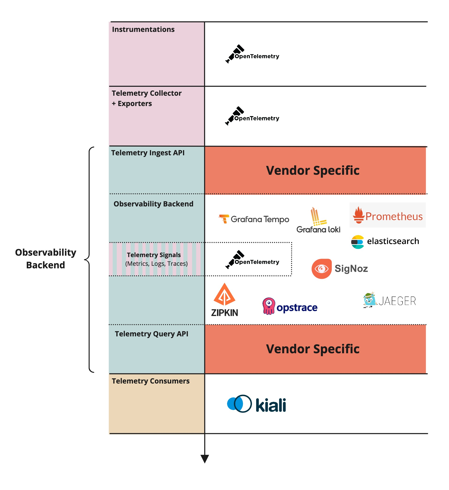

# Standard Trace Query API

Vendor agnostic API definition to query traces stored in any tracing backend platform (generally speaking, observability backends), both open source (Jaeger, Tempo, Zipkin) and proprietary (Datadog, appdynamics, etc.)

## Motivation

- The Observability space is getting mature, more and more telemetry producers try to align with the OpenTelemetry standards to produce telemetry signals.

  On the other side, telemetry consumers platforms (platforms that uses traces to enrich and correlate existing events. Kiali [1]), need to implement N backend (each for each observability backend integrated to their platform) APIs to consume and process those telemetry signals.

- Sooner than later, at the same rhythm that the OpenTelemetry client side pipeline (instrument, collect, export) adoption grows, the need for a standard backend to consume these telemetry signals will grow as well.

- OTel collector natively supports exporting telemetry signals to multiple exporters simultaneously hence to multiple observability backends.

_[1] Telemetry consumption platforms like Kiali consume telemetry sugnals (metrics, traces, logs) and configurations from different sources to correlate, combine and offer to the user added value in the Service Mesh domain._

## Explanation

- OpenTelemetry focused on a **vendor agnostic** standard for producing telemetry signals, but there is a gap (or no standard) in a common API to be to query the stored telemetry signals.

  Unfortunately if you want to query traces for a specific platform you'd require some technical dependency on that platform (in the Kiali case, this one is the Jaeger API) which results in **vendor specific** solution.

**The Downstream Telemetry Consumption Path:**

We can see this dependency on the diagram below (given some examples for existing open source platforms):

## Internal details

TBD - Interface and capabilities definition

## Trade-offs and mitigations

### Migration Period

- Untill all vendors will implement such an API, it would be nice to have a single library (i.e. opentelemetry-backend) that will enable telemetry consumers to query any supported observability backend in a common format.
- This means to create kind of proxy client for telemetry consumer that will abstract the details of specific implementations (Jaeger, Tempo, etc.) for easy change from one platform to another.
  This library should be deprecated by the time all vendors will implement the suggested standard API.

- This can be nspired by this POC made by @lucasponce [https://github.com/lucasponce/jaeger-proto-client](https://github.com/lucasponce/jaeger-proto-client) that can plug any jaeger solution (jaeger/tempo) for consumers.

## Prior art and alternatives

- The current API of Jaeger could be a good API to start as it is widely adopted by telemetry consumers adding potential modifications that the community would need.

## Open questions

1. This initiative is not very well aligned with the current vision of OpenTelemetry. Otel in the past mostly stayed away from backend functionality. See [https://opentelemetry.io/docs/](https://opentelemetry.io/docs/) where they say:
   > OpenTelemetry, also known as OTel for short, is a vendor-neutral open-source Observability framework for instrumenting, generating, collecting, and exporting telemetry data such as traces, metrics, logs.
   > See how it stops at "exporting". With some small exceptions OTel consider their job done once the telemetry is delivered to the backend.
   - Does the OpenTelemetry repo is the right place for such an initiative? any other suggestion?
2. One of the challenges we see, is different vendors having different capabilities and APIs. For example, one vendor support searching by arbitrary attributes and aggregations between telemetry signals, etc. Probably some parts of the API should be mandatory, and some optional.
3. We need to find more downstream telemetry consumers to validate this need (some other platforms / users / organizations) other then Kiali.

## Future possibilities

- Potentially extended not only for tracing but other signals (logs, metrics).
- Probably a common set of features can be "standardized," and the OpenTelemetry group may foster a "standard client" for these needs.
