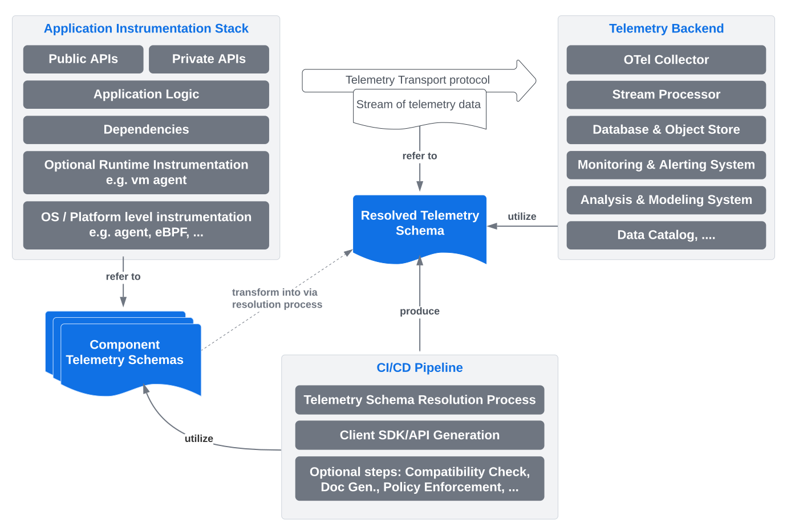
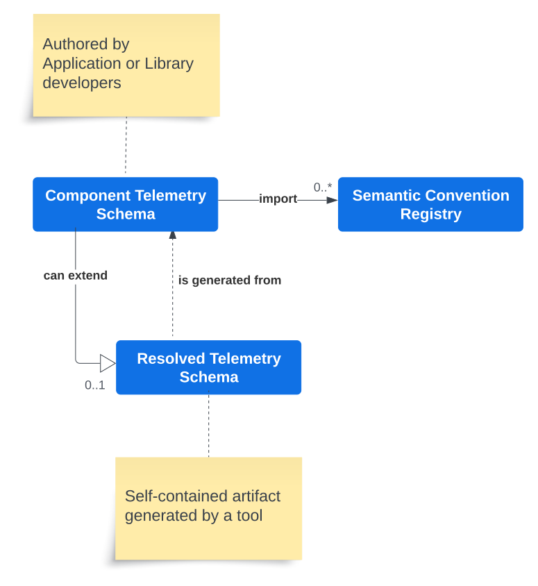
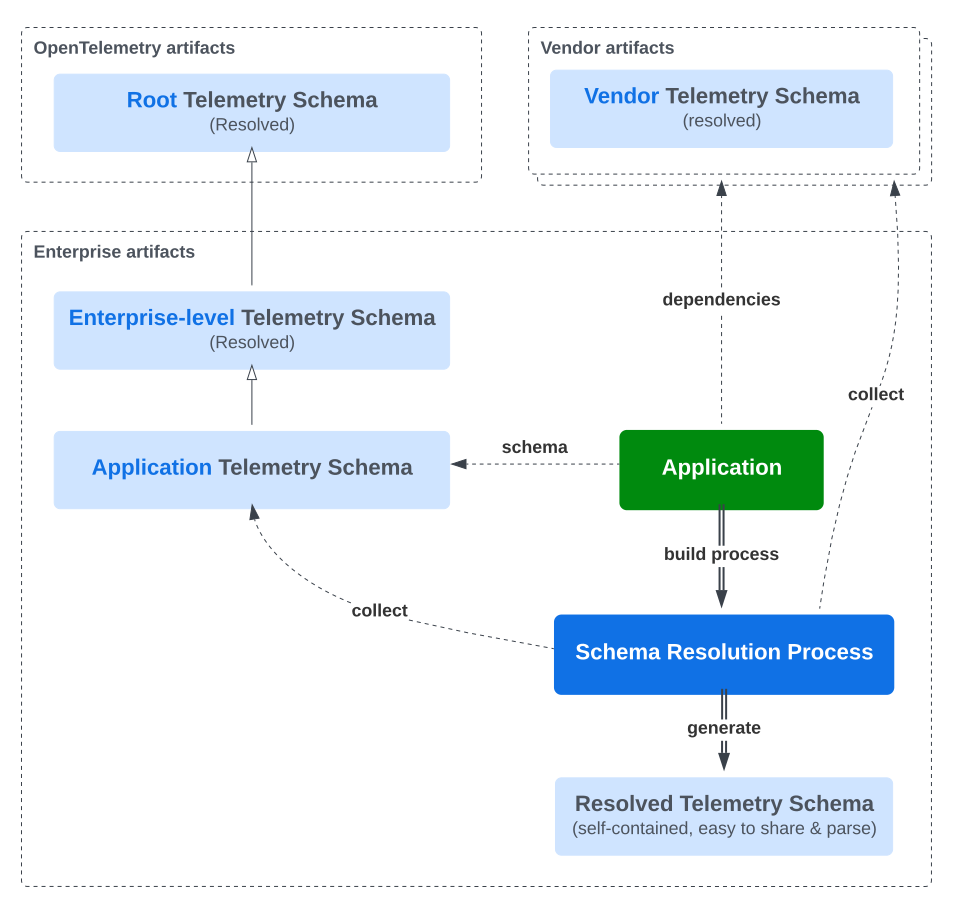
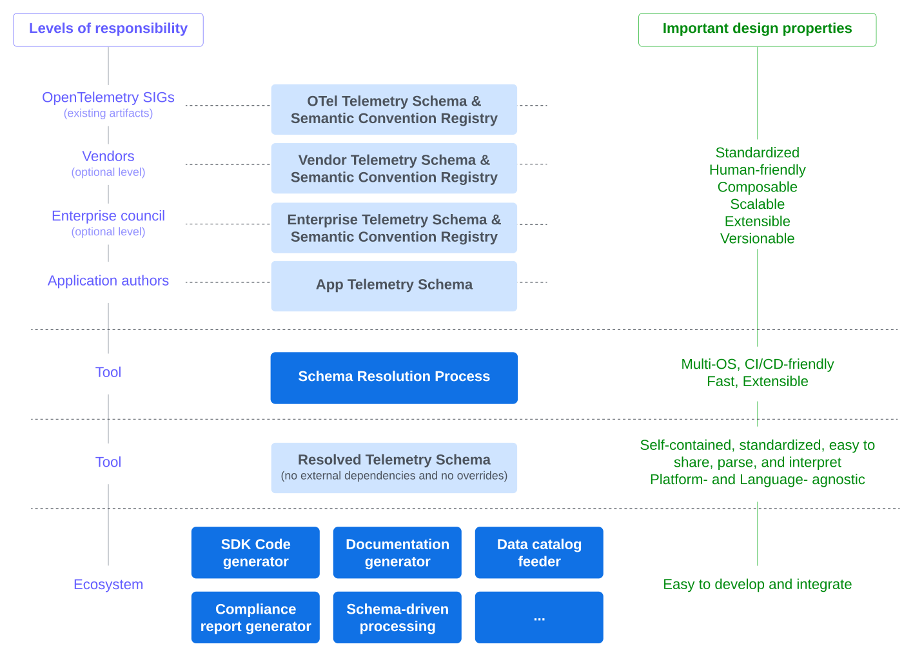
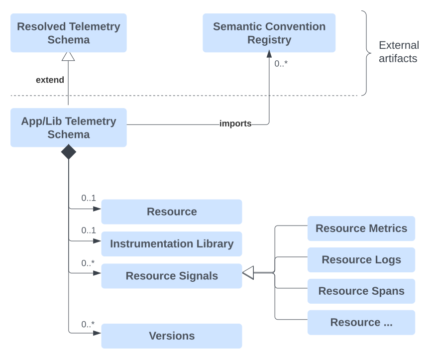
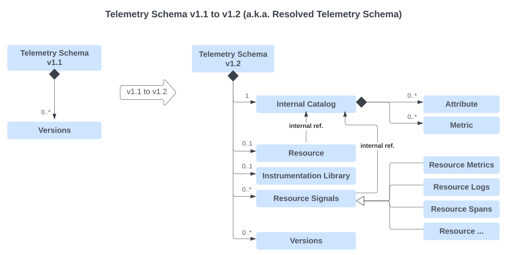

# Introducing Application Telemetry Schema in OpenTelemetry - Vision and Roadmap

----
**Author**: Laurent Querel, F5 Inc.

**Keywords**: Schema-First Approach, Telemetry Schema, Semantic Convention, 
Discoverability, Interoperability, Type-Safe Client SDKs, Client SDKs Generation,
CI/CD Integration, Data Governance, Data Privacy.

**Related OTEPs**: [OTEP0152](https://github.com/open-telemetry/oteps/blob/main/text/0152-telemetry-schemas.md), [OTEP0202](https://github.com/open-telemetry/oteps/blob/main/text/0202-events-and-logs-api.md).

----
_Unlike the traditional data ecosystem (OLTP and OLAP), the world of telemetry
generally does not rely on the concept of a schema. Instrumentation is deeply
embedded in the code of applications and libraries, making it difficult to
discover all the possible telemetry signals an application can emit. This gap
prevents or limits the development of CI/CD tools for checking, reporting,
documenting, and generating artifacts from telemetry signals specific to an
application. This document presents a long-term vision aimed at enabling the
OpenTelemetry project to address this issue and extend its impact to a broader
ecosystem. It proposes extending the initiatives of Telemetry Schema and
Semantic Conventions to include logical concepts of Component Telemetry Schema
and Resolved Telemetry Schema. A series of OTEPs and Tools will be proposed in
this overarching document to detail each aspect of this vision._

## Current State Overview

Traditionally, the instrumentation of applications is deeply integrated into the
source code of the applications and their components. The current stack of
OpenTelemetry follows this approach and offers a unified mechanism that allows
this ecosystem to report telemetry data jointly via a generic client interface
and a common protocol through an SDK. Moreover, OpenTelemetry's semantic
conventions establish a vendor-agnostic and standardized vocabulary to ensure
more consistent instrumentation over time. This standardization facilitates the
analysis and utilization of these metadata data across the entire telemetry
pipeline.

But this approach is not without challenges:

* **Discoverability and Interoperability**: It is difficult to discover a priori
and automatically what an application as a whole specifically generates in terms
of telemetry and associated metadata.This makes it difficult to integrate with
enterprise data catalogs, compliance procedures, or automated privacy
enforcement in _CI/CD pipelines_.
* **User experience**: Although very flexible, generic clients do not offer the
same benefits as a strongly typed dedicated API. A type-safe API is more
ergonomic, more robust, and more easily maintainable. Modern IDEs are capable
of providing smart autocompletion and contextual documentation based on the API.
Compilers can automatically detect errors in case of refactoring or evolution
of the telemetry schema.
* **Extensibility**: Adding metadata to the basic signal specification is
essential for enabling use cases like data security, privacy enforcement,
metadata-driven data transformation, and knowledge graph enrichment. Currently,
there's no standard way to add metadata separate from an application's or
library's development cycle. These metadata definitions should be distinct from
the signal definitions and could be specified by teams other than development
teams.
* **Performance overheads**: A significant downside of generic telemetry
instrumentation is the various overheads it generally introduces due to inherent
layers of abstraction. For example, the collection of attributes is typically
represented as a list of key/value pairs or as hashmaps, resulting in memory
overhead. A simple struct or a set of well-typed function arguments will be more
efficient and less error-prone for representing this list of attributes. In the
same way, it is possible to use a dictionary encoding for values whose domain is
specified in the form of an enumeration in the schema definition.

Databases and RPC systems (e.g., Protobuf & gRPC) have already addressed some of
these issues with a schema-first approach. There is nothing to prevent adopting
a similar approach in the context of telemetry. **This document discusses how to
apply a schema-first approach in the OpenTelemetry project and its implications
for the existing Telemetry Schema and Semantic Conventions.**

The following diagram provides a conceptual overview of the relationships
between the various components, processes, and artifacts of what could be a
typical schema-driven end-to-end telemetry system in the future.

The Application Telemetry Schema concept is divided into two key parts: the
Component Telemetry Schema and the Resolved Telemetry Schema, as shown in the
previous diagram. These concepts are central to unlocking a variety of use
cases.

Examples of use cases include:

* Automatic generation of Telemetry Client SDKs from telemetry schemas,
improving user experience and performance.
* CI/CD pipelines using telemetry schemas to:
  * Check compatibility between different schema versions.
  * Ensure security and privacy compliance.
  * Integrate with enterprise data catalog systems.
  * And more.
* Telemetry backends capable of:
  * Automatically updating database schemas or dashboards.
  * Triggering schema-driven transformations or processing in stream processors.
  * And more.

> **Note: The names and formats of these concepts are still under discussion. A
> detailed analysis of pros and cons will be covered later in the document. The
> final decision will be deferred to future dedicated OTEPs.**

Another problem this proposal aims to address is the inherent complexity of the
ecosystem where OpenTelemetry is utilized but not fully addressed by existing
solutions. OpenTelemetry has been adopted by enterprises of all sizes. While
offering the possibility to inherit standardized semantic conventions is
beneficial, it often proves insufficient due to the need for customizations in
diverse contexts, such as overriding some properties (e.g., changing the
requirement level from recommended to required). Additionally, the presence of
vendor-specific attributes and metrics in the existing official OpenTelemetry
semantic convention registry does not align with the goal of offering a catalog
of attributes, metrics, and signals that are vendor-agnostic. **These issues are
indicative of a lack of standardized mechanisms for extending, customizing, and
developing an ecosystem of schemas and semantic convention registries.**

In response to these problems, a hierarchy of telemetry schemas can be defined,
ranging from the most general to one that is specifically refined for an
application. Each child schema inherits the properties of the parent schema and
can, if necessary, override these properties locally. Additionally, any
telemetry schema can import one or several semantic convention registries,
allowing for the definition of OpenTelemetry, vendor-specific, and
enterprise-level registries. These two enhancements make OpenTelemetry more
customizable, extensible, and ecosystem-friendly.

The following section will elaborate on the concepts of the Component Telemetry
Schema, Resolved Telemetry Schema, Semantic Convention Registries, and their
relationship with both the existing OpenTelemetry Schema v1.1 and the
OpenTelemetry Semantic Conventions.

## Proposal

### Overview

Conceptually, this proposal is based on three main concepts: Application/Library
Telemetry Schema, Semantic Convention Registry, and Resolved Telemetry Schema.
The relationships between these entities are described in the following diagram.

The Application/Library Telemetry Schemas, referred to as App Telemetry Schema
in this document, are created by application or library authors. An App
Telemetry Schema may import any number of Semantic Convention Registries as
needed. During the schema resolution process, a Resolved Telemetry Schema is
created from an App Telemetry Schema. This Resolved Telemetry Schema is self-contained
and has no external references. Optionally, an App Telemetry Schema can extend
an existing Resolved Telemetry Schema. Typically, the official OpenTelemetry
root telemetry schema, which is a resolved schema, is extended to include the
standard OpenTelemetry Semantic Convention registry. In complex cases, large
enterprises might create their own intermediary resolved schemas for custom
definitions.

The idea of Resolved Telemetry Schema is actually an extension of the Telemetry
Schema v1.1, which was first defined in the [OTEP 0152](https://github.com/open-telemetry/oteps/blob/main/text/0152-telemetry-schemas.md).

The following diagram illustrates a possible instance of a complex hierarchy of
schemas and semantic convention registries. It involves several vendor and
enterprise artifacts, in addition to the standardized OpenTelemetry artifacts.
The schema resolution process will produce a self-contained Resolved Telemetry
Schema that can be easily consumed by various tools and applications, such as a
Client SDK generator, compatibility checker, compliance checker, data catalog
feeder, and more.

For each important component, the following diagram defines the responsibilities
and key design properties that have been considered in the subsequent sections
of this document.

This design enables the definition of semantic conventions in a distributed
manner. OpenTelemetry, vendors, and enterprises can define their own semantic
conventions in different registries simplifying the existing process.

The next two sections will describe the concepts of Telemetry Schema v1.2 and
the Resolved Telemetry Schema.

## Application/Library Telemetry Schema

The Application/Library Telemetry Schema, also known as the App Telemetry
Schema, is a user-friendly format for defining an application's or library's
telemetry schema. Authors of applications or libraries can enhance an existing
resolved telemetry schema by overriding or adding new elements, referencing
semantic convention registries, defining resource attributes (only for
applications), defining properties of the instrumentation library, and defining
the telemetry signals an application or library can produce. They can also use
the versioning mechanism from OTEP 0152. The base schema is typically the
official Telemetry Schema, which links to the OpenTelemetry Semantic Convention
Registry. The final schema in this system, named the Application Telemetry
Schema, details all the signals produced by a specific application.

Although there is no direct lineage between these systems, a similar approach
was designed and deployed by Facebook to address the same type of problem but in
a proprietary context (refer to this [positional paper](https://research.facebook.com/publications/positional-paper-schema-first-application-telemetry/)
for more information).

The following diagram shows how a Telemetry Schema is structured.

> Note 1: Each signal definition, where possible, reuses the existing syntax and
> semantics defined by the semantic conventions. Each signal definition is also
> identified by a unique name (or ID), making schemas easy to traverse, validate
> , and diff.
>
> Note 2: This hierarchy of telemetry schemas helps large organizations in
> collaborating on the Application Telemetry Schema. It enables different
> aspects of an Application Telemetry Schema to be managed by various teams.
>
> Note 3: For all the elements that make up the Application Telemetry Schema, a
> general mechanism of annotation or tagging will be integrated in order to
> attach additional traits, characteristics, or constraints, allowing vendors
> and companies to extend the definition of concepts defined by OpenTelemetry.
>
> Note 4: Annotations and Tags can also be employed to modify schemas for
> diverse audiences. For example, the public version of a schema can exclude all
> signals or other metadata labeled as private. Similarly, elements can be
> designated as exclusively available for beta testers. These annotations can
> also identify attributes as PII (Personally Identifiable Information), and
> privacy policy enforcement can be implemented at various levels (e.g., in the
> generated client SDK or in a proxy).
>
> Note 5: This recent [paper](https://arxiv.org/pdf/2311.07509.pdf#:~:text=The%20results%20of%20the%20benchmark%20provide%20evidence%20that%20supports%20our,LLM%20without%20a%20Knowledge%20Graph)
> from [data.world](https://data.world/home/), along with the [MetricFlow framework](https://docs.getdbt.com/docs/build/about-metricflow)
> which underpins the [dbt Semantic Layer](https://www.getdbt.com/product/semantic-layer),
> highlights the significance of adopting a schema-first approach in data
> modeling, especially for Generative AI-based question answering systems. Tools
> like Observability Query Assistants (e.g. [Elastic AI Assistant](https://www.elastic.co/fr/blog/introducing-elastic-ai-assistant)
> and [Honeycomb Query Assistant](https://www.honeycomb.io/blog/introducing-query-assistant?utm_source=newswire&utm_medium=link&utm_campaign=query_assistant))
> are likely to become increasingly prevalent and efficient in the near future,
> thanks to the adoption of a schema-first approach.

Several OTEPs will be dedicated to the precise definition of the structure and
the format of Telemetry Schema v1.2. The rules for resolving overrides
(inheritance), external references, and conflicts will also be described in
these OTEPs. See the Roadmap section for a comprehensive list of these OTEPs.

## Resolved Telemetry Schema

A Resolved Telemetry Schema is the outcome of the schema resolution process.
This process involves taking the entire hierarchy of Telemetry Schemas and
Semantic Convention Registries and applying a set of rules to resolve overrides
and eliminate external references. The key design principles to be followed in
the definition of the Resolved Telemetry Schema are:

* **Self-contained**: No external references are allowed. This artifact contains
everything required to determine what an application or a library produces in
terms of telemetry.
* **Easy to exchange**: This artifact must be easily accessible from a web
server via a URL. This artifact must be small and avoid the repetition of
definitions.
* **Easy to parse**: A widespread and well-defined format should be preferred.
JSON is an example of such a format.
* **Easy to interpret**: The internal structure of this artifact must be
straightforward to avoid any misinterpretation.
* **Platform- and Language-agnostic**: This artifact must be independent of any
platform architectures and programming languages.

Conceptually, the main components of a Resolved Telemetry Schema are described
in the following diagram.

The internal catalog is used to define all the attributes and metrics in this
artifact. This design allows for the reuse of the same attributes or metrics
multiple times in different signals and different instrumentation libraries. It
is expected to be a very common pattern to reuse the same subset of attributes
or metrics across several signals and libraries.

A dedicated OTEP will precisely define the structure and format of the Resolved
Telemetry Schema.

### Development Strategies

Two development strategies coexist and must be supported. The first strategy, a
monorepo type (single source of truth), has complete control over the
applications, their dependencies, and the associated telemetry schemas. The
second strategy is more heterogeneous, composed of multiple repositories, where
the build process of external dependencies is out of the control of the entity
owning the applications or services.

In the first model, each build process can independently apply telemetry schema
policies in parallel, knowing that the policies are shared and the entire
environment is controlled by the same entity.

In the second model, the application or service environment cannot access or
control the telemetry schema policies of the libraries. We need a way to
retrieve telemetry schemas from these dependencies. At this point, the preferred
method is to include the telemetry schema artifact within the library artifact
(like binary libraries, jar files, crates, go modules, etc.). This way, they are
automatically collected during the application's build process. This method is
fully decentralized and does not need a global schema registry. A specific OTEP
will describe the best method for this.

## Roadmap

To facilitate the review process and progressively deliver value to the
OpenTelemetry community, a series of OTEPs and tools are proposed.

### OTEPs

* **Telemetry Schema** (a.k.a Resolved Telemetry Schema)
  * File format V1.2: This OTEP will add a registry section containing a list of fully
  resolved attributes, metrics, and other telemetry signals defined in the
  existing semantic convention registry. Once implemented, the telemetry schema
  published by the OpenTelemetry project will contained the registry of all the
  standardized attributes, metrics, and signals defined by the semantic
  conventions.
  * File format V1.3: This OTEP will add a resource, instrumentation library, and schema
  sections to represent the telemetry signal emitted by an application (and its
  dependencies), or by a library. Telemetry Schema V1.3 depends on the
  definition of Component Telemetry Schema V1.0.
  * Dependency Management: This OTEP will describe the method use to collect the
  resolved telemetry schemas from dependencies.
* **Component Telemetry Schema** (a.k.a Application/Library Telemetry Schema)
  * File format V1.0: This OTEP will allow application or library authors to define the
    telemetry signals (metrics, logs, spans) emitted by their components.
  * File format V1.1: This OTEP will allow application or library authors to override the
    definitions inherited from a parent resolved schema.
  * File format V1.2: This OTEP will add support for events in the schema section. This OTEP
    is contingent upon the approval of events in OpenTelemetry.
  * File format V1.3: This OTEP will add support for metric_groups (multivariate metrics) in
    the schema section. This will only be relevant if a support for multivariate
    metrics is planned in the Client SDK Generator.

### Tools

* OTel Weaver Commands
  * `resolve registry`: This command will produce a Telemetry Schema V1.2 from
    the official OpenTelemetry semantic convention registry.
  * `resolve schema`: This command will produce a Telemetry Schema V1.3 from
    a Component Telemetry Schema V1.0 (or upper version).
  * `search registry`: This command will provide search capabilities within the
    official OpenTelemetry semantic convention registry.
  * `search schema`: This command will provide search capabilities within a
    Component Telemetry Schema V1.0 (or upper version).
  * `gen-client sdk`: This command will generate a Client SDK from a Component
    Telemetry Schema V1.0 (or upper version) or a Telemetry Schema V1.3.
  * `gen-client api`: This command will generate a Client API from a Component
    Telemetry Schema V1.0 (or upper version) or a Telemetry Schema V1.3.
* OTel Weaver Plugin System
  * Plugin Framework
  * Plugin to collect telemetry schemas from external dependencies.
  * Plugin to check compatibility between two telemetry schemas.This tool will
  verify that two successive versions of the same Telemetry Schema adhere to the
  specified compatibility rules.

Other tools will be developed by the broader community and could be implemented
by relying on the standardized format of the Resolved Telemetry Schema.

## Links

- [Positional Paper: Schema-First Application Telemetry](https://research.facebook.com/publications/positional-paper-schema-first-application-telemetry/)
- [A benchmark to understand the role of knowledge graphs on Large Language Model's accuracy for question answering on enterprise sql databases](https://arxiv.org/pdf/2311.07509.pdf#:~:text=The%20results%20of%20the%20benchmark%20provide%20evidence%20that%20supports%20our,LLM%20without%20a%20Knowledge%20Graph)
- [MetricFlow framework](https://docs.getdbt.com/docs/build/about-metricflow)
