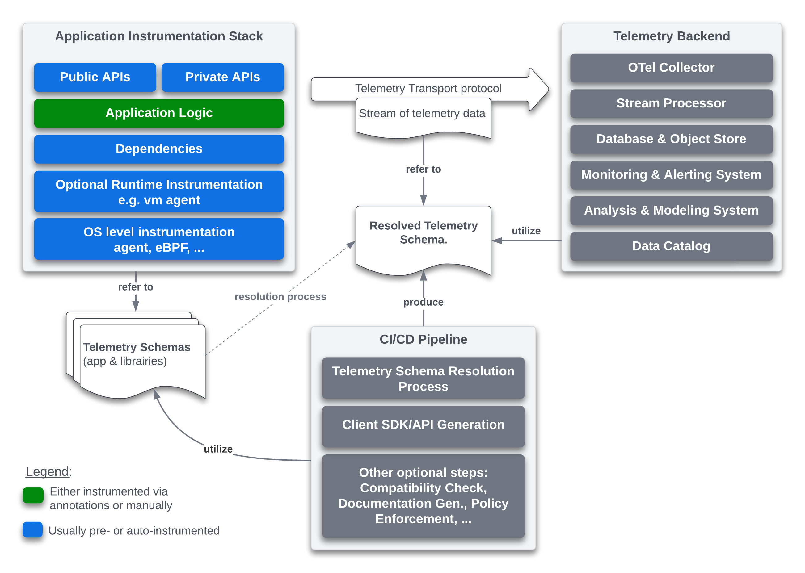
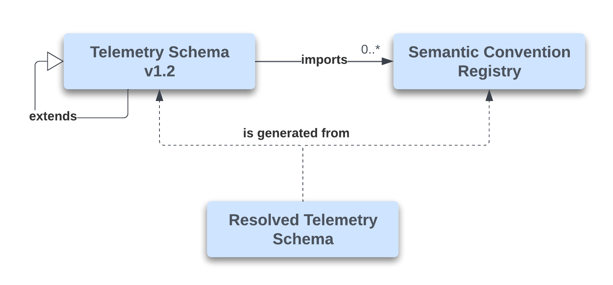
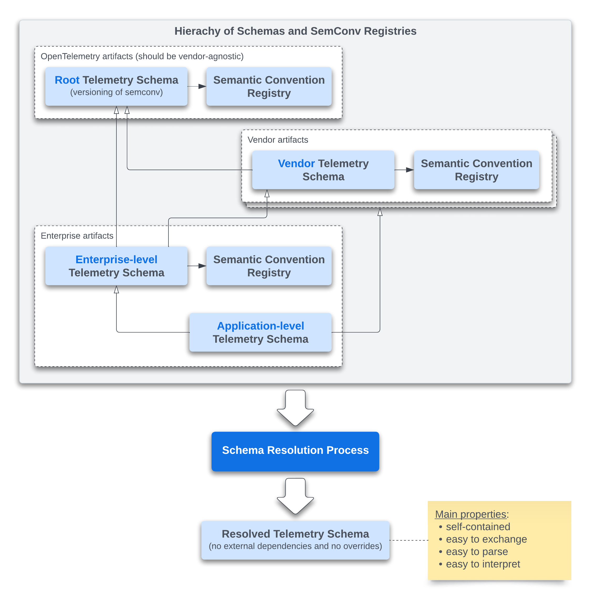
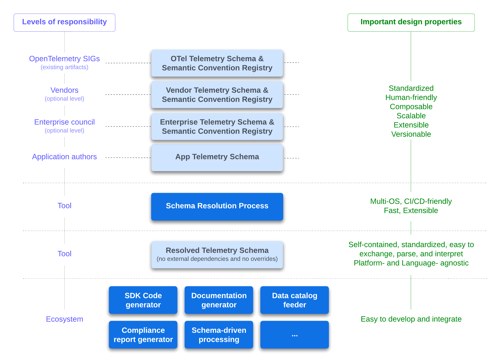
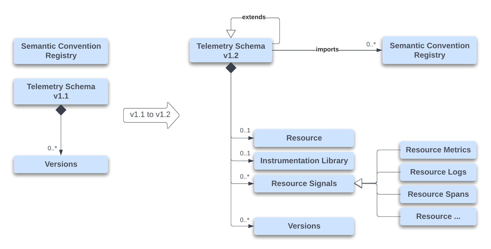
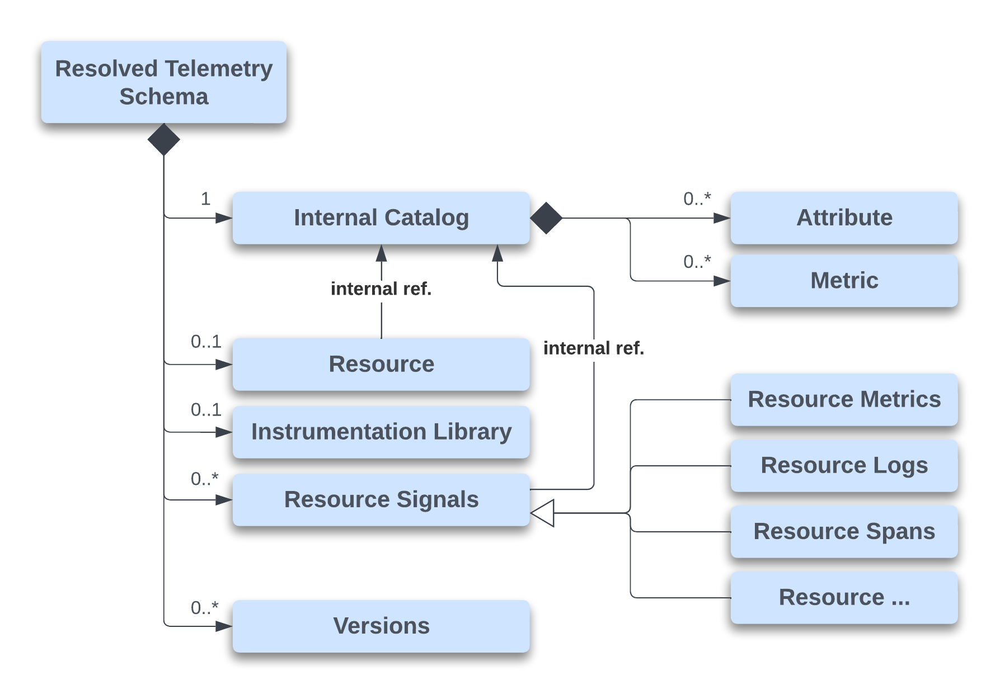
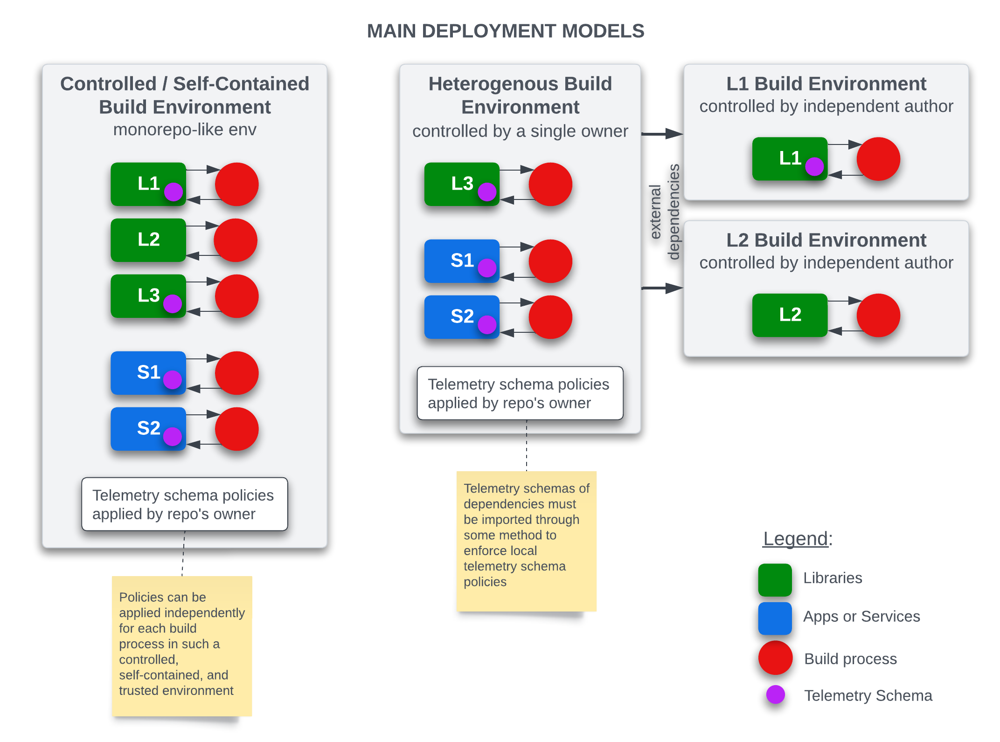
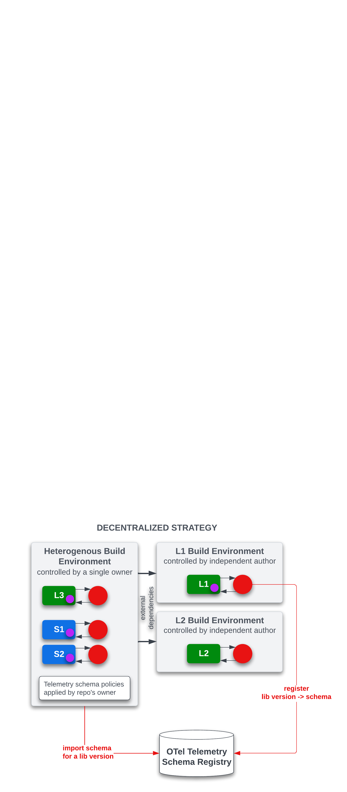
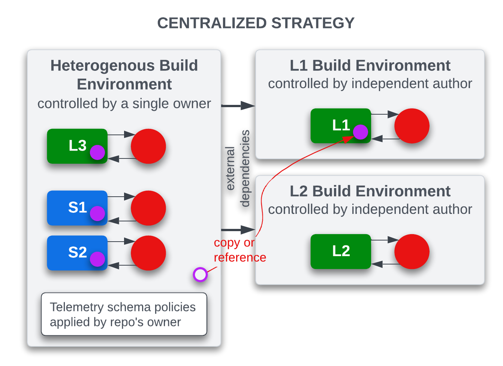

# Introducing Application Telemetry Schema in OpenTelemetry - Vision and Roadmap

----
**Author**: Laurent Querel, F5 Inc.

**Keywords**: Telemetry Schema, Semantic Convention, Code Generator,
Telemetry Backend, Data Governance, Automated Privacy Enforcement.

**Related OTEPs**: [OTEP0152](https://github.com/open-telemetry/oteps/blob/main/text/0152-telemetry-schemas.md), [OTEP0202](https://github.com/open-telemetry/oteps/blob/main/text/0202-events-and-logs-api.md).

----
_Unlike the traditional data ecosystem (OLTP and OLAP), the world of telemetry
generally does not rely on the concept of a schema. Instrumentation is deeply
embedded in the code of applications and libraries, making it difficult to
discover all the possible telemetry signals an application can emit. This gap
prevents or limits the development of CI/CD tools for checking, reporting,
documenting, and generating artifacts from telemetry signals specific to an
application. This document presents a long-term vision aimed at enabling the
OpenTelemetry project to address this issue and extend its impact to a broader
ecosystem. It proposes extending the initiatives of Telemetry Schema and
Semantic Conventions to include concepts of Application Telemetry Schema and
Resolved Telemetry Schema. A series of OTEPs and Tools will be proposed in this
overarching document to detail each aspect of this vision._

## Current State Overview

Traditionally, the instrumentation of applications is deeply integrated into the
source code of the applications and their components. The current stack of
OpenTelemetry follows this approach and offers a unified mechanism that allows
this ecosystem to report telemetry data jointly via a generic client interface
and a common protocol through an SDK. Moreover, OpenTelemetry's semantic
conventions establish a vendor-agnostic and standardized vocabulary to ensure
more consistent instrumentation over time. This standardization facilitates the
analysis and utilization of these metadata data across the entire telemetry
pipeline.

But this approach is not without challenges:

* **Discoverability and Interoperability**: It is difficult to discover a priori
and automatically what an application as a whole specifically generates in terms
of telemetry and associated metadata.This makes it difficult to integrate with
enterprise data catalogs, compliance procedures, or automated privacy
enforcement in CI/CD pipelines.
* **User experience**: Although very flexible, generic clients do not offer the
same benefits as a strongly typed dedicated API. A type-safe API is more
ergonomic, more robust, and more easily maintainable. Modern IDEs are capable
of providing smart autocompletion and contextual documentation based on the API.
Compilers can automatically detect errors in case of refactoring or evolution
of the telemetry schema.
* **Performance overheads**: A significant downside of generic telemetry
instrumentation is the various overheads it generally introduces due to inherent
layers of abstraction. For example, the collection of attributes is typically
represented as a list of key/value pairs or as hashmaps, resulting in memory
overhead. A simple struct or a set of well-typed function arguments will be more
efficient and less error-prone for representing this list of attributes.

Databases and RPC systems (e.g., Protobuf & gRPC) have already addressed some of
these issues with a schema-first approach. There is nothing to prevent adopting
a similar approach in the context of telemetry. This document discusses how to
apply a schema-first approach in the OpenTelemetry project and its implications
for the existing Telemetry Schema and Semantic Conventions.

The following diagram provides an overview of the relationships between the
various components, processes, and artifacts of what could be a typical
schema-driven end-to-end telemetry system in the future.

The concept of the Application Telemetry Schema and Resolved Telemetry Schema,
as described in the previous diagram, will play a central role and unlock
numerous use cases (this is not an exhaustive list):

* Telemetry Client SDKs can be automatically generated from an application
telemetry schema, enhancing both user experience and performance.
* CI/CD pipelines can leverage an application telemetry schema to:
  * Check compatibility of different schema versions,
  * Ensure security and privacy compliance,
  * Integrate with enterprise data catalog systems.
  * And more.
* Telemetry backends can:
  * Automatically derive or update database schemas or dashboards.
  * Trigger schema-driven transformations or processing in stream processor systems.
  * And more.

Another problem this proposal aims to address is the inherent complexity of the
ecosystem where OpenTelemetry is utilized but not fully addressed by existing
solutions. OpenTelemetry has been adopted by enterprises of all sizes. While
offering the possibility to inherit standardized semantic conventions is
beneficial, it often proves insufficient due to the need for customizations in
diverse contexts, such as overriding some properties (e.g., changing the
requirement level from recommended to required). Additionally, the presence of
vendor-specific attributes and metrics in the existing official OpenTelemetry
semantic convention registry does not align with the goal of offering a catalog
of attributes, metrics, and signals that are vendor-agnostic. These issues are
indicative of a lack of standardized mechanisms for extending, customizing, and
developing an ecosystem of schemas and semantic convention registries.

In response to these problems, a hierarchy of telemetry schemas can be defined,
ranging from the most general to one that is specifically refined for an
application. Each child schema inherits the properties of the parent schema and
can, if necessary, override these properties locally. Additionally, any
telemetry schema can import one or several semantic convention registries,
allowing for the definition of OpenTelemetry, vendor-specific, and
enterprise-level registries. These two enhancements make OpenTelemetry more
customizable, extensible, and ecosystem-friendly.

The following section will elaborate on the concepts of the Application
Telemetry Schema, schema inheritance, semantic convention registries, Resolved
Telemetry Schema, and their relationship with both the existing OpenTelemetry
schema v1.1 and the OpenTelemetry semantic conventions.

## Proposal

### Overview

Conceptually, this proposal is based on three main concepts: Telemetry
Schema v1.2, Semantic Convention Registry, and Resolved Telemetry Schema. The
relationships between these entities are described in the following diagram.

The Telemetry Schemas form a hierarchy of schemas, the complexity of which
depends on the complexity of the situation (usage in very large enterprises
will tend to produce more complex schema hierarchies). A single Telemetry Schema
can import from zero to n Semantic Convention Registries, depending on its
needs. A Resolved Telemetry Schema is generated during the schema resolution
process from a hierarchy of Telemetry Schemas and Semantic Convention
Registries.

The following diagram illustrates a possible instance of a complex hierarchy of
schemas and semantic convention registries. It involves several vendor and
enterprise artifacts, in addition to the standardized OpenTelemetry artifacts.
The schema resolution process will produce a self-contained Resolved Telemetry
Schema that can be easily consumed by various tools and applications, such as a
Client SDK generator, compatibility checker, compliance checker, data catalog
feeder, and more.

For each important component, the following diagram defines the responsibilities
and key design properties that have been considered in the subsequent sections
of this document.

This design enables the definition of semantic conventions in a distributed
manner. OpenTelemetry, vendors, and enterprises can define their own semantic
conventions in different registries simplifying the existing process.

The next two sections will describe the concepts of Telemetry Schema v1.2 and
the Resolved Telemetry Schema.

## Telemetry Schema v1.2 (aka Application Telemetry Schema)

The Telemetry Schema v1.2 represents a forward-compatible extension of the
existing Telemetry Schema v1.1. It offers a way to import semantic convention
registries and to define resource attributes, the properties of the
instrumentation library, and the telemetry signals an application or library can
produce. The existing versioning mechanism defined in version 1.1 remains
unchanged. A Telemetry Schema can inherit from one or several other telemetry
schemas (as explained in the previous section). The root schema is usually the
official Telemetry Schema, referencing the official OpenTelemetry Semantic
Convention Registry. The last schema (leaf) in this hierarchy is called the
Application Telemetry Schema, as it defines all the signals a particular
application produces. Although there is no direct lineage between these systems,
a similar approach was designed and deployed by Facebook to address the same
type of problem but in a proprietary context (refer to this
[positional paper](https://research.facebook.com/publications/positional-paper-schema-first-application-telemetry/)
for more information).

The following diagram illustrates the relationships between these concepts and
the main changes from Telemetry Schema v1.1 to v1.2.

> Note 1: Each signal definition, where possible, reuses the existing syntax and
> semantics defined by the semantic conventions. Each signal definition is also
> identified by a unique name (or ID), making schemas easy to traverse, validate
> , and diff.
>
> Note 2: This hierarchy of telemetry schemas helps large organizations in
> collaborating on the Application Telemetry Schema. It enables different
> aspects of an Application Telemetry Schema to be managed by various teams.
>
> Note 3: For all the elements that make up the Application Telemetry Schema, a
> general mechanism of annotation or tagging will be integrated in order to
> attach additional traits, characteristics, or constraints, allowing vendors
> and companies to extend the definition of concepts defined by OpenTelemetry.
>
> Note 4: Annotations and Tags can also be employed to modify schemas for
> diverse audiences. For example, the public version of a schema can exclude all
> signals or other metadata labeled as private. Similarly, elements can be
> designated as exclusively available for beta testers. These annotations can
> also identify attributes as PII (Personally Identifiable Information), and
> privacy policy enforcement can be implemented at various levels (e.g., in the
> generated client SDK or in a proxy).
>
> Note 5: This recent [paper](https://arxiv.org/pdf/2311.07509.pdf#:~:text=The%20results%20of%20the%20benchmark%20provide%20evidence%20that%20supports%20our,LLM%20without%20a%20Knowledge%20Graph)
> from [data.world](https://data.world/home/), along with the [MetricFlow framework](https://docs.getdbt.com/docs/build/about-metricflow)
> which underpins the [dbt Semantic Layer](https://www.getdbt.com/product/semantic-layer),
> highlights the significance of adopting a schema-first approach in data
> modeling, especially for Generative AI-based question answering systems. Tools
> like Observability Query Assistants (e.g. [Elastic AI Assistant](https://www.elastic.co/fr/blog/introducing-elastic-ai-assistant)
> and [Honeycomb Query Assistant](https://www.honeycomb.io/blog/introducing-query-assistant?utm_source=newswire&utm_medium=link&utm_campaign=query_assistant))
> are likely to become increasingly prevalent and efficient in the near future,
> thanks to the adoption of a schema-first approach.

Several OTEPs will be dedicated to the precise definition of the structure and
the format of Telemetry Schema v1.2. The rules for resolving overrides
(inheritance), external references, and conflicts will also be described in
these OTEPs. See the Roadmap section for a comprehensive list of these OTEPs.

## Resolved Telemetry Schema

A Resolved Telemetry Schema is the outcome of the schema resolution process.
This process involves taking the entire hierarchy of Telemetry Schemas and
Semantic Convention Registries and applying a set of rules to resolve overrides
and eliminate external references. The key design principles to be followed in
the definition of the Resolved Telemetry Schema are:

* **Self-contained**: No external references are allowed. This artifact contains
everything required to determine what an application or a library produces in
terms of telemetry.
* **Easy to exchange**: This artifact must be easily accessible from a web
server via a URL. This artifact must be small and avoid the repetition of
definitions.
* **Easy to parse**: A widespread and well-defined format should be preferred.
JSON is an example of such a format.
* **Easy to interpret**: The internal structure of this artifact must be
straightforward to avoid any misinterpretation.
* **Platform- and Language-agnostic**: This artifact must be independent of any
platform architectures and programming languages.

Conceptually, the main components of a Resolved Telemetry Schema are described
in the following diagram.

The internal catalog is used to define all the attributes and metrics in this
artifact. This design allows for the reuse of the same attributes or metrics
multiple times in different signals. It is expected to be a very common pattern
to reuse the same subset of attributes or metrics across several signals.

A dedicated OTEP will precisely define the structure and format of the Resolved
Telemetry Schema.

### Development Models

Two development models coexist. The first model, a monorepo type (or similar),
has complete control over the applications, their dependencies, and the
associated telemetry schemas. The second model is more heterogeneous, where the
build process of external dependencies is out of the control of the entity
owning the applications or services.

In the first model, each build process can independently apply telemetry schema
policies in parallel, knowing that the policies are shared and the entire
environment is controlled by the same entity.

In the second model, the application/service environment does not have access to
and does not control the telemetry schema policies applied to the telemetry
schemas of the libraries. Two strategies for recovering telemetry schemas are
currently being considered. A specific OTEP will be responsible for identifying
the best approach.

#### Decentralized Strategy

# Library Designers Using a Schema-First Telemetry Schema Approach

Library designers using this schema-first telemetry schema approach add a phase
in their CI/CD pipeline for the registration of the resolved telemetry schema
associated with their library for a given version. This registration is done
towards a registry maintained by OpenTelemetry.

Application/service owners configure their CI/CD pipeline to automatically
import the resolved telemetry schemas of dependencies (if they exist) in order
to apply locally the telemetry schema policies or any other build step that
applies to/feeds off the resolved telemetry schemas of the dependencies.

This approach is considered decentralized as it does not impose any direct
collaboration between parties while ensuring consistency between versions of
dependencies and their associated telemetry schemas.

#### Centralized Strategy

In this strategy, the library designers have no interaction with the external
world. They define a telemetry schema for their library, version the resolved
schema in their repository, and release their library as usual.

On the application and service owners' side, they must either make a local copy
of the resolved telemetry schemas corresponding to their dependencies (similar
conceptually to the model followed by protobuf and gRPC) or link to the resolved
telemetry schema for a specific version. In both cases, the synchronization
between the versions of the library and the resolved telemetry schema is the
responsibility of the application owner.

This approach is considered centralized as the application owner has the
responsibility of maintaining, in a centralized manner locally, all the
telemetry schemas of the dependencies.

## Roadmap

To facilitate the review process and progressively deliver value to the
OpenTelemetry community, a series of OTEPs and tools are proposed.

### OTEPs

* Telemetry Schema versions (incremental steps):
  * V1.1.1: Add a section to import one or several Semantic Convention
  Registries. Once implemented, the official Semantic Convention Registry will
  be referenced from the official OpenTelemetry Root Telemetry Schema.
  * V1.2: Add references to parent schemas and define a schema section to
  describe application/library signals. In this version, only metrics, logs, and
  spans signals are described. This is the first version of the telemetry schema
  that can be used by the Client SDK generator. In this version only one schema
  can be inherited. More complex hierarchies will be supported in version 1.5.
  * V1.3: Add support for events in the schema section. This OTEP is contingent
  upon the approval of events in OpenTelemetry.
  * V1.4: Add support for metric_groups (multivariate metrics) in the schema
  section. This will only be relevant if a support for multivariate metrics is
  planned in the Client SDK Generator.
  * V1.5: Add support for multi-inheritance and for schema hierarchies of more
  than 2 levels. This is useful for supporting complex environments and will
  allow the distribution of semantic convention registries across vendors and
  enterprises. This OTEP depends on the “Schema Child/Parent relationship
  resolution” OTEP.
* Resolved Schema Format v1.0. This OTEP will define both the structure and
format of the Resolved Telemetry Schema and the strategy for collecting the
Resolved Telemetry Schemas of the dependencies.
* Schema-driven Client SDK Generator.
* Schema Child/Parent relationship resolution.

### Tools

OpenTelemetry tools

* Semantic Convention Registry Merger (Johannes Tax's proposal): This tool will
merge all the semantic convention files of a registry into a single and
referencable file.
* Search Engine: This tool will provide search capability within semantic
convention registries and telemetry schemas.
  * V1 focusing on the semantic convention registry.
  * V2 focusing on telemetry schema v1.2.
* Telemetry Schema Resolver: This tool will resolve the telemetry schema and its
dependencies. The main outcome of this tool is a Resolved Telemetry Schema.
* Schema-driven Client SDK Generator: This tool will generate a client SDK or a
client API from a telemetry schema v1.2. It will be designed to be extensible,
allowing each language SIG and the general community to create templates for
generating client SDKs and APIs in specific programming languages.
* Telemetry Schema Compatibility Checker: This tool will verify that two
successive versions of the same Telemetry Schema adhere to the specified
compatibility rules.

Other tools will be developed by the broader community and could be implemented
by relying on the standardized format of the Resolved Telemetry Schema.

## Links

- [Positional Paper: Schema-First Application Telemetry](https://research.facebook.com/publications/positional-paper-schema-first-application-telemetry/)
- [A benchmark to understand the role of knowledge graphs on Large Language Model's accuracy for question answering on enterprise sql databases](https://arxiv.org/pdf/2311.07509.pdf#:~:text=The%20results%20of%20the%20benchmark%20provide%20evidence%20that%20supports%20our,LLM%20without%20a%20Knowledge%20Graph)
- [MetricFlow framework](https://docs.getdbt.com/docs/build/about-metricflow)
