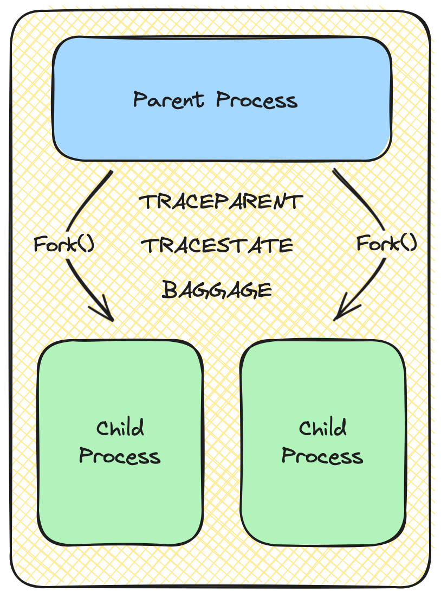
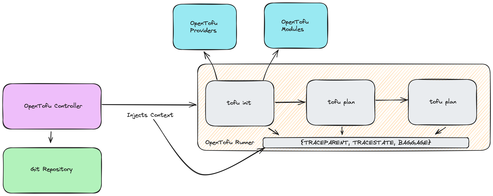
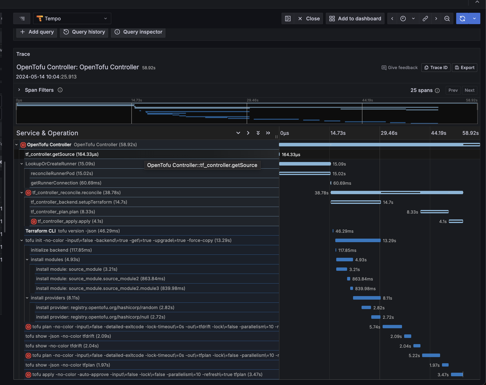

# Environment Variable Specification for Context and Baggage Propagation

This is a proposal to add Environment Variables to the OpenTelemetry
specification as a carrier for context and baggage propagation between
processes.

## Table of Contents

* [Motivation](#motivation)
* [Explanation](#explanation)
* [Internal Details](#internal-details)
    * [UNIX](#unix)
    * [Windows](#windows)
    * [Allowed Characters](#allowed-characters)
* [Trade-offs and Mitigations](#trade-offs-and-mitigations
* [Prior Art and Alternatives](#prior-art-and-alternatives)

## Motivation

The motivation for defining the specification for context and baggage
propagation by using environment variables as carriers stems from a long open
issue on the OpenTelemetry Specification repository, [issue #740](https://github.com/open-telemetry/opentelemetry-specification/issues/740#issue-665588273).

The original issue identifies several use cases of systems that do not
communicate across bounds by leveraging HTTP communications like, ETL, batch,
and CI/CD systems, that need to benefit from context and baggage propagation.
Defining a specification for this will enable better observability of these
systems by enabling distributed tracing. There has already been a significant
amount of [Prior Art](#prior-art) built within the industry and within
OpenTelemetry to accomplish the immediate needs, however, OpenTelemetry at this
time does not clearly define the specification for this form of propagation.

Notably, as we define semantic conventions within the [CI/CD Working Group][cicd-wg],
we'll need the specification defined for the industry to be able to adopt
native tracing wtihin CI/CD systems.

[cicd-wg]: https://github.com/open-telemetry/community/blob/main/projects/ci-cd.md

## Explanation

To propagate context and baggage between parent, and child processes
in systems where HTTP communication does not occur, a specification for
Environmental Variables can be used.

Consider the following diagram:

In this diagram, a parent process is forked to spawn a child process,
inheriting the environment variables from the original parent. The environment
variables defined here, `TRACEPARENT`, `TRACESTATE`, and `BAGGAGE` are used to
propagate context to the child process such that it can be tied to the parent.
Without `TRACEPARENT`, a tracing backend would not be able to connect the child
process spans to the parent span, forming an end-to-end trace.

`traceparent` (lowercase), originates in the [W3C Specification][w3c-parent]
and includes the following fields:

* `version`
* `trace-id`
* `parent-id`
* `trace-flags`

`tracestate` (lowercase), originates in the [W3C Specification][w2c-state] and
can include any opaque value in a key-value pair structure. Its goal is to
provide additional vendor-specific trace information.

`baggage` (lowercase), also is defined in the [W3C Specification][w3c-bag] and
is a set of key-value pairs to propagate context between signals. In
OpenTelemetry, baggage is propagated through the [Baggage API][bag-api].

Consider this real world example OpenTofu Controller Deployment.

In this model, the OpenTofu Controller is the start of the trace, containing
the actual trace_id and generating the root span. The OpenTofu controller
deploys a runner which has it's own environment and processes to run OpenTofu
commands. If one was to trace these processes without a carrier mechanism, then
they would all show up as unrelated root spans as separate traces. However, by
leveraging environment variables as carriers, each span is able to be tied back
to the root span, creating a single trace as shown in the image of a real
OpenTofu trace below.

Additionally, the `init` span is able to pass baggage to the `plan` and `apply`
spans. One example of this is module version and repository information. This
information is only determined and known during the `init` process. Subsiquent
processes only know about the module by name. With `BAGGAGE` the rest of the
proccesses are able to understand a key piece of information which allows
errors to be tied back to original module version and source code.

Defining the specification for Environment Variables as carriers will have a
wide impact to the industry in enabling better observability to systems outside
of the normal HTTP microservice architecture.

[w3c-parent]: https://www.w3.org/TR/trace-context/#traceparent-header
[w3c-state]: https://www.w3.org/TR/trace-context/#tracestate-header
[w3c-bag]: https://www.w3.org/TR/baggage/#header-name
[bag-api]: https://opentelemetry.io/docs/specs/otel/baggage/api/

## Internal details

Defining the specification for Environment Variables as carriers for context
will enable SDK's and other tools to implement getters and settings of context
in a standard, observable way. Therefore, current OpenTelemetry language
maintainers will need to develop language specific implementations that adhere
to the specification. Of course the specification itself will have to be
defined, and a decision made on whether or not to adhere to the W3C
specification or not will need to be made.

Due to the current programming conventions, prior art, and information below,
it is recommended to leverage upper-cased environment variables for the
carrier. `TextMapPropagator` will be the means of propagation for environment
variables.

### UNIX

UNIX system utilities use upper-case for environment variables and lower-case
are reserved for applications. Using upper-case will prevent conflicts with
internal application variables.

Environment variable names used by the utilities in the XCU specification
consist solely of upper-case letters, digits and the "_" (underscore) from the
characters defined in Portable Character Set. Other characters may be permitted
by an implementation; applications must tolerate the presence of such names.
Upper- and lower-case letters retain their unique identities and are not folded
together. The name space of environment variable names containing lower-case
letters is reserved for applications. Applications can define any environment
variables with names from this name space without modifying the behaviour of
the standard utilities.

Source: [The Open Group, The Single UNIX® Specification, Version 2, Environment Variables](https://pubs.opengroup.org/onlinepubs/7908799/xbd/envvar.html)

### Windows

Windows is case-insensitive with environment variables. Despite this, the
recommendation to be upper-cased across OS.

Some languages already do this. This [CPython issue][cpython] discusses how
Python automatically upper-cases environment variables. The issue was merged and
this [documentation][cpython-doc] was added to clarify the behavior.

[cpython]: https://github.com/python/cpython/issues/101754
[cpython-doc]: https://docs.python.org/3/library/os.html#os.environ

### Allowed characters

The characters allowed in keys by the `TextMapPropagator` are also allowed as
environment variable keys on UNIX and Windows.

These are:

> "!" / "#" / "$" / "%" / "&" / "'" / "*"
> / "+" / "-" / "." / "^" / "_" / "`" / "|" / "~"
> / DIGIT / ALPHA

To ensure compatibility, specification for Environment Variables SHOULD adhere
to the current specification for `TextMapPropagator` where key/value pairs MUST
only consist of US-ASCII characters that make up valid HTTP header fields as
per RFC 7230.

One key note is that windows disallows the use of the `=` character in
environment variables. See [MS Env Vars][ms-env] for more information.

There is also a limit on how many characters an environment variable can
support which is 32,767 characters.

[ms-env]: https://learn.microsoft.com/en-us/windows/win32/procthread/environment-variables

## Trade-offs and Mitigations

### Case-sensitivity

On Windows, because environment variable keys are case insensitive, there is a
chance that automatically instrumented context propagation variables could
conflict with existing application environment variables. It will be important
to denote this behavior and identify document how languages mitigate this
issue.

### Security

Do not put sensitive information in environment variables. Due to the nature of
environment variables, an attacker with the right access could obtain
information they should not be privy too. Additionally, the integrity of the
environment variables could be compromised.

## Prior Art and Alternatives

There are many users of `TRACEPARENT` and/or `TRACESTATE` environment variables
mentioned in [opentelemetry-specification #740](https://github.com/open-telemetry/opentelemetry-specification/issues/740):

* [Jenkins OpenTelemetry Plugin](https://github.com/jenkinsci/opentelemetry-plugin)
* [otel-cli generic wrapper](https://github.com/equinix-labs/otel-cli)
* [Maven OpenTelemetry Extension](https://github.com/cyrille-leclerc/opentelemetry-maven-extension)
* [Ansible OpenTelemetry Plugin](https://github.com/ansible-collections/community.general/pull/3091)
* [go-test-trace](https://github.com/rakyll/go-test-trace/commit/22493612be320e0a01c174efe9b2252924f6dda9)
* [Concourse CI](https://github.com/concourse/docs/pull/462)
* [BuildKite agent](https://github.com/buildkite/agent/pull/1548)
* [pytest](https://github.com/chrisguidry/pytest-opentelemetry/issues/20)
* [Kubernetes test-infra Prow](https://github.com/kubernetes/test-infra/issues/30010)
* [hotel-california](https://github.com/parsonsmatt/hotel-california/issues/3)

Additionally, there was a prototype implementation for environment variables as
context carriers written in the [Python SDK][python-env].

[python-env]: https://github.com/open-telemetry/opentelemetry-specification/issues/740#issuecomment-919657003

## Alternatives and why they were not chosen

### Using a file for the carrier

Using a JSON file that is stored on the filesystem and referenced through an
environment variable would eliminate the need to workaround case-insensitivity
issues on Windows, however it would introduce a number of issues:

1. Would introduce an out-of-band file that would need to be created and
   reliably cleaned up.
2. Managing permissions on the file might be non-trivial in some circumstances
   (for example, if `sudo` is used).
3. This would deviate from significant prior art that currently uses
   environment variables.

## Open questions

The author has no open questions at this point.

## Future possibilities

1. Enabling distributed tracing in systems that do not communicate over HTTP.
