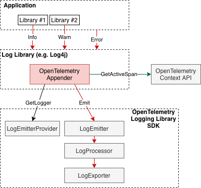
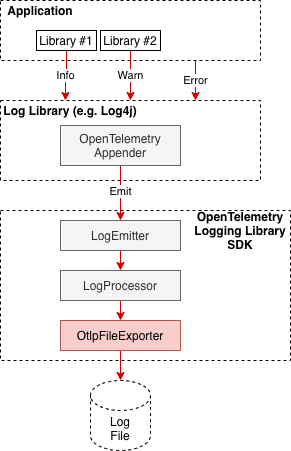
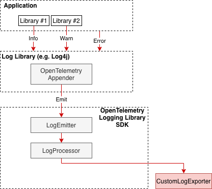
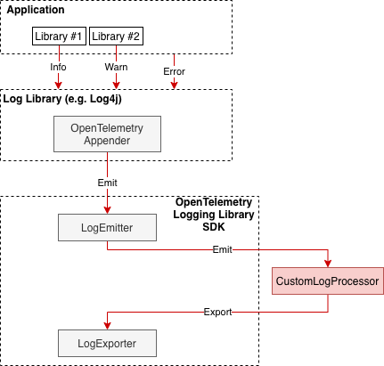

# Logging Library SDK Prototype Specification

Initial draft specification to create prototypes of OpenTelemetry Logging
Library SDKs.

Status: for prototyping. Don't merge to main OpenTelemetry specification until
prototyping is done.

## Motivation

This is a draft proposal for OpenTelemetry Logging Library SDK specification.
The purpose of his proposal is to lay out the initial understanding of
what Logging Library SDKs will look like.

We would like to create prototypes based on this proposal in a few languages.
The learnings from the prototypes will then allow us to refine this proposal and
eventually make the proposed approach part of the OpenTelemetry specification.

The approach proposed in this OTEP is not intended to be merged into the
OpenTelemetry specification after the OTEP itself is approved. We want to have
successful prototypes first. This OTEP is first and foremost a specification and
guidelines on how to create the prototypes.

The specification defines how the OpenTelemetry Logging Library SDK exposes its
functionality to authors of extensions to language-specific 3rd party logging
libraries and to end users that want to produce logs in the
[OpenTelemetry manner](https://github.com/open-telemetry/opentelemetry-specification/blob/main/specification/logs/overview.md).

The specification defines SDK elements that to some extent mirror the
OpenTelemetry
[Trace SDK](https://github.com/open-telemetry/opentelemetry-specification/tree/main/specification/trace).
This ensures uniformity and consistency of the OpenTelemetry specification and
of the implementations across traces and logs. For additional clarity the
definitions in this document refer to the Trace analogs where appropriate.

The descriptions of interfaces and methods in this document are intentionally
very brief. Detailed and precise descriptions will be borrowed from Trace
specification when this OTEP is submitted as a Log specification PR. I kept the
descriptions as short as possible in this document to make reviewing it easy and
fast.

## Specification

Many existing logging libraries have some sort of extension mechanism that
allows to customize how log records are encoded and delivered to their
destinations (for example Appender in Log4j or Core in zapcore). The
OpenTelemetry Logging Library SDK is intended to be used by such extensions to
emit logs in OpenTelemetry formats.

Note: The functionality that this document proposes will be an SDK package. A
logging-related API package may be added in the future if we decide to have an
end-user callable logging API.

We will have the following in the SDK.

### LogEmitterProvider

Methods:

- Get LogEmitter. Accepts the instrumentation library name and version and
  returns a LogEmitter associated with the instrumentation library.
- Shutdown.
- ForceFlush.

LogEmitterProvider can be configured at startup time, to be associated with a
Resource and with LogProcessor/LogExporter pipeline.

### LogEmitter

Methods:

- Emit(LogRecord). Emits a log record. The LogRecord and the Resource and
  Instrumentation library associated with the LogEmitter will be converted into
  a readable LogData and will be pushed through the SDK and the configured
  LogProcessors and LogExporter. It is expected that the caller will populate
  trace context related fields (TraceId,SpanId,TraceFlags) if applicable before
  making the call. Open Question: do we need to also pass the Baggage so that
  log processors and exporters can use it if they see the need?
- Flush.

### LogRecord

See LogRecord
[data model](https://github.com/open-telemetry/opentelemetry-specification/blob/main/specification/logs/data-model.md)
for the list of fields.

Open Question: should LoggerName field be added to the data model to allow
logging libraries to supply it? We have an
[open PR](https://github.com/open-telemetry/opentelemetry-specification/pull/1236).

### LogProcessor

Plugin interface. Analog of SpanProcessor. Interface to hook the log record
emitting action.

Methods:

- Emit(LogData). Call when a log record is ready to be processed and exported.
- Shutdown.
- ForceFlush.

Built-in implementations: SimpleLogProcessor, BatchLogProcessor.

### LogData

Readable LogRecord data plus associated Resource and InstrumentationLibrary.
Analog of SpanData.

### LogExporter

Plugin interface. Analog of SpanExporter. Allows to implement protocol-specific
exporters so that they can be plugged into OpenTelemetry SDK and support sending
of log data.

Methods:

- Export(batch). Exports a batch of LogData.
- Shutdown.

## Usage

### How to Create Log4J Style Appender

An Appender implementation can be used to allow emitting log records via
OpenTelemetry Logging Library exporters. This approach is typically used for
applications which are fine with changing the log transport and is
[one of the supported](https://github.com/open-telemetry/opentelemetry-specification/blob/main/specification/logs/overview.md#direct-to-collector)
log collection approaches.

The Appender implementation will typically acquire a LogEmitter from the global
LogEmitterProvider at startup time, then call LogEmitter.Emit for log records
received from the application.

For languages with implicit Context, the Appender may call Context API to get
the currently
[active Span](https://github.com/open-telemetry/opentelemetry-specification/blob/main/specification/trace/api.md#context-interaction)
and populate TraceId, SpanId, TraceFlags fields of the LogRecord before emitting
it. The log library may also have an alternate way to inject the context into
log records (e.g. MDC in Log4j).

This same approach can be also used for example for:

- Python logging library by creating a Handler.
- Go zap logging library by implementing the Core interface. Note that since
  there is no implicit Context in Go it is not possible to get and use the
  active Span.

Appenders can be created in OpenTelemetry language libraries by OpenTelemetry
maintainers, or by 3rd parties for any logging library that supports a similar
extension mechanism. This specification recommends each OpenTelemetry language
library to include out-of-the-box Appender implementation for at least one most
popular logging library.

### Logging to File

One of the possible approaches to emit and collect logs that OpenTelemetry
supports is via intermediary files. When configuring the LogEmitterProvider,
OTLP File exporter should be used to write logs to a file or stdout in either
OTLP JSON or OTLP Protobuf binary format.

### Logging Directly to OTLP Network Destination

The approach is the same as for logging to a file, except OTLP/gRPC or OTLP/HTTP
exporter implementation is used.

### Implicit Context Injection

When Context is implicitly available (e.g. in Java) it may be fetched by the log
library extension synchronously for every log record by calling the
OpenTelemetry Context API and injecting the span context fields into the
LogRecord before emitting it.

Some log libraries have mechanisms specifically tailored for injecting
contextual information into log records. An example of such a mechanism is Log4j
MDC. When available such mechanisms may be the preferable place to fetch the
span context and inject it into the log records, since it usually allows
fetching of the context to work correctly even when log records are emitted
asynchronously (which otherwise can result in the incorrect implicit context
being fetched.

### Explicit Context

In languages where the Context must be provided explicitly (e.g. Go) the end
user must capture the context and explicitly pass it to the logging subsystem in
order for trace context to be recorded in Log records.

Support for OpenTelemetry for logging libraries in these languages typically can
be implemented in the form of logger wrappers that can capture the context once,
when the span is created and then use the wrapped logger to execute log
statements in a normal way. The wrapper will be responsible for injecting the
captured context in the log records.

This specification does not define how exactly it is achieved since the actual
mechanism depends on the language and the particular logging library used. In
any case the wrappers are expected to make use of the Trace Context API to get
the current active span.

See
[an example](https://docs.google.com/document/d/15vR7D1x2tKd7u3zaTF0yH1WaHkUr2T4hhr7OyiZgmBg/edit#heading=h.4xuru5ljcups)
of how it can be done for zap logging library for Go.

### Custom LogExporter

LogExporter implementations can be plugged into OpenTelemetry Logging Library to send logs via custom protocols.

OTLP/gRPC, OTLP/HTTP, OTLP/File log exporters are provided with OpenTelemetry Logging Library out of the box.

### Custom LogProcessor

LogProcessor implementations can be plugged into the OpenTelemetry Logging
Library to have custom processing of logs before they are exported.

Simple and Batch processors should be provided by the OpenTelemetry Logging
Library out of the box.

## Prior art and alternatives

This specification relies on OpenTelemetry Trace and API specification as much
as possible. It is written after examining existing logging libraries (see
References).

An alternative approach was considered where we had the traditional separation
into API and SDK packages which followed the OpenTelemetry Trace library more
closely. However we found that the alternative approach was artificially trying
to enforce uniformity at the cost of ending up with a worse and less coherent
solution from logs perspective and also would make future introduction of
user-facing logging API more complicated.

## Open questions

- Decide if want to pass the Baggage to LogEmmiter's Emit method. For example
  Spring Cloud Sleuth currently enables appending Sleuth Baggage to log records
  via the slf4j MDC. See
  [Spring documentation](https://docs.spring.io/spring-cloud-sleuth/docs/current/reference/htmlsingle/#features-baggage)
  of this feature.  

- Make final decision on
  [adding LoggerName](https://github.com/open-telemetry/opentelemetry-specification/pull/1236).
  
## Future possibilities

In the future we may also add end-user callable OpenTelemetry Logging API
specification.

## References

- Overview of logging library structure by
  [David Poncelow](https://docs.google.com/document/d/15vR7D1x2tKd7u3zaTF0yH1WaHkUr2T4hhr7OyiZgmBg/edit#)
- Log4J
  [Extending guide](https://logging.apache.org/log4j/2.x/manual/extending.html).
- Python [logging handlers](https://docs.python.org/3/library/logging.handlers.html).
- Zap [Core](https://pkg.go.dev/go.uber.org/zap@v1.16.0/zapcore#Core).
