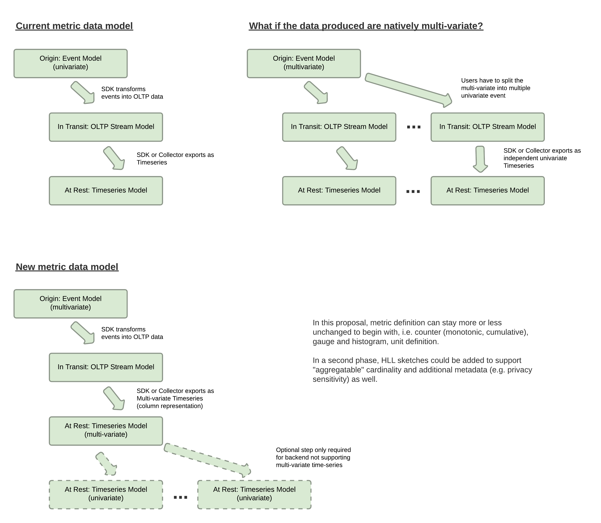
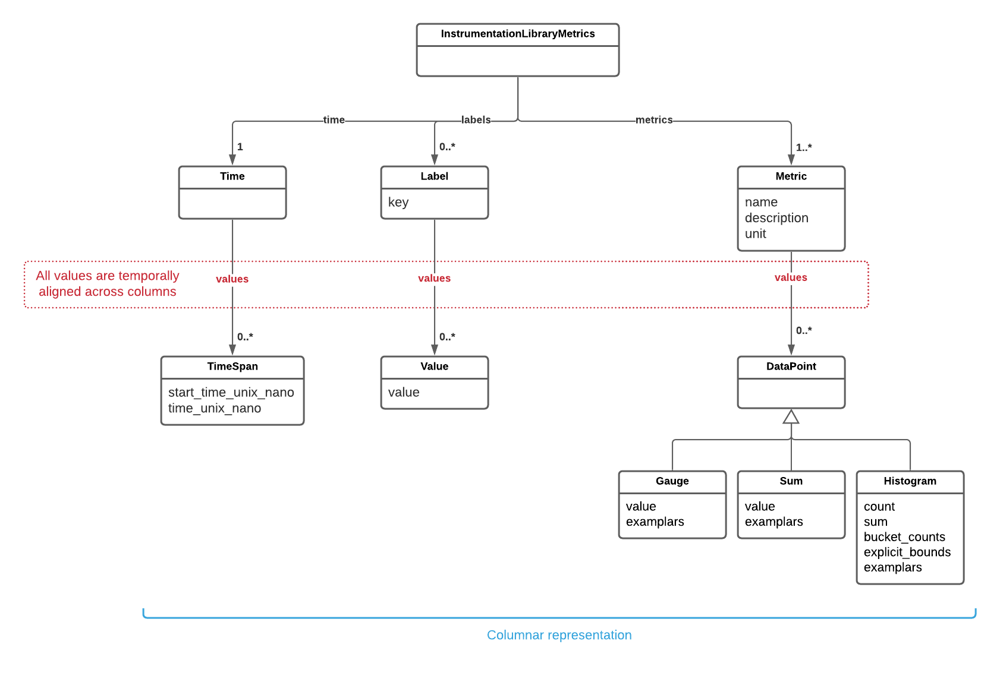

# Multivariate time-series

Generalization of the metrics data model (currently univariate) to support multivariate time-series.

## Motivation

A Multivariate time series has more than one time-dependent variable. Each variable depends not only on its past values but also has 
some dependency on other variables. A 3 axis accelerometer reporting 3 metrics simultaneously; a meteorological weather station reporting 
temperature, cloud cover, dew point, humidity and wind speed; an http transaction chararterized by many interrelated metrics sharing the same 
labels are all common examples of multivariate time-series. 

**With the current version of the OpenTelemetry protocol we force users to transform these multivariate time-series into a collection of 
univariate time-series instead of keeping end-to-end an efficient multivariate representation.**

A transport layer should not constrain such a radical change of representation as the implications are so important, to name a few:
* It's straighforward to translate a multivariate time-series into a collection of univariate time-series but the opposite is much more 
complex to do at scale. To rebuild a multivariate from a set of univariate time-series you need to join potentially dozens of time-series 
together. On a distributed backend environment, it's involve a lot of data movement, complex logic to deal with missing data points, some 
form of join computation, ... 
* This transformation enforced by the protocol has also strong implications on the data usage. Each query on a multivariate time-series will
involve a set of joins. The discoverability of data becomes more complex as every univariate time-series are independent. A data catalog
will not magically discover these relationships.
* **This transformation involves a lot of redundant informations.** All the labels must be redeclared for each univariate time-series. It's
not only more work for the developer but it's also less efficient. Even with a good compression algorithm, a such transformation will be 
much more computationally intensive and less efficient in term of compression ratio.
* This transformation makes simple filtering and aggregation on multivariate time-series much more complex in the OpenTelemetry processor 
layer. This has the potential to transform stateless processors into statefull/complex processors. For example, a user wants to report
http transaction where the sum dns-latency + tcp-con-latency + ssl-handshake-latency + content-transfer-latency + server-processing-latency is greater
than 2s. Defining this expression on a multivariate time-series and implementing it with a processor multivariate compatible will be 
straightforward and stateless. With a collection of univariate time-series it's a different story at every level and it's not going in
the direction of a stateless architecture.

**By generalizing the existing metric data model we can get rid of all these limitations without adding much complexity to the protocol.**
We simplify the implementation of multivariate forecasting and anomaly detection mechanisms. We minimize the risk of seing again a new
telemetry protocol with the only purpose to add a better support for multivariate time-series. Finally, for backends that do not support 
multivariate time-series, a simple transformation to univariate time-series will be simple to implement in their server-side 
OpenTelemetry endpoints.

## Explanation

The following diagram provides a 10,000-feet comparison between the existing metric data model and the multivariate metric
data model proposed in this document. 

As stated before the current metric data model supports univariate time-series, so as a user we have:
* for a specific resource, an instrumentation library that provides a way to report multiple independent metrics,
* and for each metric, a set of metadata such as name, description, unit and a list of data points with their corresponding attributes. 

For resources that natively produce mutlivariate time-series, the user has to transform this time-series into a 
collection of univariate time-series duplicating the same set of attributes again and again. 

In this proposal, we recommend to improve the existing protocol and at the same time significantly change the user 
experience:
* for a specific resource, an instrumentation library will provide a way to report a collection of multivariate time-series.
* for each multivariate time-series, the user will be able to define:
  * a collection of metadata describing each metric.
  * a set of columnar representation for the timestamps, attributes, metric values and examplars (all aligned together).

As multivariate time-series are a superset of univariate time-series, this representation is a generalization of the 
existing model. 

For backends that natively support mutlivariate time-series, the data will be stored without complex processing. For
backends that only support univariate time-series, the data stream will be transformed into a collection of univariate time-series. 

The benefits of this columnar representation are:
* Attributes and timestamps are shared between multiple metrics and are no longer duplicated.
* Creation, serialization, compression and deserialization are much more efficient with a columnar representation at the
  protocol level (see benchmark results).
* Processing operations on multivariate time-series are greatly simplified by keeping attributes, 
  metric values and examplars aligned with their corresponding timestamps. It becomes straightforward to:
  * store multivariate time-series without complex pre-processing in the backend.
  * apply filters and transformations on multiple interrelated metrics in the OpenTelemetry processor layer.   

**TODO UPDATE THIS DIAGRAM**

## Internal details

The three following approaches have been identified to implement this proposal:
1. Add the concept of multivariate time-series in addition to the existing metric object defined in the InstrumentationLibraryMetrics
  message. 
2. Replace the existing Metric message by a generalized version supporting multivariate time-series represented in a columnar encoding.
3. Use the structured logs and introduce the concept of schema to support the definition of metrics directly in the logs.

The first option is fully backward compatible with the existing protocol. 

The second option unify the representation of univariate and multivariate time-series at the protocol level. This approach 
is not backward compatible with the existing protocol.

The third option will require more work, will not leverage the existing metric-oriented processing layer already in place
to filter and aggregate metrics, and will not simplify the understandability of the Open Telemetry model as metrics will be
defined in multiple locations. An alternative to this option will be to unify every data (metric, log, trace) to a unique
internal representation based on the concept of structured event. Although interesting, this option can't easily be 
introduced at this stage of development of the Open Telemetry protocol without a complex modification of the eco-system.

The selection between option 1 and 2 is a decision to be made on the basis of the changes the community is willing to 
accept at this level of protocol maturity. The option 2 offers a more unified experience than option 1 and should be 
preferred if the introduction of incompatible changes are accepted by the community.

[TBD]
From a technical perspective, how do you propose accomplishing the proposal? In particular, please explain:

* How the change would impact and interact with existing functionality
* Likely error modes (and how to handle them)
* Corner cases (and how to handle them)

While you do not need to prescribe a particular implementation - indeed, OTEPs should be about **behaviour**, not implementation! - it may be useful to provide at least one suggestion as to how the proposal *could* be implemented. This helps reassure reviewers that implementation is at least possible, and often helps them inspire them to think more deeply about trade-offs, alternatives, etc.

## Trade-offs and mitigations

Talk about adoption and what we need to do to increase 
[TBD]
*What are some (known!) drawbacks? What are some ways that they might be mitigated?*

*Note that mitigations do not need to be complete *solutions*, and that they do not need to be accomplished directly through your proposal. A suggested mitigation may even warrant its own OTEP!*

## Prior art and alternatives

Existing protocols supporting multivariate time-series
* AWS CloudWatch EMF
* InfluxDB line protocol 
* The Apache Arrow Flight 
* TimescaleDB (PostgreSQL extension)
* Splunk Event Collector 

## Open questions

* Explore the impact of this proposal on the OpenTelementry processor layer.

*What are some questions that you know aren't resolved yet by the OTEP? These may be questions that could be answered through further discussion, implementation experiments, or anything else that the future may bring.*

## Future possibilities

* Column encoding to improve compression ratio (delta encoding, dictionary, ...)

## Examples of multivariate time-series
Some classical examples of multivariate time-series in the context of infrastructure monitoring.

* VM
  * Labels
    * hostname
    * instance-type 
    * ...
  * Metrics 
    * cpu-usage
    * memory-usage
    * disk-usage
    * disk-operation-per-sec
    * network-in
    * network-out
    * ... 
* Processus / POD
  * Labels
    * pod-id
    * pod-labels
    * ...
  * Metrics 
    * cpu-usage
    * memory-usage
    * disk-usage
    * disk-operation-per-sec
    * network-in
    * network-out
    * ... 
* Http transaction
  * Labels
    * url
    * method
    * status
    * ...
  * Metrics
    * dns-latency
    * tls-handshake-latency
    * tcp-connection-latency
    * server-processing-latency
    * content-transfer-latency
    * request-size
    * response-size
    * ... 
