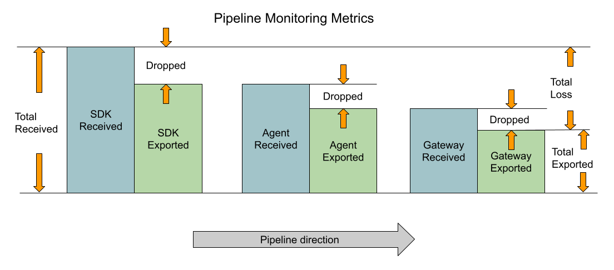

# OpenTelemetry Export-pipeline metrics

Propose a uniform standard for OpenTelemetry SDK and Collector
export-pipeline metrics with three standard levels of detail.

## Motivation

OpenTelemetry has pending requests to standardize the metrics emitted
by SDKs. At the same time, the OpenTelemetry Collector is becoming a
stable and critical part of the ecosystem, and it has different
semantic conventions.  Here we attempt to unify them.

## Explanation

The OpenTelemetry Collector's pipeline metrics were derived from the
OpenCensus collector.  There is no original source material explaining
the current state of metrics in the OTel collector.

### Collector metrics

The OpenTelemetry collector code base was audited for metrics usage
detail around the time of the v0.88.0 release.  Here is a summary of
the current state of the Collector regarding export-pipeline metrics.

The core collector formerly contained a package named `obsreport`,
which has a uniform interface dedicated to each of its components.
This package has been migrated into the commonly-used helper classes
known as `receiverhelper`, `processorhelper`, and `exporterhelper.`

Obsreport is responsible for giving collector metrics a uniform
appearance.  Metric names were created using OpenCensus style, which
uses a `/` character to indicate hierarchy and a `.` to separate the
operative verb and noun.  This library creates metrics named, in
general, `{component-type}/{verb}.{plural-noun}`, with component types
`receiver`, `processor`, and, `exporter`, and with signal-specific
nouns `spans`, `metric_points` and `logs` corresponding with the unit
of information for the tracing, metrics, and logs signals,
respectively.

Earlier adopters of the Collector would use Prometheus to read these
metrics, which does not accept `/` or `.`.  The Prometheus integration
would add a `otelcol_` prefix and replace the invalid characters with
`_`.  The same metric in the example above would appear named
`otelcol_receiver_accepted_spans`, for example.

#### Obsreport receiver

For receivers, the obsreport library counts items in two ways:

1. Receiver `accepted` items.  Items that are received and
   successfully consumed by the pipeline.
2. Receiver `refused` items.  Items that are received and fail to be
   consumed by the pipeline.

Items are exclusively counted in one of these counts.  The lifetime
average failure rate of the receiver com is defined as
`refused / (accepted + refused)`.

#### Collector: Obsreport processor metrics

For processors, the obsreport library counts items in three ways:

1. Processor `accepted` items.  Defined as the number of items that are passed to the next component and return successfully.
2. Processor `dropped` items.  This is a counter of items that are
   deliberately excluded from the output, which will be counted as accepted by the preceding pipeline component but were not transmitted.
3. Processor `refused` items.  Defined as the number of items that are passed to the next component and fail.

Items are exclusively counted in one of these counts.  The average drop rate
can be defined as `dropped / (accepted + dropped + refused)`

#### Collector: Obsreport exporter metrics

The `obsreport_exporter` interface counts spans in two ways:

1. Exporter `sent` items.  Items that are sent and succeed.
2. Receiver `send_failed` items.  Items that are sent and fail.

Items are exclusively counted in one of these counts.  The average
failure rate is defined as `send_failed / (sent + send_failed)`.

### Jaeger trace SDK metrics

Jaeger SDKs expose metrics on the "Reporter", which includes
"Success", "Failure", "Dropped" counters describing the pipeline.  See
[here](https://github.com/jaegertracing/jaeger-client-go/blob/8d8e8fcfd04de42b8482476abac6a902fca47c18/metrics.go#L22-L106).

Jaeger SDK metrics are equivalent to the three metrics produced by
OpenTelemetry Collector processor components.

### Analysis

#### Use of exclusive counters

As we can see by the examples documented above, it is a standard
practice to monitor a telemetry pipeline using three counters to count
successful, failed, and dropped items.  In each of the existing
solutions, because the counters are exclusive, all three counter
values are needed to establish the total loss rate.

Because the number of SDKs generally is greater than collectors, and
because they are in the first position of the pipeline, this is a
significant detail.  When the subject is a single SDK, all three
counters are essential and necessary for a complete understanding of
loss.  The single-SDK loss rate, defined for exclusive counters, is:

```
SingleLossRate = 1 - Success / (Success + Failed + Dropped)
```

However, in a scenario where hundreds or thousands of identical SDKs
are deployed, users may wish to opt-out of such extensive detail.
Reasoning that identical SDKs are likely experiencing the same
failures, users may wish to enable additional detail only in a sample
of SDKs, or only in regions or services where loss is already known to
exist.

To use inclusive counters, in this case, means to use a single metric
name with one or more attributes to subdivide the total into specific
categories.  For example, a total count can be subdivided into
`success=true` and `success=false`.  From the SDK perspective, drops
are counted as failures, and from the Collector perspective we will
find other reasons to count drops separately.  Therefore, the
definition above can be replaced for inclusive counters:

```
SingleLossRate = Total{success=false} / Total{*}
```

By using inclusive counters instead of exclusive counters, it is
possible to establish the total rate of loss with substantially fewer
timeseries, because we only need to distinguish success and failure
the end of the pipeline to determine total loss.

```
PipelineLossRate = LastStageTotal{success=false} / FirstStageTotal{*}
```

Since total loss can be calculated with only a single timneseries per
SDK, this will be specified as the behavior when configuring pipeline
monitoring with basic-level metric detail.

#### Collector perspective

Collector counters are exclusive.  Like for SDKs, items that enter a
processor are counted in one of three ways and to compute a meaningful
ratio requires all three timeseries.  If the processor is a sampler,
for example, the effective sampling rate is computed as
`(accepted+refused)/(accepted+refused+dropped)`.

While the collector defines and emits metrics sufficient for
monitoring the individual pipeline component--taken as a whole, there
is substantial redundancy in having so many exclusive counters.  For
example, when a collector pipeline features no processors, the
receiver's `refused` count is expected to equal the exporter's
`send_failed` count.

When there are several processors, it is primarily the number of
dropped items that we are interested in counting.  When there are
multiple sequential processors in a pipeline, however, counting the
total number of items at each stage in a multi-processor pipeline
leads to over-counting in aggregate.  For example, if you combine
`accepted` and `refused` for two adjacent processors, then remove the
metric attribute which distinguishes them, the resulting sum will be
twice the number of items processed by the pipeline.

### Pipeline monitoring

The term _Stage_ is used to describe the a single component in an
export pipeline.

The term _Station_ is used to describe a location in the export
pipeline where the participating stages are part of the same logical
failure domain.  Typically each SDK or Collector is considered a
station.

#### Station integrity principles

The [OpenTelemetry library guidelines (point
4)](https://github.com/open-telemetry/opentelemetry-specification/blob/main/specification/library-guidelines.md#requirements)
describes a separation of protocol-dependent ("receivers",
"exporters") and protocol-independent ("processors") parts.  We refer
to the combination of parts as a station.

The station concept is called out because within a station, we expect
that the station (software) acts responsibly by design, for the
integrity of the pipeline.  Stations allow data to enter a pipeline
only through receiver components.  Stations are never responsible for
dropping data, because only processor components drop data.  Stations
allow data to leave a pipeline only through exporter components.

Because of station integrity, we can make the following assertions:

1. Data that enters a station is eventually exported or dropped.
2. No other outcomes are possible.

These principles suggest ways to monitor a pipeline, when normal-level
metric detail is configured, to avoid redundancy.  For simple
pipelines, the number of items exported equals the number of items
received minus the number of items dropped, and for simple pipelines
it is sufficient to observe only successes and failures by receiver as
well as items dropped by processors.

#### Practice of error suppression

There is a accepted practice in the OpenTelemetry Collector of
accepting data and returning success before the data is written to its
final destination.  In fact, this is the out-of-the-box default for
most pipelines, because of `exporterhelper` defaults.

Suppressing errors, when it is practiced, means a later stage in the
pipeline must be monitored to detect resource exhaustion, since
earlier stages will not see any failures or experience backpressure.
Because the practice of asynchronous reporting is widespread,
OpenTelemetry Collectors therefore should normally count exported data
in addition to received data, despite creating redundancy when errors
are not suppressed.

#### Pipeline stage-name uniqueness

The Pipeline Stage Name Uniqueness requirement developed here avoids
over-counting in an export pipeline by ensuring that no single metric
name counts items more than once in transit.  This rule prevents
counting items of telemetry sent by SDKs and Collectors in the same
metric; it also prevents counting items of telemetry sent through a
multi-tier arrangement of Collectors using the same metric.

In a standard deployment of OpenTelemetry, we expect one, two, or
three stations in a collection pipeline.  The names given to these
standard set of stations:

- `sdk`: an original source of new telemetry
- `agent`: a collector with operations "local" to the `sdk`
- `gateway`: a collector serving as a proxy to an external service.

This is not meant as an exclusive set of station names.  Users should
be given the ability to configure the station name used by particular
instances of the OpenTelemetry Collector.  It may even be desirable to
support configuring "sub-stations" within a larger pipeline, for
example when there are connectors in use; however, if so, the
collector must enforce that pipeline-stage names are unique within a
station.

#### Pipeline signal type

OpenTelemetry currently has 3 signal types, but it may add more.
Instead of using the signal name in the metric names, we opt for a
general-purpose noun that usefully describes any signal.

The signal-agnostic term used here is "items", referring to spans, log
records, and metric data points.  An attribute to distinguish the
`signal` will be used with name `traces`, `logs`, or `metrics`.

Users are expected to understand that the data item for traces is a
span, for logs is a record, and for metrics is a point.  Users may
opt-in to removing this attribute, in which case items of telemetry
data will be counted in aggregate.  When the `signal` attribute is
removed, loss-rate can likewise only be calculated in aggregate.

#### Pipeline component name

Components are uniquely identified using a descriptive `name`
attribute which encompasses at least a short name describing the type
of component being used (e.g., `batch` for the SDK BatchSpanProcessor
or the Collector batch proessor).

When there is more than one component of a given type active in a
pipeline having the same `domain` and `signal` attributes, the `name`
should include additional information to disambiguate the multiple
instances using the syntax `<type>/<instance>`.  For example, if there
were two `batch` processors in a collection pipeline (e.g., one for
error spans and one for non-error spans) they might use the names
`batch/error` and `batch/noerror`.

#### Pipeline monitoring diagram

The relationship between items received, dropped, and exported is
shown in the following diagram.



### Proposed metrics semantic conventions

The proposed metric names match the following pattern:

| Metric Name               | Meaning                                                            |
|---------------------------|--------------------------------------------------------------------|
| `otel.{station}.received` | Inclusive count of items entering the pipeline at a station.       |
| `otel.{station}.dropped`  | Non-inclusive count of items dropped by a processor in a pipeline. |
| `otel.{station}.exported` | Inclusive count of items exiting the pipeline at a station.        |

The behavior specified for SDKs and Collectors at each level of detail
is different, because SDKs do not receive items from a pipeline and
because they outnumber the other components.

These attributes can be applied to any of the pipeline monitoring
metrics specified here.

| Attributes     | Meaning                                     | Level of detail (Optional) | Examples                                                   |
|----------------|---------------------------------------------|----------------------------|------------------------------------------------------------|
| `otel.signal`  | Name of the telemetry signal                | Basic (Opt-out)            | `traces`, `logs`, `metrics`                                |
| `otel.name`    | Type, name, or "type/name" of the component | Normal (Opt-out)           | `probabilitysampler`, `batch`, `otlp/grpc`                |
| `otel.success` | Boolean: item considered success?           | Normal (Opt-out)           | `true`, `false`                                            |
| `otel.reason`  | Explaination of success/failures.           | Detailed (Opt-in)          | `ok`, `timeout`, `permission_denied`, `resource_exhausted` |
| `otel.scope`   | Name of instrumentation.                    | Detailed (Opt-in)          | `opentelemetry.io/library`                                 |

For example, when a sampler processor drops an item it may report
`success=true`, but when a queue processor drops an item it may report
`success=false`.

#### SDK default configuration

| Metric name         | Enablement level |
|---------------------|------------------|
| `otel.sdk.received` | Basic            |
| `otel.sdk.dropped`  | Normal           |
| `otel.sdk.exported` | Detailed         |

#### Collector default configuration

| Metric name               | Enablement level |
|---------------------------|------------------|
| `otel.{station}.received` | Basic            |
| `otel.{station}.dropped`  | Basic            |
| `otel.{station}.exported` | Basic            |

## Pipeline monitoring as a service

With this specification, users operating OpenTelemetry SDKs and
Collectors sending to a third-party observability system may expect to
be provided with information about telemetry losses.

### Configuration of pipeline monitoring metrics

OpenTelemetry SDKs will be configured by default to send pipeline
monitoring metrics using Meter instances obtained from the global
meter provider.

SDKs authors SHOULD provide users with an option to configure an
alternate destination for pipeline monitoring metrics, so that
pipeline metrics can be monitored independently of ordinary telemetry
data.

### Inference rules for service providers

By design, losses and failures due to intermediate collectors will be
observable to the service provider, as long as all original producers
report pipeline-monitoring metrics.  For all telemetry producers with
basic-level pipeline monitoring enabled, the telemetry system will be
able to compare the actual number of OpenTelemetry spans, metric data
points, and log records received against the numbers that entered the
system's own pipelines.  In aggregate, the number of items entering
the pipeline should match the number of items successfully received,
otherwise the system is capable of reporting the combined losses to
the user.

When losses are unacceptable to the user, or the causes of loss cannot
be resolved through other system indicators, the user (or the system
acting on the user's behalf) may wish to enable normal-level detail
for SDKs or enable metrics for intermediate collectors.  The
additional detail will give the system information that can be used to
narrow down the location(s) and source(s) where loss occurs.

## OpenTelemetry SDKs have no receivers

OpenTelemetry SDKs are special pipeline components because they do not
receive data from an external source.  OpenTelemetry SDKs support
specific, signal-specific features that may appear like standard
receivers or processors in a pipeline, but as specified here, pipeline
monitoring only applies to items of data that are submitted for
export by an SDK-internal mechanism.

There are several examples:

- In the trace SDK, spans are sampled by a component that emulates a
  pipeline processor, but the actions of a sampler are not the same as
  an export pipeline.  While we could count spans not sampled using
  `otel.sdk.dropped` with `success=true` and
  `name=traceidratiosampler`, it could lead to misleading
  interpretation because spans that are unfinished are neither
  `success=true` nor `success=false`.  Different semantic conventions
  should probably be used to monitor sampler components.
- In the metrics SDK, Metric View configuration can cause metric
  events to be "dropped".  We could count all metric data points as
  logically entering a pipeline, and then the ones that are dropped
  would appear as `otel.sdk.dropped` with `success=true` and
  `name=metricreader`, but this would lead to an accounting problem.
  The point of Drop aggregation is to avoid the cost of a metric
  instrument, so we do not which to count what we drop.

For these reasons, the `otel.sdk.received` metric is defined as the
number of items that the SDK produces as input to the pipeline.  This
quantity MUST be the number of items that are are expected for
delivery at the final destination, when the pipeline is operating
correctly and without failures.

## Metrics SDK special considerations

We expect that Metrics SDKs will be used to generate
pipeline-monitoring metrics reporting about themselves.

As stated above, SDKs SHOULD support configuring an alternate Meter
Provider for pipeline-monitoring metrics.  When the global Meter
Provider is used, the Metrics SDK's pipeline will receive its own
pipeline-monitoring metrics.  When a custom Meter Provider is used, a
secondary pipeline will receive the pipeline monitoring metrics, in
which case the secondary pipeline may also self-report for itself.

## Trade-offs and mitigations

The use of three-levels of metric detail may seem like more freedom
than necessary.  Implementors are expected to take advantage of Metric
View configuration in the Metrics SDK for configuring opt-out of
standard attributes (i.e., to remove `otel.signal`, `otel.name`, or
`otel.signal`).  For opt-in attributes (i.e., to configure no
`otel.reason` or `otel.scope` attribute), implementors MAY choose to
enable additional attributes only when configured.

## Prior art and alternatives

Prior work in (this PR)[https://github.com/open-telemetry/semantic-conventions/pull/184].

Issues:
- [Determine how to report dropped metrics](https://github.com/open-telemetry/opentelemetry-specification/issues/1655)
- [How should OpenTelemetry-internal metrics be exposed?](https://github.com/open-telemetry/opentelemetry-specification/issues/959)
- [OTLP Exporter must send client side metrics](https://github.com/open-telemetry/opentelemetry-specification/issues/791)
- [Making Tracing SDK metrics aware](https://github.com/open-telemetry/opentelemetry-specification/issues/381)
