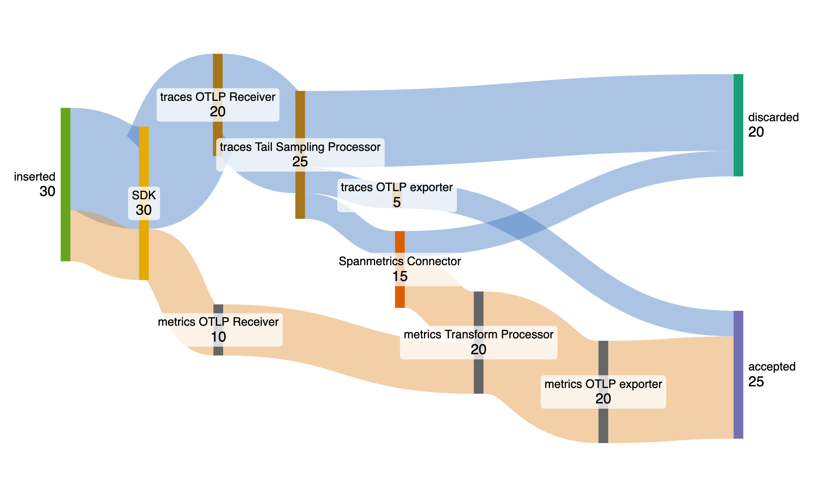

# OpenTelemetry Telemetry Pipeline Metrics

Propose a uniform standard for telemetry pipeline metrics generated by
OpenTelemetry SDKs and Collectors.

## Motivation

OpenTelemetry desires to standardize conventions for the metrics emitted by 
SDKs about success and failure of telemetry reporting. At the same time, the 
OpenTelemetry Collector has existing conventions which are expected to connect 
with metrics emitted by SDKs and have similar definitions.

## Explanation

This document proposes two metric instrument semantics and three overall metric 
instruments for pipeline accounting, considering SDK and Collector pipeline 
metrics as separate, non-intersecting signals for reasons discussed below. The 
three instruments are:

- `otelcol_outgoing_items`: Exported, dropped, and discarded items (Collector)
- `otelcol_incoming_items`: Received and inserted data items (Collector)
- `otelsdk_outgoing_items`: Exported, dropped, and discarded items (SDK)

The fourth instrument, named `otelsdk_incoming_items`, is logically 
well-defined by this proposal, but not necessary or useful, for SDK-specific 
reasons discussed below.

We use the term "pipeline" to describe a directional arrangement of system 
components ("services") which telemetry flows through. Telemetry is incoming to 
a service either by receiving or inserting it. It is outgoing when it is sent 
to a downstream service, dropped, or discarded.

Categories of services defined in this specification are:

- OpenTelemetry SDKs: As telemetry producers, these components are the
  start of a pipeline.
- OpenTelemetry Collectors: The OpenTelemetry Collector contains an
  arrangement of Collector components which receive, process, and export 
  telemetry.

The terms "following"/"follower" and "preceding"/"preceder" refer to the 
relative services after or before another service in a pipeline. The preceding 
service ("preceder") transmits telemetry to the following service ("follower").

An arrangement of discrete pieces of functionality ("components") within a 
service acting as a single unit is called a segment. Segments can be found in 
the OpenTelemetry Collector as Collector pipelines. A Collector can contain 
multiple Collector pipelines which can contain multiple segments. Each segment 
consists of the following components: a receiver, zero or more processors, and 
an exporter. Components can be a part of multiple segments. The terms 
"following" and "preceding" apply to components with the same meaning as for 
services.  For example, an agent pipeline segment forwards to a gateway 
pipeline segment.

## Detailed Design

### Pipeline Conservation

We choose to specify two metric instruments for counting telemetry seen: one 
instrument to account for incoming items and one to account for outgoing items. 
In an ideal pipeline, a conservation rule exists between what goes in and what 
goes out. The use of incoming and outgoing metric instruments is designed to 
enable consistency checks between metrics within a pipeline segment and between 
adjacent segments. When the pipeline is properly functioning and instrumented, 
we expect the sum of incoming items to equal the sum of outgoing items.

### Incoming Items

An item is incoming when it is received from a preceder or inserted by the 
service. Within a segment, the component that receives a telemetry item from a 
preceder increments the incoming item instrument with the attribute 
`origin: received`. Any component that inserts an item into the pipeline should 
increment the incoming item instrument with `origin:inserted`. Even in the case 
of a component both adding a removing an item from the pipeline, the item must 
be counted.  In the case of immediate removal, both incoming and outgoing items 
would be incremented at the same time.

In the context of an OpenTelemetry Collector pipeline, mostly receivers will be 
incrementing incoming items as they receive them. It's also possible that a 
connector or processor could insert items into the pipeline.

### Outgoing Items

An item is outgoing when it is sent from the segment to its following segment 
or removed from the pipeline. Any component that removes an item from the 
pipeline should increment the outgoing item instrument. An item being removed 
from the pipeline doesn't indicate an error (an example of this is sampling). 

In the context of an OpenTelemetry Collector pipeline, mostly exporters will
be incrementing outgoing items as they export them. It's also possible that a
processor or connector could discard items. Any component could encounter an
error leading to removing items from the pipeline.

### Outcomes

Below are the possible outcomes for incoming and outgoing items. 

#### Successful Outcomes

- `accepted`: Indicates a normal, synchronous request success case.
  The item was received by the next segment of the pipeline, which
  returned success.
- `discarded`: Indicates a successful outcome in which the next stage
  of the pipeline does not handle the event, as by a sampling
  processor.

#### Error Outcomes: Transient

- `dropped`: The component introduced an original failure and did not
  send to the next stage in the pipeline.
- `timeout`: The item was in the process of being sent but the request
  timed out, or its deadline was exceeded.  In this case, it is
  undetermined whether the follower saw the item or not.
- `exhausted`: The item was handled by the next stage of the pipeline,
  which returned an error code indicating that it was overloaded.  If
  the resource being exhausted is local and the item was not handled
  by the next stage of the pipeline, record the item `dropped` and
  return a resource-exhausted status code to the preceding component, who will
  record an `exhausted` outcome for incoming items.
- `retryable`: The item was handled by the next stage of the pipeline,
  which returned a retryable error status not covered by any of the
  above values.

#### Error Outcomes: Permanent

- `rejected`: The item was handled by the next stage of the pipeline,
  which returned a permanent error status or partial success status
  indicating that some items could not be accepted.
- `unknown`: May be used when the component is suppressing errors and
  not actually counting successes and failures. As a special case,
  the outcome `deferred:unknown` indicates that a success response
  was given and no information about the actual outcome is available.

#### Error Outcomes: Deferred

- `deferred:<failure outcome>`: Deferred cases are where the preceder receives 
  a success response and the true outcome is failure, but this is not known 
  until later. The item is counted as `deferred:` combined with the failure 
  outcome that would otherwise have been counted. The failure outcome could be 
  transient or permanent. An example of when deferred would be used is in an 
  asynchronous Collector pipeline.

Additional examples of these outcomes can be found in the Appendix.

### Collector Pipelines With Multiple Exporter Components

In an OpenTelemetry Collector pipeline, it's possible to have multiple
exporters. In this case, a telemetry item is counted once as an incoming item,
but, due to fanout, is counted in outgoing items as many times as the number of
exporters. If the pipeline is synchronous, the outcome for the incoming item is
recorded based on the rules in the below order:

1. If there is a permanent error, that is used as the outcome. If there are
   multiple permanent errors, choose them in the following order:
   `rejected`, `deferred:rejected`, `unknown`, `deferred:unknown`.
2. If there is a transient error, that is used as the outcome. If there are
   multiple transient errors, choose them in the following order:
   `dropped`, `deferred:dropped`, `timeout`, `deferred:timeout`, `exhausted`, 
   `deferred:exhausted`, `retryable`, `deferred:retryable`.
3. If there are only successful outcomes, choose them in the following order:
   `accepted`, `discarded`.

### Outcomes Can Be Asymmetric

There are a few reasons why a telemetry item may have a different outcome
between incoming and outgoing item instruments.

One example is when timeouts are configured independently between segments. A
preceding segment's timeout being smaller than a following segment's timeout
may cause outgoing items to have `timeout` outcomes while the corresponding
incoming items have different outcomes.

Another example is an OpenTelemetry Collector pipeline that is asynchronous.
If a receiver responsible for recording the outcome of an incoming item is
given a successful response by its following component, it will record an
`accepted` outcome regardless of the result in, for example, the exporter. For
these cases, exporters are expected to use the `deferred:` outcome categories
to signal to monitoring systems especially the failure outcomes that were not
seen by preceders.

### SDK-specific considerations

OpenTelemetry SDKs receive telemetry from multiple components. In
addition to telemetry originating from OpenTelemetry APIs,
signal-specific bridges also insert telemetry into the SDK pipeline.

The asymmetry between incoming and outgoing item outcomes that is seen for
Collectors is not a consideration for SDKs, because [OpenTelemetry
APIs _by definition_ do not return errors to the
caller](https://github.com/open-telemetry/opentelemetry-specification/blob/main/specification/library-guidelines.md#api-and-minimal-implementation).
The use of an incoming item metric instrument is not specified for SDKs,
even though it can be meaningfully defined, because there is no additional 
information gained from the metric. The origin of sdk_incoming_items is always 
`inserted`, and the incoming item outcomes always match the outgoing item 
outcomes in SDK pipelines. For this reason, there is no 
`otelsdk_incoming_items` in this proposal.

Similarly, SDKs are not meant to use the `deferred:` outcome prefix,
as there is not a meaningful distinction to be made.

Like the OpenTelemetry Collector, SDK pipelines may discard (e.g., by
sampling) and drop (e.g., because queue-full) items.

## Metric instrument summary

The specified counter names are:

- `otelcol_incoming_items`: The number of items received or inserted into a pipeline.
- `otelcol_outgoing_items`: The number of items discarded, dropped, or exported by a Collector pipeline segment.
- `otelsdk_outgoing_items`: The number of items discarded, dropped, or exported by a SDK pipeline segment.

### Recommended conventional attributes

- `otel.error` (boolean): This is true or false depending on whether the
  outcome is considered a failure or a success.  See the chart below.
- `otel.outcome` (string): This describes the outcome in a more specific
  way than `otel.error`.
- `otel.signal` (string): This is the name of the signal (e.g., "logs",
  "metrics", "traces").
- `otel.service` (string): Name of the service.
- `otel.component` (string): Name of the component in a service.
- `otel.pipeline` (string): Name of the pipeline in a service, to distinguish multiple.
- `otel.origin` (string): Only for `otelcol_incoming_items`, to distinguish 
  items `received` from a preceder and items `inserted` by the service/component.

### Success, Outcome matrix

| `otel.outcome`     | `otel.error` | Export Attempted? | Export Success? | Meaning                                                       |
|--------------------|--------------|-------------------|-----------------|---------------------------------------------------------------|
| accepted           | false        | true              | true            | Data (successfully) sent                                      |
| discarded          | false        | false             | true            | Data (successfully) discarded                                 |
| dropped            | true         | false             | false           | Request never started, error returned                         |
| timeout            | true         | true              | false           | Request started, timed out, error returned                    |
| exhausted          | true         | true              | false           | Request started, insufficient resources, error returned       |
| retryable          | true         | true              | false           | Request started, retryable error status, error returned       |
| rejected           | true         | true              | false           | Request completed, permanent error status, error returned     |
| unknown            | true         | true              | true            | Request has unknown outcome                                   |
| deferred:dropped   | true         | false             | true            | Request never started, error NOT returned                     |
| deferred:timeout   | true         | true              | true            | Request started, timed out, error NOT returned                |
| deferred:exhausted | true         | true              | true            | Request started, insufficient resources, error NOT returned   |
| deferred:retryable | true         | true              | true            | Request started, retryable error status, error NOT returned   |
| deferred:rejected  | true         | true              | true            | Request completed, permanent error status, error NOT returned |
| deferred:unknown   | true         | true              | true            | Request has unknown outcome, error NOT returned               |

## Pipeline equations

Defining the above metric instruments allows for accounting for all telemetry 
items in a pipeline within and between segments.

The incoming categories, leading to the first pipeline segment equation:

- **Received**: An item of telemetry was exported from a preceding pipeline segment
- **Inserted**: An item of telemetry was inserted by this pipeline segment

The first equation:

```
Incoming(Segment) == Recieved(Segment) + Inserted(Segment)
```

The outgoing categories, leading to the second pipeline segment equation:

- **Exported**: An attempt was made to export the telemetry to a following pipeline segment
- **Discarded**: Considered success, an item of telemetry was eliminated (i.e., export never attempted)
- **Dropped**: Considered failure, an item of telemetry was eliminated (i.e., export never attempted)

The second equation:

```
Outgoing(Segment) == Discarded(Segment) + Dropped(Segment) + Exported(Segment)
```

Note that the incoming categories match the origin attribute, while the 
outgoing categories look like a pared down version of the outcome attribute. 
However, the exported category here encompasses all outcomes where export 
is attempted.  The `exported` outcome is only when export is successful.

The third equation states that the sum of all incoming items should equal the 
sum of all outgoing items.

```
Incoming(Segment) == Outgoing(Segment)
```

#### Invariant checking

In order to use these equations exactly as written, it is important to
recognize that incoming and outgoing accounting is independent and
that these signals can lead or lag each order, depending on pipeline
configuration.

The simplest way to check the invariants, therefore, is to "drain" the
pipeline so that it is empty, meaning all items have been accounted
for. For the OpenTelemetry Collector, therefore, it should be
possible to verify this and warn about improper accounting during
shutdown. After a pipeline has been drained and the individual
components shut down, we expect the incoming and outgoing instrument
values to match exactly.

### Measuring Pipeline Loss Between Segments

Considering an Exporter and Receiver pair connecting two OpenTelemetry
Collector pipeline segments, we expect ideally the number exported to
match the number received.

```
Exported(Preceder) == Received(Follower)
```

Where Exported and Received counts are defined by the first and second
equations above, noting that Exported excludes Dropped or Discarded
outcomes.

When an exporter retries the same item on failures, the equality changes:

```
Exported(Preceder) <= Received(Follower)
```

However, some outcomes in the preceder don't indicate that the follow ever 
received (and therefore couldn't count) the item. This is in the case where a 
timeout has occurred on the exporter side before any response from the 
follower. In this case, the equality shifts the other way:

```
Exported(Preceder) >= Received(Follower)
```

We can describe exported items that have definitely received a response from 
the follower by removing `retryable` and `timeout`:

```
Exported_Responded(Segment) == Exported(Segment) - Retryable(Segment) - Timeout(Segment)
```

In a real pipeline, therefore, we expect:

```
Exported_Responded(Preceder) <= Received(Follower)
```

When an observability platform detects an out-of-range value, there is
likely to be a defective pipeline or missing instrumentation.

### Measuring Total Pipeline Loss

*WIP: Figure this out. This is a bit subjective. What does an end user expect 
when calculating total items dropped in failure?*

## Example scenarios

### Agent and Gateway


This example shows multiple pipeline segments with varying outcomes captured in 
the same diagram. This is focused on one signal, so signal information isn't 
specified.

*WIP: add details*

### Spanmetrics Connector




This example shows both trace and metric signals sent through an OpenTelemetry 
Collector with a spanmetrics connector as well as multiple exporters.

*WIP: add details*

### Exporterhelper and batch processor

*WIP: add details*

### Retries

*WIP: add details*

## Alternatives Considered

#### Alternative: Don't Count Outcome for Incoming Items

We need this for when earlier components in segments have their own timeouts. 
This allows us to capture the timeout error in an asynchronous Collector 
pipeline. It also helps with accounting for telemetry items in a segment.

#### Alternative: Distinct Metrics Per Outcome

Using one metric instrument per incoming items outcome and one metric 
instrument per outgoing items outcome has known difficulties. To define a ratio 
between any one outcome and the total requires a metric formula defined by all 
the outcomes. On other hand, it is common practice using OpenTelemetry metrics 
to aggregate by attribute. When a single metric instrument is used with an 
attribute for distinct outcomes, it is easier and more convenient to define 
ratios and build area charts from the resulting data.

The use of per-outcome counters is also logically confusing. For example, 
existing OpenTelemetry collector metrics for exporters have both `sent` and 
`send_failed` metrics. However, `sent` only counts success outcomes. A user 
could easily believe that the failure ratio is defined as `send_failed / sent`, 
since (logically) something has to be sent before the send can fail. The 
correct failure ratio using exclusive counters is 
`send_failed / (sent + send_failed)`, but users can easily miss this detail. 
Moreover, when exclusive counters have been defined in this manner, it is 
impossible to define new outcomes, as every formula must be updated.

### Alternative: Indistinct prefixes for SDKs and Collectors

There is a potential to use the same metric names to describe SDK instruments 
and Collector instruments.  However, we find two reasons this unification step 
should be avoided.

1. We seek to avoid aggregations combining first-class SDKs producers, SDK 
   consumer components (i.e., bridges) and Collector producers, which do not 
   have corresponding consumer metrics.
2. (really a specific case of the first) We seek to avoid aggregations that 
   combine OpenTelemetry Collector pipeline metrics with SDK pipeline metrics 
   in the same process, when the OpenTelemetry SDK instruments the 
   OpenTelemetry Collector.

## Appendix

### Exhausted Outcome Callout

The `exhausted` outcome is meant to map to the gRPC RESOURCE_EXHAUSTED
status code and the HTTP 429 status code.  These codes are special and
distinct from the general-purpose `retryable` outcome because:

- The failures they represent should generally be excluded in
  calculating service-level objectives.  When these error codes are
  returned, it is the caller's responsibility to remediate.
- This outcome may lead to specifically different load-balancer
  behavior, so it is an important signal for monitoring pipeline
  health.

### Examples of each outcome

#### Success, Accepted

This is the common success case.  The item(s) were sent to the follower in the 
pipeline and the result was success. It does not matter whether the request was 
deferred or not when telemetry is `accepted`.

#### Success, Discarded

A segment was configured with instructions not to pass certain data. For 
example, a sampler or a filter processor that decides not to pass an item for 
any reason, when it is considered success.

#### Dropped and Deferred-Dropped

(If deferred: A component returned success to its preceder, then ...)

The component never sent the item(s) due to limits in effect. For example, 
shutdown was ordered and the queue could not be drained in time due to a 
limit on parallelism. Another example is dropping due to resource limitations.

#### Timeout and Deferred-Timeout

(If deferred: A component returned success to its preceder, then ...)

The component attempted sending the item(s), and the item(s) did not
succeed before the deadline expired or the timeout elapsed.

#### Exhausted and Deferred-Exhausted

(If deferred: A component returned success to its preceder, then ...)

The component attempted sending the item(s), and the consumer
indicated its (or its consumers') resources were exceeded.

#### Retryable and Deferred-Retryable

(If deferred: A component returned success to its preceder, then ...)

The component attempted sending the item(s), and the response was some
kind of retryable condition not covered by `timeout` or `exhausted`.
This could be host unavailable, for example.

#### Rejected and Deferred-Rejected

(If deferred: A component returned success to its preceder, then ...)

The component attempted sending the item(s), but the response was some
kind of non-retryable condition.  This could be host access denied,
for example.

#### Deferred-Unknown

A component returned success to its preceder, then the component
attempted sending the item(s), and that is all we know.