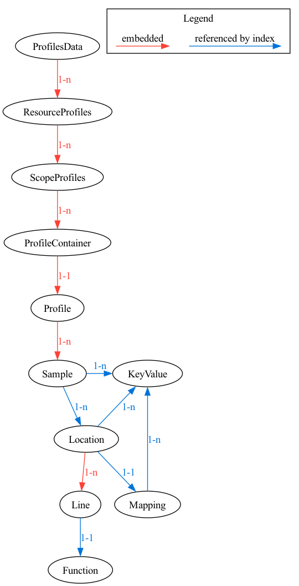

# Profiles Data Model

Introduce Data Model for Profiles signal to OpenTelemetry.

<!-- toc -->
* [Motivation](#motivation)
* [Design Notes](#design-notes)
  * [Design Goals](#design-goals)
* [Data Model](#data-model)
  * [Relationships Diagram](#relationships-diagram)
  * [Message Descriptions](#message-descriptions)
    * [`ProfilesData`](#profilesdata)
    * [`ResourceProfiles`](#resourceprofiles)
    * [`ScopeProfiles`](#scopeprofiles)
    * [`Profile`](#profile)
    * [`AttributeSet`](#attributeset)
    * [`Stacktrace`](#stacktrace)
    * [`Link`](#link)
    * [`Location`](#location)
    * [`Mapping`](#mapping)
    * [`Function`](#function)
  * [Example Payloads](#example-payloads)
  * [Notable differences compared to other signals](#notable-differences-compared-to-other-signals)
    * [Relationships between messages](#relationships-between-messages)
    * [Arrays of Integers vs Arrays of Structures](#arrays-of-integers-vs-arrays-of-structures)
* [Trade-offs and mitigations](#trade-offs-and-mitigations)
* [Prior art and alternatives](#prior-art-and-alternatives)
  * [Benchmarking](#benchmarking)
    * [Average profile](#average-profile)
    * [Average profile with timestamps added to each sample](#average-profile-with-timestamps-added-to-each-sample)
    * [Ruby profile with very deep stacktraces](#ruby-profile-with-very-deep-stacktraces)
    * [Large profile](#large-profile)
* [Open questions](#open-questions)
* [Future possibilities](#future-possibilities)
<!-- toc -->

## Motivation

This is a proposal of a data model and semantic conventions that allow to represent profiles coming from a variety of different applications or systems. Existing profiling formats can be unambiguously mapped to this data model. Reverse mapping from this data model is also possible to the extent that the target profiling format has equivalent capabilities.

The purpose of the data model is to have a common understanding of what a profile is, what data needs to be recorded, transferred, stored and interpreted by a profiling system.

## Design Notes

### Design Goals

These goals are based on the vision set out in [Profiling Vision OTEP](./0212-profiling-vision.md)

* Make profiling compatible with other signals
* Standardize profiling data model for industry-wide sharing and reuse
* Profilers must be able to be implementable with low overhead and conforming to OpenTelemetry-wide runtime overhead / intrusiveness and wire data size requirements.

The last point is particularly important in the context of profiling. Profilers generate large amounts of data, and users of profiling technology are very sensitive to the overhead that profiling introduces. In the past high overhead has been a blocker for wider adoption of continuous profiling and was one of the reasons why profiling was not used in production environments. Therefore it is important to make sure that the overhead, particularly on the client side, and intermediaries (e.g collector) of the profiling signal is minimal.

## Data Model

This section describes various protobuf messages that are used to represent profiles data.

### Relationships Diagram

The following diagram shows the relationships between the messages. Relationships between messages are represented by either embedding one message in another (red arrows), or by referencing a message by index in a lookup table (blue arrows). More on that in [Relationships between messages](#relationships-between-messages) section below.

In addition to that, relationship between `stacktraces`, `attribute_sets` and `links` is implicit. This is because of a "arrays of integers vs arrays of structures" optimization that is used. The relationship between these messages creates an ephemeral structure commonly referred to as a "Sample". More on that in [Arrays of Integers vs Arrays of Structures](#arrays-of-integers-vs-arrays-of-structures) section below.

For more information on that see



### Message Descriptions

#### `ProfilesData`

ProfilesData represents the profiles data that can be stored in a persistent storage,
OR can be embedded by other protocols that transfer OTLP profiles data but do not
implement the OTLP protocol.
The main difference between this message and collector protocol is that
in this message there will not be any "control" or "metadata" specific to
OTLP protocol.
When new fields are added into this message, the OTLP request MUST be updated
as well.


#### `ResourceProfiles`

A collection of ScopeProfiles from a Resource.


#### `ScopeProfiles`

A collection of Profiles produced by an InstrumentationScope.


#### `Profile`

Profile embeds one or more ProfileType messages — this allows to represent multiple profiles of different types (e.g allocated objects and allocated bytes) in a single Profile message.


#### `AttributeSet`

AttributeSet represents a set of attributes. It is referenced from other tables
and not embedded because it is common for multiple samples to have the same
set of attributes


#### `Stacktrace`

TODO


#### `Link`

A pointer from a profile to a trace span. This allows for linking between profiles and traces.


#### `Location`

Describes function and line table debug information.


#### `Mapping`

TODO


#### `Function`

TODO


#### `Sample`

Sample is an ephemeral structure. It is not explicitly represented as a protobuf message, instead it is represented by stacktraces, links, attribute sets, values and timestamps tables in `ProfileType` message. The connection is based on the order of the elements in the corresponding tables.


### Example Payloads


### Notable differences compared to other signals

Due to the increased performance requirements associated with profiles signal, here are some notable differences between profiles signal and other signals.

#### Relationships between messages

There are two main ways relationships between messages are represented:
* by embedding a message into another message (standard protobuf way)
* by referencing a message by index (similar to how it's done in pprof)

Profiling signal is different from most other ones in that we use the referencing technique a lot to represent relationships between messages where there is a lot of duplication happening. This allows to reduce the size of the resulting protobuf payload and the number of objects that need to be allocated to parse such payload.

This pseudocode illustrates the conceptual difference between the two approaches. Note that this example is simplified for the sake of clarity:
```
// denormalized
"samples": [
  {
    "stacktrace": ["foo", "bar"],
    "value": 100,
    "attribute_set": {
      "endpoint": "/v1/users",
    }
  }, {
    "stacktrace": ["foo", "bar", "baz"],
    "value": 200,
    "attribute_set": {
      "endpoint": "/v1/users",
    }
  }
],

// normalized
"attribute_sets": [
  {
    "endpoint": "/v1/users",
  }
],
"samples": [
  {
    "stacktrace": ["foo", "bar"],
    "value": 100,
    "attribute_set_index": 0
  }, {
    "stacktrace": ["foo", "bar", "baz"],
    "value": 200,
    "attribute_set_index": 0
  }
],
```

Explanation: because multiple samples have the same attributes, we can store them in a separate table and reference them by index. This reduces the size of the resulting protobuf payload and the number of objects that need to be allocated to parse such payload.

Benchmarking shows that this approach is significantly more efficient in terms of CPU utilization, memory consumption and size of the resulting protobuf payload. See [Prior art and alternatives](#prior-art-and-alternatives) for more details.

#### Arrays of Integers vs Arrays of Structures

Another optimization technique that we use to reduce the size of the resulting protobuf payload and the number of objects that need to be allocated to parse such payload is using arrays of integers instead of arrays of structures to represent messages. This technique is used in conjunction with the referencing technique described above. Here's pseudocode that illustrates the approach. Note that this example is simplified for the sake of clarity:
```
// normalized
"samples": [
  {
    "stacktrace_id": 1,
    "value": 100
  }, {
    "stacktrace_id": 2,
    "value": 200
  }
],

// arrays
"stacktrace_ids": [1, 2],
"values": [100, 200]
```

Explanation: samples are a collection of references to other messages plus a value. The standard way of representing those is to put each `Sample` into a separate message, and link from `Sample` to other messages. Parsing / generating such payloads creates many individual objects that runtime has to track. The second represenation puts values of the same kind into separate arrays. This reduces the size of the resulting protobuf payload and the number of objects that need to be allocated to parse / generate such payload.

Benchmarking shows that this approach is significantly more efficient in terms of CPU utilization, memory consumption and size of the resulting protobuf payload. See [Prior art and alternatives](#prior-art-and-alternatives) for more details.


## Trade-offs and mitigations

The biggest trade-off was made between the performance characteristics of the format and it's simplicity. The emphasis was made on the performance characteristics, which resulted in a cognitively more complex format.

Authors feel like the complexity is justified for the following reasons:
* as presented in [Design Goals](#design-goals) section, the performance characteristics of the format are very important for the profiling signal
* the format is not intended to be used directly by the end users, but rather by the developers of profiling systems that are used to and are expected to be able to handle the complexity. It is not more complex than other existing formats

Alternative formats that are simpler to understand were considered, but they were not as efficient in terms of CPU utilization, memory consumption and size of the resulting protobuf payload. See [next chapter, Prior art and alternatives](#prior-art-and-alternatives) for more details.

## Prior art and alternatives

The specification presented here was heavily inspired by pprof. Multiple alternative representations were considered, including:
* `denormalized` representation, where all messages are embedded and no references by index are used. This is the simplest representation, but it is also the least efficient (by a huge margin) in terms of CPU utilization, memory consumption and size of the resulting protobuf payload.
* `normalized` representation, where messages that repeat often are stored in separate tables and are referenced by indices. See [this chapter](#relationships-between-messages) for more details. This technique reduces the size of the resulting protobuf payload and the number of objects that need to be allocated to parse such payload.
* `arrays` representation, which is based on `normalized` representation, but uses arrays of integers instead of arrays of structures to represent messages. See [this chapter](#arrays-of-integers-vs-arrays-of-structures) for more details. It further reduces the number of allocations, and the size of the resulting protobuf payload.

### Benchmarking

[Benchmarking results](https://docs.google.com/spreadsheets/d/1Q-6MlegV8xLYdz5WD5iPxQU2tsfodX1-CDV1WeGzyQ0/edit#gid=0) showed that `arrays` representation is the most efficient in terms of CPU utilization, memory consumption and size of the resulting protobuf payload. Some notable benchmark results are showcased below:

#### Average profile

The source for this test is a single 10 second pprof profile collected from a simple go program. It represents a typical profile that is collected from a running application. You can see that the `arrays` representation is the most efficient in terms of memory allocations and size of the resulting protobuf payload.

|name|bytes|gzipped_bytes|retained_objects|unique_label_sets|bytes_allocated|allocs|
|---|---|---|---|---|---|---|
|BenchmarkAveragePprof-10|8,030|3,834|n/a|1|n/a|n/a|
|BenchmarkAverageDenormalized-10|83,187|3,829|3,167|1|1,027,424|3,191|
|BenchmarkAverageNormalized-10|7,955|3,416|706|1|867,488|1,037|
|BenchmarkAverageArrays-10|7,742|3,311|584|1|869,648|880|

#### Average profile with timestamps added to each sample

The source is the same as in the previous example, but this time there were timestamps added to each sample in the profile. `arrays` representation remains the most efficient one.

|name|bytes|gzipped_bytes|retained_objects|unique_label_sets|bytes_allocated|allocs|
|---|---|---|---|---|---|---|
|BenchmarkAverageTimestampsPprof-10|9,478|3,865|n/a|1|n/a|n/a|
|BenchmarkAverageTimestampsDenormalized-10|119,526|4,154|4,482|1|1,125,320|4,893|
|BenchmarkAverageTimestampsNormalized-10|9,637|3,549|941|1|890,192|1,873|
|BenchmarkAverageTimestampsArrays-10|9,560|3,381|684|1|894,472|1,680|

#### Ruby profile with very deep stacktraces

The source for this test is an aggregated pprof profile collected from a Ruby application that has very deep stacktraces. You can see that the `arrays` representation is the most efficient in terms of memory allocations and size of the resulting protobuf payload (``).

|name|bytes|gzipped_bytes|retained_objects|unique_label_sets|bytes_allocated|allocs|
|---|---|---|---|---|---|---|
|BenchmarkRuby1Pprof-10|1,869,563|115,323|n/a|1|n/a|n/a|
|BenchmarkRuby1Denormalized-10|163,107,484|4,716,442|3,840,093|1|319,473,752|3,844,625|
|BenchmarkRuby1Normalized-10|1,931,905|130,556|41,457|1|18,982,328|78,242|
|BenchmarkRuby1Arrays-10|1,886,964|120,382|23,481|1|18,365,800|42,284|

#### Large profile

The source for this test is an aggregated pprof profile collected from a Go application over a large period of time. This one shows that the `arrays` representation remains the most efficient, however, the `gzipped_bytes` number is a little bit larger.

|name|bytes|gzipped_bytes|retained_objects|unique_label_sets|bytes_allocated|allocs|
|---|---|---|---|---|---|---|
|BenchmarkLargePprof-10|16,767,419|4,625,632|n/a|163|n/a|n/a|
|BenchmarkLargeDenormalized-10|969,446,655|71,246,645|24,036,740|163|2,140,322,432|24,429,954|
|BenchmarkLargeNormalized-10|17,813,931|4,874,456|2,068,600|163|208,793,736|4,217,313|
|BenchmarkLargeArrays-10|16,980,323|5,779,036|964,989|163|218,418,624|3,396,515|

## Open questions

Client implementations are out of scope for this OTEP. At the time of writing this we do have a reference implementation in Go, as well as a working backend and collector, but they are not yet ready for production use. We are also working on a reference implementation in Java. We are looking for contributors to help us with other languages.

## Future possibilities

<!-- What are some future changes that this proposal would enable? -->


