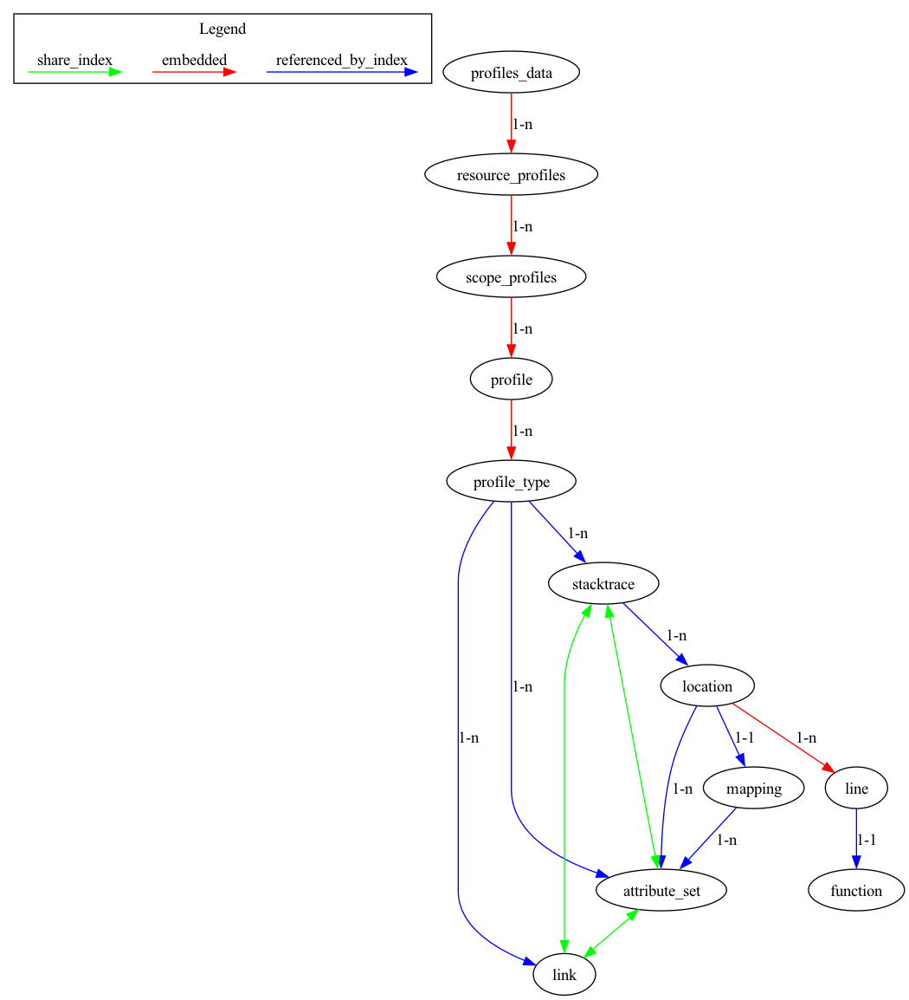

# Profiles Data Format

Introduces Data Model for Profiles signal to OpenTelemetry.

*This document is a DRAFT*


<!-- toc -->
* [Motivation](#motivation)
* [Design Notes](#design-notes)
  * [Design Goals](#design-goals)
* [Data Model](#data-model)
  * [Relationships Diagram](#relationships-diagram)
  * [Message Descriptions](#message-descriptions)
    * [Message `ProfilesData`](#message-profilesdata)
    * [Message `ResourceProfiles`](#message-resourceprofiles)
    * [Message `ScopeProfiles`](#message-scopeprofiles)
    * [Message `Profile`](#message-profile)
    * [Message `ProfileType`](#message-profiletype)
    * [Message `Sample`](#message-sample)
    * [Message `Stacktrace`](#message-stacktrace)
    * [Message `AttributeSet`](#message-attributeset)
    * [Message `Link`](#message-link)
    * [Message `Location`](#message-location)
    * [Message `Mapping`](#message-mapping)
    * [Message `Function`](#message-function)
  * [Example Payloads](#example-payloads)
    * [Simple example](#simple-example)
  * [Notable differences compared to other signals](#notable-differences-compared-to-other-signals)
    * [Relationships between messages](#relationships-between-messages)
    * [Arrays of Integers vs Arrays of Structures](#arrays-of-integers-vs-arrays-of-structures)
* [Trade-offs and mitigations](#trade-offs-and-mitigations)
* [Prior art and alternatives](#prior-art-and-alternatives)
  * [Benchmarking](#benchmarking)
    * [Average profile](#average-profile)
    * [Average profile with timestamps added to each sample](#average-profile-with-timestamps-added-to-each-sample)
    * [Ruby profile with very deep stacktraces](#ruby-profile-with-very-deep-stacktraces)
    * [Large profile](#large-profile)
  * [Semantic Conventions](#semantic-conventions)
  * [Decision Log](#decision-log)
* [Open questions](#open-questions)
* [Future possibilities](#future-possibilities)
<!-- toc -->

## Motivation

This is a proposal of a data model and semantic conventions that allow to represent profiles coming from a variety of different applications or systems. Existing profiling formats can be unambiguously mapped to this data model. Reverse mapping from this data model is also possible to the extent that the target profiling format has equivalent capabilities.

The purpose of the data model is to have a common understanding of what a profile is, what data needs to be recorded, transferred, stored and interpreted by a profiling system.

## Design Notes

### Design Goals

These goals are based on the vision set out in [Profiling Vision OTEP](./0212-profiling-vision.md):

* Make profiling compatible with other signals
* Standardize profiling data model for industry-wide sharing and reuse
* Profilers must be able to be implementable with low overhead and conforming to OpenTelemetry-wide runtime overhead / intrusiveness and wire data size requirements.

The last point is particularly important in the context of profiling. Profilers generate large amounts of data, and users of profiling technology are very sensitive to the overhead that profiling introduces. In the past high overhead has been a blocker for wider adoption of continuous profiling and was one of the reasons why profiling was not used in production environments. Therefore it is important to make sure that the overhead of handling the profiling data on the client side as well as in intermediaries (e.g collector) is minimal.

## Data Model

This section describes various protobuf messages that are used to represent profiles data.

### Relationships Diagram

The following diagram shows the relationships between the messages. Relationships between messages are represented by either embedding one message in another (red arrows), or by referencing a message by index in a lookup table (blue arrows). More on that in [Relationships between messages](#relationships-between-messages) section below.

In addition to that, relationship between `stacktraces`, `attribute_sets` and `links` is implicit and based on the order of references to these objects in corresponding reference lists within a `ProfileType` message. The relationship between these messages creates an ephemeral structure called "Sample". More on that in [Arrays of Integers vs Arrays of Structures](#arrays-of-integers-vs-arrays-of-structures) section below.



### Message Descriptions

<!-- messages -->
#### Message `ProfilesData`

ProfilesData represents the profiles data that can be stored in a persistent storage,
OR can be embedded by other protocols that transfer OTLP profiles data but do not
implement the OTLP protocol.
The main difference between this message and collector protocol is that
in this message there will not be any "control" or "metadata" specific to
OTLP protocol.
When new fields are added into this message, the OTLP request MUST be updated
as well.


#### Message `ResourceProfiles`

A collection of ScopeProfiles from a Resource.

<details>
<summary>Field Descriptions</summary>

##### Field `resource`

The resource for the profiles in this message.
If this field is not set then no resource info is known.


##### Field `scope_profiles`

A list of ScopeProfiles that originate from a resource.


##### Field `schema_url`

This schema_url applies to the data in the "resource" field. It does not apply
to the data in the "scope_profiles" field which have their own schema_url field.
</details>


#### Message `ScopeProfiles`

A collection of Profiles produced by an InstrumentationScope.

<details>
<summary>Field Descriptions</summary>

##### Field `scope`

The instrumentation scope information for the profiles in this message.
Semantically when InstrumentationScope isn't set, it is equivalent with
an empty instrumentation scope name (unknown).


##### Field `profiles`

A list of Profiles that originate from an instrumentation scope.


##### Field `schema_url`

This schema_url applies to all profiles and profile events in the "profiles" field.
</details>


#### Message `Profile`

A Profile represents a single profile generated by a profiler. It has an ID and it has a start time and end time. Profile contains lookup tables for Stacktraces, Mappings, Locations, Functions, Links, AttributeSets, and strings.

Profile embeds one or more ProfileType messages — this allows to represent multiple profile types (e.g allocated objects and allocated bytes) in a single Profile message.

<details>
<summary>Field Descriptions</summary>

##### Field `profile_id`

A unique identifier for a profile. The ID is a 16-byte array. An ID with
all zeroes is considered invalid.
This field is required.


##### Field `start_time_unix_nano`

start_time_unix_nano is the start time of the profile.
Value is UNIX Epoch time in nanoseconds since 00:00:00 UTC on 1 January 1970.
This field is semantically required and it is expected that end_time >= start_time.


##### Field `end_time_unix_nano`

end_time_unix_nano is the end time of the profile.
Value is UNIX Epoch time in nanoseconds since 00:00:00 UTC on 1 January 1970.
This field is semantically required and it is expected that end_time >= start_time.


##### Field `attributes`

attributes is a collection of key/value pairs. Note, global attributes
like server name can be set using the resource API.


##### Field `dropped_attributes_count`

dropped_attributes_count is the number of attributes that were discarded. Attributes
can be discarded because their keys are too long or because there are too many
attributes. If this value is 0, then no attributes were dropped.


##### Field `original_payload`

This is the original profile as retrieved from the profiler. For example, this can be a pprof or jfr encoded profile. The reason users might want to include these is because some formats are very generic and can not be easily converted to a more structured format.
TODO: add a field that indicates the format of the original payload?


##### Field `stacktraces`

A lookup table of Stacktraces. Other messages refer to Stacktraces in this table by index.


##### Field `mappings`

A lookup table of Mappings. Other messages refer to Mappings in this table by index.


##### Field `locations`

A lookup table of Locations. Other messages refer to Locations in this table by index.


##### Field `functions`

A lookup table of Functions. Other messages refer to Functions in this table by index.


##### Field `links`

A lookup table of Links to trace spans associated with this profile. Other messages refer to Links in this table by index. The first message must be an empty Link — this represents a null Link.


##### Field `attribute_sets`

A lookup table of AttributeSets. Other messages refer to AttributeSets in this table by index. The first message must be an empty AttributeSet — this represents a null AttributeSet.


##### Field `string_table`

A lookup table of strings. Other messages refer to strings in this table by index.
The 0-th element must be an empty string ("").


##### Field `profile_types`

List of profile types included in this profile. The first item in the list is considered to be the "default" profile type. Example profile types are allocated objects or allocated bytes.
</details>


#### Message `ProfileType`

Represents a single profile type. It implicitly creates a connection between Stacktraces, Links, AttributeSets, values and timestamps. The connection is based on the order of the elements in the corresponding lists. This implicit connection creates an ephemeral structure called Sample. The length of reference lists must be the same. It is acceptable however for timestamps, links and attribute set lists to be empty. It is not acceptable for stacktrace or values lists to be empty.

<details>
<summary>Field Descriptions</summary>

##### Field `aggregation_temporality`

aggregation_temporality describes if the aggregator reports delta changes
since last report time, or cumulative changes since a fixed start time.


##### Field `sample_rate`

Profiler sample rate in Hz. This parameter indicates the frequency at which samples are collected, specifically for CPU profiles. Common values are 99 or 100. [Optional].


##### Field `type_index`

Index into the string table for the type of the sample. Example values are "cpu", "alloc_objects", "alloc_bytes", "block_contentions". Full list is defined in https://github.com/open-telemetry/semantic-conventions


##### Field `unit_index`

Index into the string table for the unit of the sample. Example values are "ms", "ns", "samples", "bytes". Full list is defined in https://github.com/open-telemetry/semantic-conventions


##### Field `stacktrace_indices`

List of indices referring to Stacktraces in the Profile's stacktrace table.


##### Field `link_indices`

List of indices referring to Links in the Profile's link table. Each link corresponds to a Stacktrace in stacktrace_indices list. Length must match stacktrace_indices length. [Optional]


##### Field `attribute_set_indices`

List of indices referring to AttributeSets in the Profile's attribute set table. Each attribute set corresponds to a Stacktrace in stacktrace_indices list. Length must match stacktrace_indices length. [Optional]


##### Field `values`

List of values. Each value corresponds to a Stacktrace in stacktrace_indices list. Length must match stacktrace_indices length.


##### Field `timestamps`

List of timestamps. Each timestamp corresponds to a Stacktrace in stacktrace_indices list. Length must match stacktrace_indices length.
</details>


#### Message `Sample`

Sample is an ephemeral structure. It is not explicitly represented as a protobuf message, instead it is represented by stacktraces, links, attribute sets, values and timestamps tables in `ProfileType` message. The connection is based on the order of the elements in the corresponding tables. For example, AttributeSet with index 1 corresponds to a Stacktrace located at index 1 in stacktraces table, and a Value located at index 1 in values table. Together they form a Sample.


#### Message `Stacktrace`

A stacktrace is a sequence of locations. Order of locations goes from callers to callees. Many stacktraces will point to the same locations. The link between stacktraces, attribute sets, links, values and timestamps is implicit and is based on the order of the elements in the corresponding tables in ProfileType message.


#### Message `AttributeSet`

AttributeSet represents a set of attributes. Multiple Samples, Locations and Mappings may have the same attributes and that's why this is a separate message. These are stored in a lookup table in a Profile. These are referenced by index from other messages.

<details>
<summary>Field Descriptions</summary>

##### Field `attributes`

Attributes associated with a specific Sample, Location or a Mapping.
attributes is a collection of key/value pairs. Note, global attributes
like server name can be set using the resource API.


##### Field `dropped_attributes_count`

dropped_attributes_count is the number of attributes that were discarded. Attributes
can be discarded because their keys are too long or because there are too many
attributes. If this value is 0, then no attributes were dropped.
</details>


#### Message `Link`

Represents a relationship between a Sample (ephemeral structure represented by references to a Stacktrace, AttributeSet, Link + value and a timestamp) and a trace span. This allows for linking between specific Samples within a profile and traces.

<details>
<summary>Field Descriptions</summary>

##### Field `trace_id`

A unique identifier of a trace that this linked span is part of. The ID is a
16-byte array.


##### Field `span_id`

A unique identifier for the linked span. The ID is an 8-byte array.
</details>


#### Message `Location`

Describes function and line table debug information. These are stored in a lookup table in a Profile. These are referenced by index from other messages.

<details>
<summary>Field Descriptions</summary>

##### Field `mapping_index`

The id of the corresponding profile.Mapping for this location.
It can be unset if the mapping is unknown or not applicable for
this profile type.


##### Field `address`

The instruction address for this location, if available.  It
should be within [Mapping.memory_start...Mapping.memory_limit]
for the corresponding mapping. A non-leaf address may be in the
middle of a call instruction. It is up to display tools to find
the beginning of the instruction if necessary.


##### Field `line`

Multiple line indicates this location has inlined functions,
where the last entry represents the caller into which the
preceding entries were inlined.
E.g., if memcpy() is inlined into printf:
line[0].function_name == "memcpy"
line[1].function_name == "printf"


##### Field `attribute_set_indices`

Reference to an attribute set from the Profile's attribute set table.
</details>


#### Message `Mapping`

Describes the mapping from a binary to its original source code. These are stored in a lookup table in a Profile. These are referenced by index from other messages.

<details>
<summary>Field Descriptions</summary>

##### Field `memory_start`

Address at which the binary (or DLL) is loaded into memory.


##### Field `memory_limit`

The limit of the address range occupied by this mapping.


##### Field `file_offset`

Offset in the binary that corresponds to the first mapped address.


##### Field `filename_index`

The object this entry is loaded from.  This can be a filename on
disk for the main binary and shared libraries, or virtual
abstractions like "[vdso]". Index into string table


##### Field `build_id_index`

A string that uniquely identifies a particular program version
with high probability. E.g., for binaries generated by GNU tools,
it could be the contents of the .note.gnu.build-id field. Index into string table


##### Field `attribute_set_indices`

Reference to an attribute set from the Profile's attribute set table.
</details>


#### Message `Function`

Represents a function in a source file. These are stored in a lookup table in a Profile. These are referenced by index from other messages.

<details>
<summary>Field Descriptions</summary>

##### Field `name_index`

Name of the function, in human-readable form if available. Index into string table


##### Field `system_name_index`

Name of the function, as identified by the system.
For instance, it can be a C++ mangled name. Index into string table


##### Field `filename_index`

Source file containing the function. Index into string table


##### Field `start_line`

Line number in source file.
</details>


<!-- messages -->

### Example Payloads

#### Simple example

Considering the following example presented in a modified collapsed format:
```
foo;bar;baz 100 region=us,trace_id=0x01020304010203040102030401020304,span_id=0x9999999999999999 1687841528000000
foo;bar 200 region=us
```

It represents 2 samples:
* one for stacktrace `foo;bar;baz` with value `100`, attributes `region=us`, linked to trace `0x01020304010203040102030401020304` and span `0x9999999999999999`, and timestamp `1687841528000000`
* one for stacktrace `foo;bar` with value `200`, attributes `region=us`, no link, no timestamp

The resulting profile in OTLP format would look like this (in YAML format):
```
resource_profiles:
  - resource:
      attributes: null
    schema_url: todo
    scope_profiles:
      - profiles:
          - attribute_sets:
              - attributes: null
              - attributes:
                  - key: region
                    value:
                      Value:
                        string_value: us
            functions:
              - name_index: 1
              - name_index: 2
              - name_index: 3
            links:
              - span_id: ""
                trace_id: ""
              - span_id: "9999999999999999"
                trace_id: "01020304010203040102030401020304"
            locations:
              - line:
                  - {}
              - line:
                  - function_index: 1
              - line:
                  - function_index: 2
            profile_types:
              - attribute_set_indices:
                  - 1
                  - 1
                link_indices:
                  - 1
                  - 0
                stacktrace_indices:
                  - 0
                  - 1
                timestamps:
                  - 1.687841528e+15
                  - 0
                values:
                  - 100
                  - 200
            stacktraces:
              - location_indices:
                  - 0
                  - 1
                  - 2
              - location_indices:
                  - 0
                  - 1
            string_table:
              - ""
              - foo
              - bar
              - baz
            attributes: null
            profile_id: 0102030405060708090a0b0c0d0e0f10
        scope:
          attributes: null
```


### Notable differences compared to other signals

Due to the increased performance requirements associated with profiles signal, here are some notable differences between profiles signal and other signals.

#### Relationships between messages

There are two main ways relationships between messages are represented:
* by embedding a message into another message (standard protobuf way)
* by referencing a message by index (similar to how it's done in pprof)

Profiling signal is different from most other ones in that we use the referencing technique a lot to represent relationships between messages where there is a lot of duplication happening. This allows to reduce the size of the resulting protobuf payload and the number of objects that need to be allocated to parse such payload.

This pseudocode illustrates the conceptual difference between the two approaches. Note that this example is simplified for the sake of clarity:
```
// denormalized
"samples": [
  {
    "stacktrace": ["foo", "bar"],
    "value": 100,
    "attribute_set": {
      "endpoint": "/v1/users"
    }
  }, {
    "stacktrace": ["foo", "bar", "baz"],
    "value": 200,
    "attribute_set": {
      "endpoint": "/v1/users"
    }
  }
],

// normalized
"attribute_sets": [
  {
    "endpoint": "/v1/users"
  }
],
"samples": [
  {
    "stacktrace": ["foo", "bar"],
    "value": 100,
    "attribute_set_index": 0
  }, {
    "stacktrace": ["foo", "bar", "baz"],
    "value": 200,
    "attribute_set_index": 0
  }
],
```

Explanation: because multiple samples have the same attributes, we can store them in a separate table and reference them by index. This reduces the size of the resulting protobuf payload and the number of objects that need to be allocated to parse such payload.

Benchmarking shows that this approach is significantly more efficient in terms of CPU utilization, memory consumption and size of the resulting protobuf payload. See [Prior art and alternatives](#prior-art-and-alternatives) for more details.

#### Arrays of Integers vs Arrays of Structures

Another optimization technique that we use to reduce the size of the resulting protobuf payload and the number of objects that need to be allocated to parse such payload is using arrays of integers instead of arrays of structures to represent messages. This technique is used in conjunction with the referencing technique described above. Here's pseudocode that illustrates the approach. Note that this example is simplified for the sake of clarity:
```
// normalized
"samples": [
  {
    "stacktrace_index": 1,
    "value": 100
  }, {
    "stacktrace_index": 2,
    "value": 200
  }
],

// arrays
"stacktrace_indices": [1, 2],
"values": [100, 200]
```

Explanation: in `normalized` representation samples are a collection of references to other messages plus a value. The standard way of representing those is to put each `Sample` into a separate message, and link from `Sample` to other messages. Parsing / generating such payloads creates many individual objects that runtime has to track. The second `arrays` representation puts values of the same kind into separate arrays. This reduces the size of the resulting protobuf payload and the number of objects that need to be allocated to parse / generate such payload.

Benchmarking shows that this approach is significantly more efficient in terms of CPU utilization, memory consumption and size of the resulting protobuf payload. See [Prior art and alternatives](#prior-art-and-alternatives) for more details.


## Trade-offs and mitigations

The biggest trade-off was made between the performance characteristics of the format and it's simplicity. The emphasis was made on the performance characteristics, which resulted in a cognitively more complex format.

Authors feel like the complexity is justified for the following reasons:
* as presented in [Design Goals](#design-goals) section, the performance characteristics of the format are very important for the profiling signal
* the format is not intended to be used directly by the end users, but rather by the developers of profiling systems that are used to and are expected to be able to handle the complexity. It is not more complex than other existing formats

Alternative formats that are simpler to understand were considered, but they were not as efficient in terms of CPU utilization, memory consumption and size of the resulting protobuf payload. See [next chapter, Prior art and alternatives](#prior-art-and-alternatives) for more details.

## Prior art and alternatives

The specification presented here was heavily inspired by pprof. Multiple alternative representations were considered, including:
* `denormalized` representation, where all messages are embedded and no references by index are used. This is the simplest representation, but it is also the least efficient (by a huge margin) in terms of CPU utilization, memory consumption and size of the resulting protobuf payload.
* `normalized` representation, where messages that repeat often are stored in separate tables and are referenced by indices. See [this chapter](#relationships-between-messages) for more details. This technique reduces the size of the resulting protobuf payload and the number of objects that need to be allocated to parse such payload.
* `arrays` representation, which is based on `normalized` representation, but uses arrays of integers instead of arrays of structures to represent messages. See [this chapter](#arrays-of-integers-vs-arrays-of-structures) for more details. It further reduces the number of allocations, and the size of the resulting protobuf payload.

### Benchmarking

[Benchmarking results](https://docs.google.com/spreadsheets/d/1Q-6MlegV8xLYdz5WD5iPxQU2tsfodX1-CDV1WeGzyQ0/edit#gid=0) showed that `arrays` representation is the most efficient in terms of CPU utilization, memory consumption and size of the resulting protobuf payload. Some notable benchmark results are showcased below:

#### Average profile

The source for this test is a single 10 second pprof profile collected from a simple go program. It represents a typical profile that is collected from a running application. You can see that the `arrays` representation is the most efficient in terms of memory allocations and size of the resulting protobuf payload.

|name|bytes|gzipped_bytes|retained_objects|unique_label_sets|bytes_allocated|allocs|
|---|---|---|---|---|---|---|
|BenchmarkAveragePprof-10|8,030|3,834|n/a|1|n/a|n/a|
|BenchmarkAverageDenormalized-10|83,187|3,829|3,167|1|1,027,424|3,191|
|BenchmarkAverageNormalized-10|7,955|3,416|706|1|867,488|1,037|
|BenchmarkAverageArrays-10|7,742|3,311|584|1|869,648|880|

#### Average profile with timestamps added to each sample

The source is the same as in the previous example, but this time there were timestamps added to each sample in the profile. `arrays` representation remains the most efficient one.

|name|bytes|gzipped_bytes|retained_objects|unique_label_sets|bytes_allocated|allocs|
|---|---|---|---|---|---|---|
|BenchmarkAverageTimestampsPprof-10|9,478|3,865|n/a|1|n/a|n/a|
|BenchmarkAverageTimestampsDenormalized-10|119,526|4,154|4,482|1|1,125,320|4,893|
|BenchmarkAverageTimestampsNormalized-10|9,637|3,549|941|1|890,192|1,873|
|BenchmarkAverageTimestampsArrays-10|9,560|3,381|684|1|894,472|1,680|

#### Ruby profile with very deep stacktraces

The source for this test is an aggregated pprof profile collected from a Ruby application that has very deep stacktraces. You can see that the `arrays` representation is the most efficient in terms of memory allocations and size of the resulting protobuf payload (``).

|name|bytes|gzipped_bytes|retained_objects|unique_label_sets|bytes_allocated|allocs|
|---|---|---|---|---|---|---|
|BenchmarkRuby1Pprof-10|1,869,563|115,323|n/a|1|n/a|n/a|
|BenchmarkRuby1Denormalized-10|163,107,484|4,716,442|3,840,093|1|319,473,752|3,844,625|
|BenchmarkRuby1Normalized-10|1,931,905|130,556|41,457|1|18,982,328|78,242|
|BenchmarkRuby1Arrays-10|1,886,964|120,382|23,481|1|18,365,800|42,284|

#### Large profile

The source for this test is an aggregated pprof profile collected from a Go application over a large period of time. This one shows that the `arrays` representation remains the most efficient, however, the `gzipped_bytes` number is a little bit larger.

|name|bytes|gzipped_bytes|retained_objects|unique_label_sets|bytes_allocated|allocs|
|---|---|---|---|---|---|---|
|BenchmarkLargePprof-10|16,767,419|4,625,632|n/a|163|n/a|n/a|
|BenchmarkLargeDenormalized-10|969,446,655|71,246,645|24,036,740|163|2,140,322,432|24,429,954|
|BenchmarkLargeNormalized-10|17,813,931|4,874,456|2,068,600|163|208,793,736|4,217,313|
|BenchmarkLargeArrays-10|16,980,323|5,779,036|964,989|163|218,418,624|3,396,515|

### Semantic Conventions

TODO: describe things like profile types and units


### Decision Log

There were many other alternatives considered during the design process. See [Decision Log](https://github.com/open-telemetry/opentelemetry-proto-profile/blob/54bba7a86d839b9d29488de8e22d8c567d283e7b/opentelemetry/proto/profiles/v1/decision-log.md#L0-L1) for more information about various decisions that were made during the design process.

## Open questions

Client implementations are out of scope for this OTEP. At the time of writing this we do have a reference implementation in Go, as well as a working backend and collector, but they are not yet ready for production use. We are also working on a reference implementation in Java. We are looking for contributors to help us with other languages.

## Future possibilities

<!-- What are some future changes that this proposal would enable? -->


