# Span structure for messaging scenarios

The existing semantic conventions for messaging contain a [list of examples](https://github.com/open-telemetry/opentelemetry-specification/blob/main/specification/trace/semantic_conventions/messaging.md#examples),
each specifying the spans with their attributes and relationships that should
be created for a given messaging scenario.

Many users writing instrumentation for messaging systems expressed confusion
about those examples. The relationships between spans defined in the examples
don't follow a well-documented and consistent pattern, which creates confusion
for users whose use cases don't fit any of the given examples.

This OTEP aims at defining consistent conventions about what spans to create
for messaging scenarios, and at defining how those spans relate to each other.
Instrumentors should be able to rely on a consistent set of conventions, as
opposed to deducing conventions from a set of examples.

This OTEP is based on [OTEP 0173](0173-messaging-semantic-conventions.md),
which defines basic terms and describes messaging scenarios that should be
supported by messaging semantic conventions. It also relies on context
propagation requirements put forth in the [specification](https://github.com/open-telemetry/opentelemetry-specification/blob/28d02cc310d9c789b5faac58f9939bf735adadb5/specification/trace/semantic_conventions/messaging.md#context-propagation)
and detailed in [OTEP 0205](0205-messaging-semantic-conventions-context-propagation).

* [Motivation](#motivation)
* [Terminology](#terminology)
* [Stages of producing and consuming messages](#stages-of-producing-and-consuming-messages)
* [Trace structure](#trace-structure)
* [Proposed changes and additions to the messaging semantic conventions](proposed-changes-and-additions-to-the-messaging-semantic-conventions)
  - [Operation name](operation-name)
  - [Span kind](span-kind)
  - [Span relationships](span-relationships)
* [Examples](#examples)
* [Future possibilities](#future-possibilities)
  - [Intermediary instrumentation](#intermediary-instrumentation)

## Motivation

Tracking the path of an individual message through a distributed system poses
several challenges. Messaging systems allow for asynchronous workflows, which
means that the stages of producing and consuming a message can be separated by
a considerable time gap (this can be minutes, hours, or days). Furthermore, one
cannot rely on consistent instrumentation across all parts of the system that
touch a message. Correlating producer and consumer stages are expected even when
the intermediary forwarding the message between them is not instrumented.
Finally, batching of messages can happen in many different parts of a message
processing workflow, be it batch publishing, batch receiving, batch processing,
or batch settling.

Despite all those challenges, requirements for instrumentation of messaging
scenarios are high. Besides correlating spans that model the different
processing stages of a message, it should also be possible to determine the
end-to-end latency of processing a message. If intermediaries are not
instrumented, this shouldn't impact the correlation of producer and consumer
stages. If, on the other hand, intermediaries are instrumented, spans from
intermediary instrumentation should seamlessly integrate with producer and
consumer instrumentation. This integration should not require any changes in
producer or consumer instrumentation, and it should not cause any changes to
the relationships of producer and consumer spans. Furthermore, it should be
possible to provide tracing instrumentation as an out-of-the-box experience
from messaging SDKs, without requiring any additional custom instrumentation
from the user.

This OTEP aims at proposing consistent guidelines for creating spans that model
the stages of the messaging flow, and correlating those in a way so that the
requirements sketched above can be met in a consistent way across messaging
scenarios and different messaging systems.

## Terminology

For terms used in this document, refer to [OTEP 173](#0173-messaging-semantic-conventions.md#terminology).

## Stages of producing and consuming messages

Producing and consuming a message involves five stages:

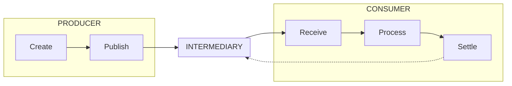

1. The producer creates a message.
2. The producer publishes the message to an intermediary.
3. The consumer receives the message from an intermediary.
4. The consumer processes the message.
5. The consumer settles the message by notifying the intermediary that the
   message was processed. In some cases (fire-and-forget scenarios, or when
   settlement happens on the broker), the settlement stage does not exist.

The semantic conventions described below define how to model those stages with
spans.

## Trace structure

### Producer

Producers are responsible for injecting a creation context into a message.
Subsequent consumers will use this context to link consumer traces to producer
traces. Ideally, each message gets a unique and distinct creation context
assigned. However, as a context must refer to a span this would require the
creation of a distinct span for each message, which is not feasible in all
scenarios. In certain batching scenarios where many messages are created and
published in large batches, creating a span for every single message would
obfuscate traces and is not desirable. Thus instrumentation libraries and
auto-instrumentation should default to creating a unique and distinct context
per message, but may support configuration or other ways to change this default
behavior.

For each producer scenario, a "Publish" span needs to be created. This span
measures the duration of the call or operation that provides messages for
sending or publishing to an intermediary. This call or operation (and the
related "Publish" span) can either refer to a single message or a batch of
multiple messages.

It is recommended to create a "Create" span for every single message. "Create"
spans can be created during the "Publish" operation as children of the
"Publish" span. Alternatively, "Create" spans can be created independently of
the "Publish" operation.

If a "Create" span exists for a message, its context must be injected into the
message. If no "Create" span exists for a message, the context of the related
"Publish" span must be injected into the message.

### Consumer

For many use cases, it is not possible to rely on the presence of "Process"
spans for correlating producer with consumer traces: there are cases where a
dedicated processing operation cannot be identified, or where processing
happens in a different trace. Furthermore, processing operations often are not
covered by messaging libraries and SDKs, but take place in application code.
Consistently creating spans for "Processing" operations would require either
effort from the application owner to correctly instrument those operations, or
additional capabilities of messaging libraries and SDKs (e. g. hooks for
processing callbacks, which can then be instrumented by the libraries or SDKs).

While it is possible to create "Process" spans and correlate those with
consumer traces in certain cases, this is not something that can be generally
required. Therefore, it is more feasible to require the creation of "Deliver"
spans (for push-based APIs) or "Receive" spans (for pull-based APIs) to
correlate producer with consumer traces.

#### Instrumenting push-based scenarios

In push-based consumer scenarios, the delivery of messages is not initiated by
the application code. Instead, callbacks or handlers are registered and then
called by messaging SDKs to forward messages to the application.

A "Deliver" span covers the call of such a callback or handler and should link
to the "Create" or "Publish" spans of all messages that are forwarded via the
respective call. 

#### Instrumenting pull-based scenarios

In pull-based consumer scenarios, the delivery of messages is requested by the
application code. This usually involves a blocking call, which returns zero or
more messages on completion.

A "Receive" span covers such calls and should link to the "Create" or "Publish"
spans of all messages that are forwarded via the respective call. 

#### General considerations for both push-based and pull-based scenarios

The operations modelled by "Deliver" or "Receive" spans do not strictly refer
to receiving the message from intermediaries, but instead refer to the
application receiving messages for processing. If messages are fetched from the
intermediary and forwarded to the application in one go, the whole operation
might be covered by a "Deliver" or "Receive" span. However, libraries or SDKs
might pre-fetch messages from intermediaries and cache those messages, and only
forward messages to the application at a later time. In this case, the
operation of pre-fetching and caching should not be covered by the "Deliver" or
"Receive" spans.

Operations covered by "Deliver" or "Receive" can forward zero messages (e. g.
to notify the application that no message is available for processing), one
message, or multiple messages (a batch of messages). "Deliver" and "Receive"
spans should link to the "Create" or "Publish" span of the messages forwarded,
thus those spans can link to zero, one, or multiple "Create" spans.

If the operation covered by "Deliver" or "Receive" forwards exactly one
message, in addition to creating a link to the "Create" span, the "Create" span
may also be used as a parent of the "Deliver" or "Receive" span. While this is
not possible for all scenarios (e. g. when receiving a batch of messages, or
when parenting "Deliver" or "Receive" spans to an ambient context), it can
improve the user experience in some scenarios.

#### Settlement
Messages can be settled in a variety of different ways. In some cases, messages
are not settled at all (fire-and-forget), or settlement happens on the broker.
In other cases settlement operations are triggered manually by the user, and in
callback scenarios settlement can be automatically triggered by messaging SDKs
based on return values of callbacks.

A "Settle" span should be created for every settlement operation, no matter which party triggered it.
SDKs will, in some cases, auto-settle messages in
push-scenarios when messages are delivered via callbacks. In cases where it is
possible, it is recommended to create the "Settle" span in the scope of the
"Deliver" span.

Alternatively, an event can be created instead of a "Settle" span. Events could
be added to "Deliver" spans or to ambient spans.

"Settle" spans may link to "Create" or "Publish" spans of the messages that are
settled, however, for some settlement scenarios this is not feasible or
possible.

## Proposed changes and additions to the messaging semantic conventions

### Operation name

The following operations related to messages are covered by these semantic
conventions:

| Operation name | Description |
|----------------|-------------|
| `publish`      | One or more messages are provided for publishing to an intermediary. |
| `create`       | A message is created. |
| `receive`      | One or more messages are requested by a consumer. |
| `deliver`      | One or more messages are passed to a consumer. |
| `settle`       | One or more messages are settled. |

For further details about each of those operations refer to the [section about trace structure](#trace-structure).

### Span kind

[Span kinds](https://github.com/open-telemetry/opentelemetry-specification/blob/main/specification/trace/api.md#spankind)
SHOULD be set according to the following table, based on the operation a span describes.

| Operation name | Span kind|
|----------------|-------------|
| `publish`      | `PRODUCER`, if no `create` spans are present. |
| `create`       | `PRODUCER` |
| `receive`      | `CONSUMER` |
| `deliver`      | `CONSUMER` |

The kind of `settle` spans should be set according to the [generic specification about span kinds](https://github.com/open-telemetry/opentelemetry-specification/blob/main/specification/trace/api.md#spankind),
e. g. it should be set to `CLIENT` if the `settle` spans models a synchronous call
to the intermediary.

Setting span kinds according to this table ensures that span links between
consumers and producers always go from a `PRODUCER` span on the producer side to
a `CONSUMER` span on the consumer side. This allows analysis tools to interpret
linked traces without the need for additional semantic hints.

### Span relationships

#### Producer spans

"Publish" spans SHOULD be created for operations of providing messages for
sending or publishing to an intermediary. A single "Publish" span can account
for a single message, or for multiple messages (in the case of providing
messages in batches). "Create" spans MAY be created. A single "Create" span
SHOULD account only for a single message.

If a "Create" span exists for a message, its context SHOULD be injected into
the message. If no "Create" span exists, the context of the related "Publish"
span SHOULD be injected into the message.

#### Consumer spans

##### Push-based scenarios

"Deliver" spans SHOULD be created for operations of passing messages to the
application when those operations are not initiated by the application
code.

##### Pull-based scenarios

"Receive" spans SHOULD be created for operations of passing messages to the
application when those operations are initiated by the application code.

##### General considerations

"Deliver" or "Receive" spans MUST NOT be created for messages which are not
forwarded to the caller, but are pre-fetched or cached by messaging
libraries or SDKs.

A single "Deliver" or "Receive" span can account for a single message, for
multiple messages (in case messages are passed for processing as batches), or
for no message at all (if it is signalled that no messages were received).  For
each message it accounts for, the "Deliver" or "Receive" span SHOULD link to
the "Create" or "Publish" span for the message. In addition, if it is possible
the "Create" or "Publish" span MAY be set as a parent of the "Deliver" or
"Receive" span.

#### Settlement spans

"Settle" spans or events SHOULD be created for every manually or automatically
triggered settlement operation. A single "Settle" span can account for a
single message or for multiple messages (in case messages are passed for
settling as batches). For each message it accounts for, the "Settle" span
MAY link to the "Create" or "Publish" span of the message.

## Examples

This section contains a list of examples illustrating the use of the
conventions outlined above. Green boxes denote spans that are required to
exist in order to conform to those conventions. Other boxes denote spans that
are not required and covered by the conventions, but are hopefully helpful in
understanding how messaging spans can be integrated into an overall trace flow.
Solid arrows denote parent/child relationships, dotted arrows denote link
relationships.

### Single message producer, single message push-based consumer

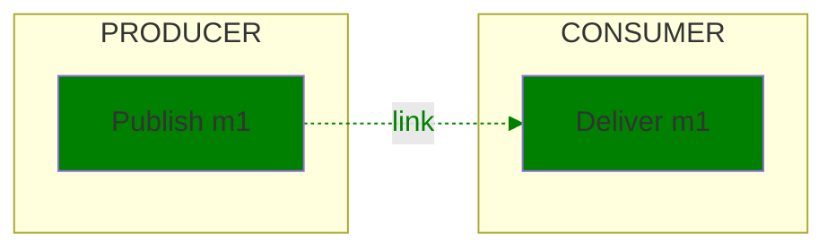

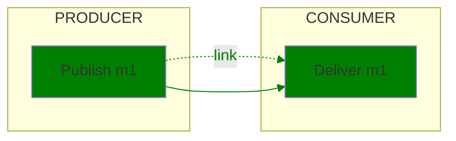

### Single message producer, single message push-based consumer with manual settlement

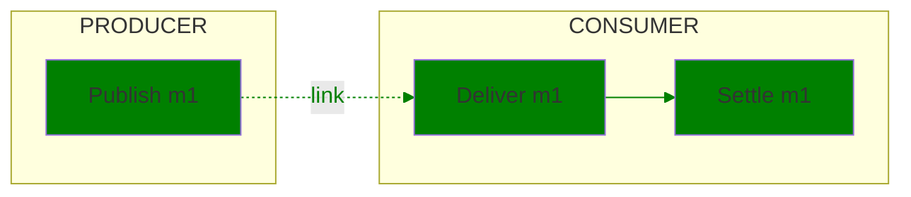

### Single message producer, single message push-based consumer with auto-settlement

### Batch message producer with "Create" spans, single message pull-based consumer

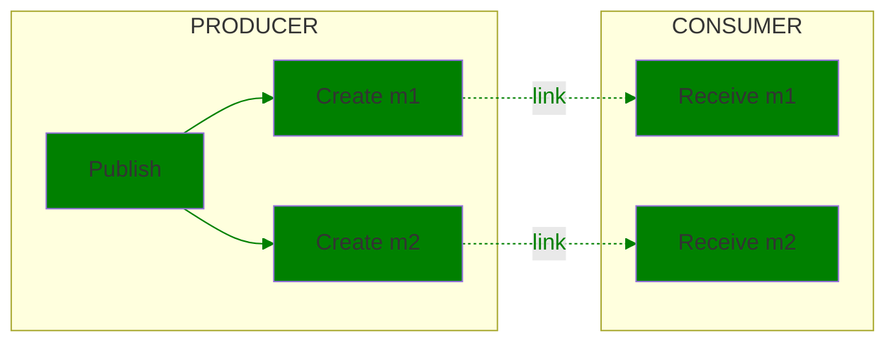

### Batch message producer, single message push-based consumer

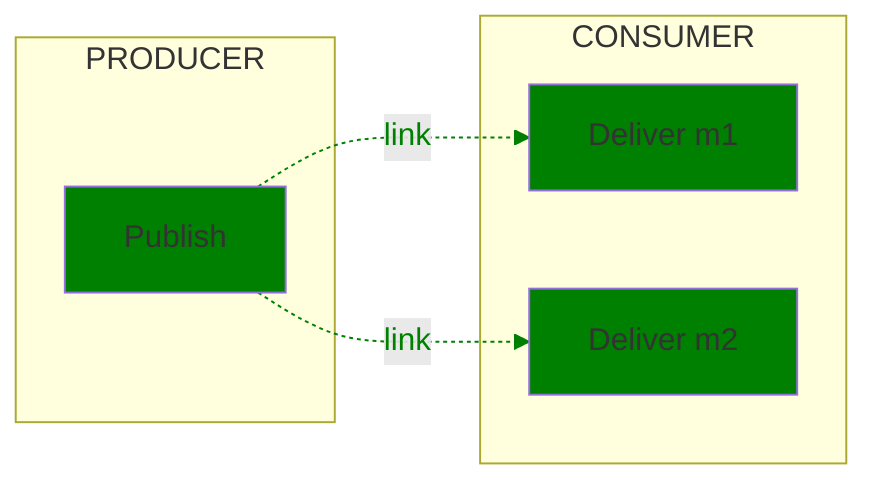

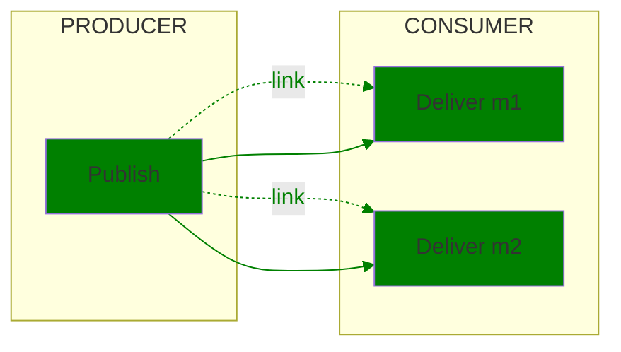

### Batch message producer with "Create" spans populated before publish, single message pull-based consumer

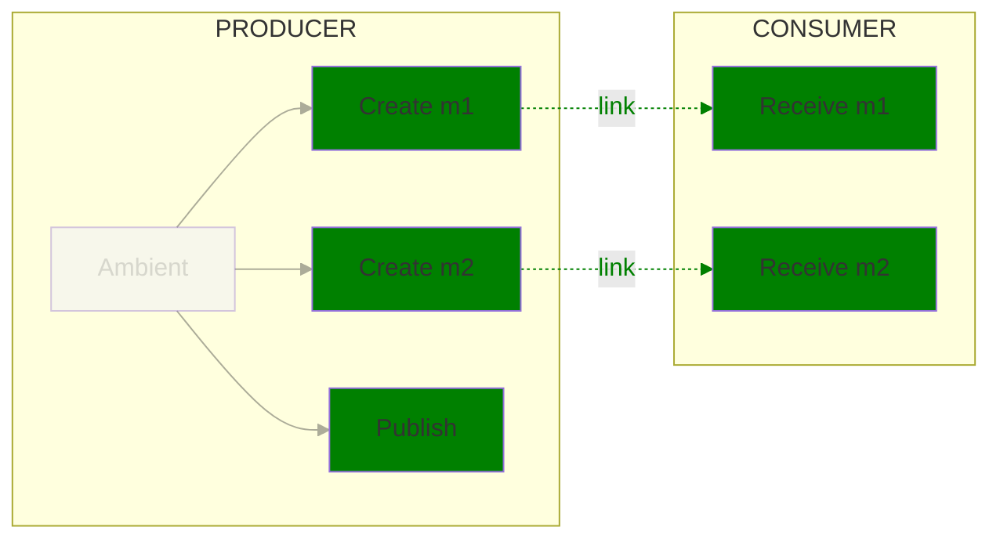

### Single message producers, batch push-based consumer with process spans

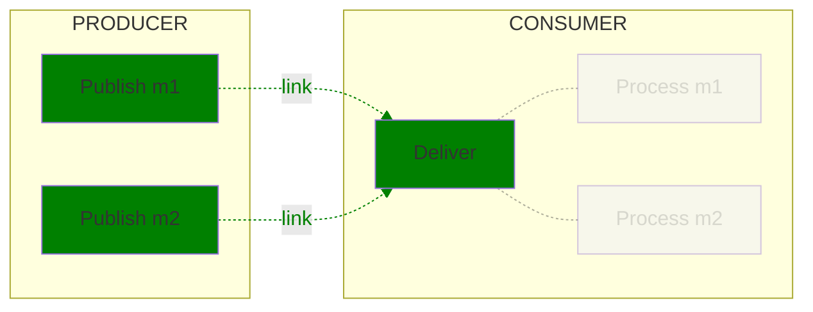

### Single message producers, batch pull-based consumer with process spans

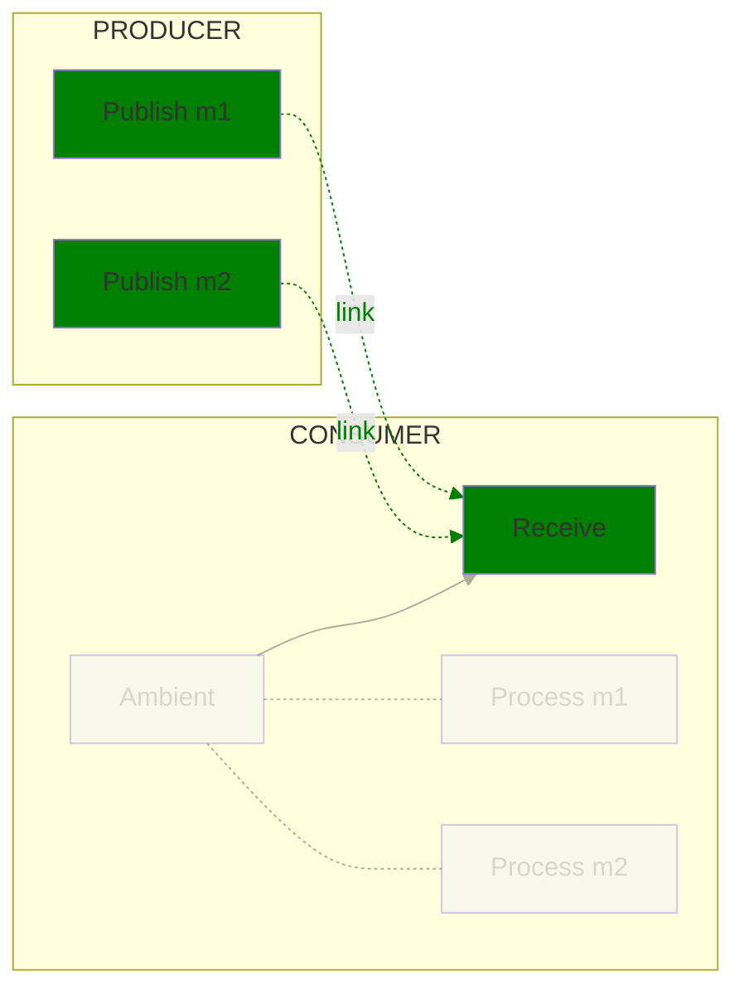

### Single message producers, batch pull-based consumer with manual settlement

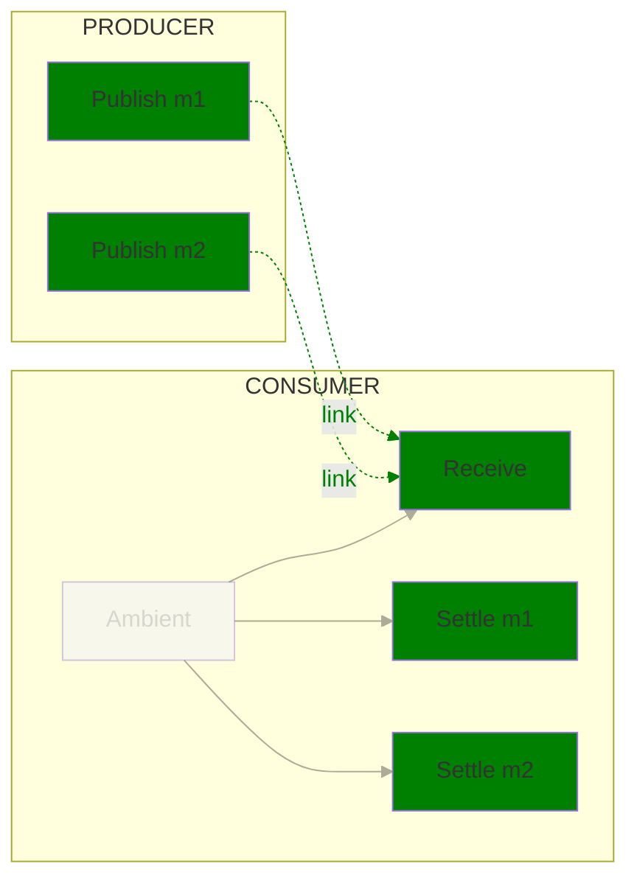

## Future possibilities

### Intermediary instrumentation

While intermediary instrumentation is not directly covered by the conventions
in this document, it certainly is necessary to keep the proposed conventions
extensible so that intermediary instrumentation can be easily added in a way
that integrates well with producer and consumer instrumentation.

The diagram below gives an example of how intermediary instrumentation can be
added. The fact that producers and consumers are consistently correlated by
links across all scenarios provides maximal flexibility for adding intermediary
instrumentation.

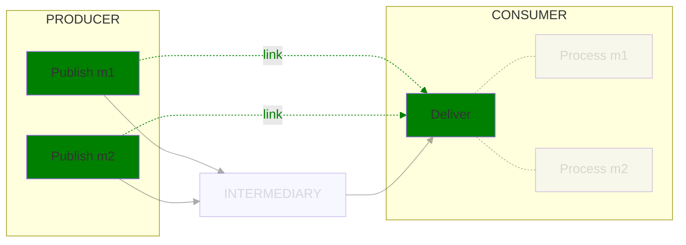
