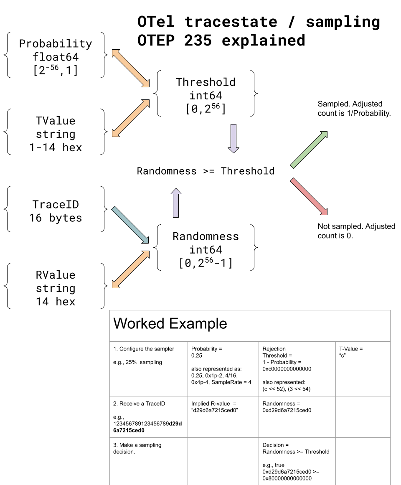

# Consistent Probability Sampling with Support for Arbitrary Sampling Rates

## Abstract

Sampling is an important lever to reduce the costs associated with collecting and processing telemetry data. It enables you to choose a representative set of items from an overall population.

There are two key aspects for sampling of tracing data. The first is that sampling decisions can be made independently for *each* span in a trace. The second is that sampling decisions can be made at multiple points in the telemetry pipeline. For example, the sampling decision for a span at span creation time could have been to **keep** that span, while the downstream sampling decision for the *same* span at a later stage (say in an external process in the data collection pipeline) could be to **drop** it.

For each of the above aspects, if we don't make *consistent* sampling decisions, we will end up with traces that are unusable and don't contain a coherent set of spans because of the completely independent sampling decisions. Instead, we want sampling decisions to be made in a **consistent** manner so that we can effectively reason about a trace.  This OTEP describes a mechanism to achieve such consistent sampling decisions using a mechanism called **Consistent Probability Sampling**. To achieve this, it proposes two key building blocks. The first is a common source of randomness (R) that is available to all participants. This can either be a custom value (called `rv`) or can be based on the last 7 bytes of the traceid. The second is a concept of a rejection threshold (T). This is derived directly from a participant's sampling rate. This proposal describes how these two values should be propagated and how participants should use them to make sampling decisions.

This mechanism will enable creating a new set of samplers (known as Consistent Probability Samplers) that will enable trace participants to choose their own sampling rates, while still achieving consistent sampling decisions. This OTEP ensures that such samplers will interoperate with existing (non consistent probability) samplers.

## Motivation

Customers want to express arbitrary sampling probabilities such as 1%, 10%, and 75%. However, the previous experimental [specification for probability sampling using TraceState](https://github.com/open-telemetry/opentelemetry-specification/blob/main/specification/trace/tracestate-probability-sampling.md) optimizes for powers of two probabilities. It supports non power of two sampling only using interpolation between powers of two. Since this approach is unnecessarily restrictive, we need an updated mechanism to support specifying any sampling probability.

Further, to achieve consistent sampling decisions, the previous experimental spec always required using a custom source of randomness (`r-value`). However, there is a performance overhead to propagate this value in the tracestate header and the tracestate span attribute. To address this, this OTEP proposes using the inherent randomness in the traceID to have a more performant approach. At the same time, it continues to support overriding that mechanism using a custom random value and hence there is still a need to reference `tracestate` to check if a custom random value is present before using the traceid as the source of randomness.

## Definitions

Let's start with the definitions for the key building blocks of this proposal.

### Sampling Probability

This decides the percentage of spans that will be *kept*. Each participant can choose a different sampling probability. For example, if the sampling probability is 0.25, around 25% of the spans will be kept.

### Consistent Sampling Decision

A consistent sampling decision means that a positive sampling decision made for a particular span with probability p1 necessarily implies a positive sampling decision for any span belonging to the same trace if it is made with probability p2 >= p1.

### Rejection Threshold

This is a 56-bit value directly derived from the sampling probability. One way to think about this is that this is the number of spans that would be *dropped* out of 2^56 considered spans. This is an alternative to the `p` value in the previous specification. The `p` value is limited to powers of two, while this supports a large range of values.

You can derive the rejection threshold from the sampling probability as follows:

Rejection Threshold = (1 - sampling probability) * 2^56.

For example, if the sampling probability is 100% (keep all spans), the rejection threshold would be 0.

Similarly, if the sampling probability is 0% (drop all spans), the rejection threshold would be (1-0) * 2^56 = 72057594037927936 = 0x100000000000000.

We refer to this rejection threshold conceptually as `T`. We represent it using the key `th`. This must be propagated in both the `tracestate` header and in the TraceState attribute of each span.

### Random Value (R)

A common random value (that is known or propagated to all participants) is the main ingredient that enables consistent probability sampling. Each participant can compare this value (R) with their rejection threshold (T) to make a consistent sampling decision across an entire trace (or even across a group of traces).

This proposal supports two sources of randomness:

- **A custom source of randomness**: This proposal allows for a _random_ (or pseudo-random) 56-bit value. We refer to this as `rv` (this was previously known as `r-value`). This can be generated and propagated through the `tracestate` header and the tracestate attribute in each span.
- **Using TraceID as a source of randomness**: This proposal introduces using the last 56 bits of the `traceid` as the source of randomness. This can be done if the root participant knows that the `traceid` has been generated in a random or pseudo-random manner.

### Consistent Sampling Decision Approach
Given the above building blocks, let's look at how a participant can make consistent sampling decisions. For this, two values MUST be present in the `SpanContext`:

1. The common source of randomness: the 56-bit `R` value.
2. The rejection threshold: the 56-bit `T` value.

If `R` >= `T`, *keep* the span, else *drop* the span.

`T` represents the maximum threshold that was applied in all previous consistent sampling stages. If the current sampling stage applies a greater threshold value than any stage before, it MUST update (increase) the threshold correspondingly.

## Explanation

### Example

Here is an example involving three participating operations `A`, `B`, and `C`:

`A` -> `B` -> `C`

where -> indicates a parent to child relationship.

- `A` uses consistent probability sampling with a sampling probability of 0.25. This corresponds to a rejection threshold of (1-0.25)*2^56 = 0xc0000000000000.
- `B` uses consistent probability sampling with a sampling probability of 0.5. This corresponds to a rejection threshold of (1-0.5)*2^56 = 0x80000000000000.
- `C` uses a parent-based sampler. This means that C indirectly follows the same rejection threshold as its parent B.

When the sampling decision for `A` is to *keep* the span, its outgoing traceparent will have the `sampled` flag SET and the `th` in its outgoing tracestate will be set to `0xc0_0000_0000_0000`.
When the sampling decision for `A` is to *drop* the span, its outgoing traceparent will have the `sampled` flag UNSET but the `th` in its outgoing tracestate will still be set to `0xc0_0000_0000_0000`.
When the sampling decision for `B` is to *keep* the span, its outgoing traceparent will have the `sampled` flag SET and the `th` in its outgoing tracestate will be set to `0x80_0000_0000_0000`.
C (being a parent based sampler) samples a span purely based on its parent (B in this case), it will use the sampled flag to make the decision. Its outgoing `th` value will continue to reflect what it got from B (`0x80_0000_0000_0000`), and this is useful to understand its adjusted count.

### Rules for `th` creation and propagation

The value of the `th` key MUST be expressed as up to 14 hexadecimal digits from the set `[0-9a-f]`. Trailing zeros (but not leading zeros) may be omitted for `th` values.

Examples:

- `th` value is missing: non-probabalistic sampling may be taking place.
- `th=0` -- equivalent to `th=00000000000000`, which is a 0% rejection threshold, corresponding to 100% sampling probability (Always Sample).
- `th=08` -- equivalent to `th=08000000000000`, which is a 3.125% rejection threshold, corresponding to 96.875% sampling probability.
- `th=4` -- equivalent to `th=40000000000000`, which is a 25% rejection threshold, corresponding to 75% sampling probability.
- `th=c` -- equivalent to `th=c0000000000000`, which is a 75% rejection threshold, corresponding to 25% sampling probability.

The `T` value MUST be derived as follows:

* If the `th` key is not present in the Tracestate header, then non-probabalistic sampling may be in use.
* Else the value corresponding to the `th` key should be interpreted as above.

Sampling Decisions MUST be propagated by setting the value of the `th` key in the Tracestate header according to the above.

This design requires that as a given span progresses along its collection path, `th` is non decreasing (and, in particular, must be increased at stages that apply lower sampling probabilities).

It does not, however, restrict a span's initial `th` in any way. If a parent-based consistent sampler is used, a span's initial `th` would be the same as its parent's `th` value, else it would be a new value based on the sampling rate chosen for that span. In other words, the sampling rate for each operation can be chosen independently, and this would map to having different `th` values for different spans. But for any particular span, it is not acceptable for a downstream sampler to *decrease* the `th` value in its context.

The system has the following invariant:

`(R >= T) = sampled flag`

The sampling decision is propagated with the following algorithm:

* If the `th` key is not specified, this implies that non-probabilistic sampling may be taking place.
* Else derive `T` by parsing the `th` key as a hex value as described below.
* If `T` is 0, Always Sample.
* Compare the 56 bits of `T` with the 56 bits of `R`. If `R >= T`, then set the sampling decision to *keep* else make the decision to *drop*.

### Rules for R value creation and propagation

At the root span, the `R` value must be generated as follows:

* If the new random flag in the `traceparent` is set, there is no need to set the `rv` key in the tracestate header, and the last 56 bits of the traceid can be used as the source of randomness. For more info on this new flag, see [the W3C trace context specification](https://w3c.github.io/trace-context/#trace-id).
* If not, `R` MUST be generated as a random value in the range `[0, (2**56)-1]` and added to the Tracestate header with key `rv`. The value of the `rv` key MUST be expressed as up to 14 hexadecimal digits from the set `[0-9a-f]`. `rv` keys MUST always be exactly 14 hex digits.

Although less common, there are circumstances where trace-id randomness is not sufficient. One example of this is when you want to achieve consistent sampling across a group of traces in a session. For such cases, a common `rv` value must be generated and added to the tracestate header.

In all other places, the `R` value MUST be derived as follows:

* If the key `rv` is present in the Tracestate header, then `R = rv`.
* Else `R` is the lowest-order 56 bits of the trace-id.

## Sampler behavior for initializing and updating T and R values

There are two categories of samplers:

- **Head samplers:** Implementations of [`Sampler`](https://github.com/open-telemetry/opentelemetry-specification/blob/v1.29.0/specification/trace/sdk.md#sampler), called by a `Tracer` during span creation.
- **Downstream samplers:** Any component that, given an ended Span, decides whether to *drop* it or *keep* it (by forwarding it to the next component in the pipeline). This category is also known as "collection path samplers" or "sampling processors". Note that _Tail samplers_ are a special class of downstream samplers that buffer spans of a trace and make a sampling decision for the trace as a whole using data from any span in the buffered trace.

This section defines the behavior for these two categories of samplers.

### Head samplers

A head sampler is responsible for computing the `rv` and `th` values in a new span's initial [`TraceState`](https://github.com/open-telemetry/opentelemetry-specification/blob/v1.29.0/specification/trace/api.md#tracestate). The main inputs to that computation include the parent span's trace state (if a parent span exists), the new span's trace ID, and possibly the trace flags (to know if the trace ID has been generated in a random manner).

First, a consistent probability `Sampler` may choose its own sampling rate. The higher the chosen sampling rate, the lower the rejection threshold (T). It MAY select any value of T. If a valid `SpanContext` is provided in the call to `ShouldSample` (indicating that the span being created will be a child span), there are two possibilities:

- **The child span chooses a T greater than the parent span's T**: The parent span may be *kept* but it is possible that its child, the current span, may be dropped because of the lower sampling rate. At the same time, in the case where the decision for the child span is to *keep* it, the decision for the parent span would have also been to *keep* (due to our consistent sampling approach) since the parent's sampling rate is greater than the child's sampling rate.
- **The child span chooses a T less than or equal to the parent span's T**:  The parent span might have been *dropped* but it is possible that its child, the current span, may be *kept* because of the higher sampling rate. At the same time, in case where the parent span is *kept*, the child span would be *kept* as well (due to our consistent sampling approach) since the child's sampling rate is greater than the parent's sampling rate.

Note that while both the above cases can result in partial traces, they still meet the consistent sampling goals.

For the output TraceState,

- The `th` key MUST be defined with a value corresponding to the sampling probability the sampler actually used.
- The `rv` value, if present on the input TraceState, MUST be defined and equal to the parent span's `rv`. Otherwise, `rv` MUST be defined if and only if the effective R was _generated_ during the decision, per the "derive R" algorithm given earlier.

TODO: For _new_ spans, `ShouldSample` doesn't currently have a way to know the new Span's `TraceFlags`, so it can't determine whether the Random Trace ID Flag is set, and in turn can't execute the "derive R" algorithm. Maybe it should take `TraceFlags` as an additional parameter, just like it takes `TraceId`?

### Downstream samplers

A downstream sampler, in contrast, may output a given ended Span with a _modified_ trace state, complying with following rules:

- If the chosen sampling probability is 1, the sampler MUST NOT modify any existing `th`, nor set any `th`.
- Otherwise, the chosen sampling probability is in `(0, 1)`. In this case the sampler MUST output the span with a `th` equal to `max(input th, chosen th)`. In other words, `th` MUST NOT be decreased (as it is not possible to retroactively adjust an earlier stage's sampling probability), and it MUST be increased if a lower sampling probability was used. This case represents the common case where a downstream sampler is reducing span throughput in the system.

## Visual



## Algorithms

The `th` and `rv` values may be represented and manipulated in a variety of forms depending on the capabilities of the processor and needs of the implementation. As 56-bit values, they are compatible with byte arrays and 64-bit integers, and can also be manipulated with 64-bit floating point with a truly negligible loss of precision.

The following examples are in Python3. They are intended as examples only for clarity, and not as a suggested implementation.

### Converting t-value to a 56-bit integer threshold

To convert a t-value string to a 56-bit integer threshold, pad it on the right with 0s so that it is 14 digits in length, and then parse it as a hexadecimal value.

```py
padded = (tvalue + "00000000000000")[:14]
threshold = int('0x' + padded, 16)
```

### Converting integer threshold to a t-value

To convert a 56-bit integer threshold value to the t-value representation, emit it as a hexadecimal value (without a leading '0x'), optionally with trailing zeros omitted:

```py
h = hex(tvalue).rstrip('0')
# remove leading 0x
tv = 'tv='+h[2:]
```

### Testing rv vs threshold

Given rv and threshold as 64-bit integers, a sample should be taken if rv is greater than or equal to the threshold.

```
shouldSample = (rv >= threshold)
```

### Converting threshold to a sampling probability

The sampling probability is a value from 0.0 to 1.0, which can be calculated using floating point by dividing by 2^56:

```py
# embedded _ in numbers for clarity (permitted by Python3)
maxth = 0x100_0000_0000_0000  # 2^56
prob = float(maxth - threshold) / maxth
```

### Converting threshold to an adjusted count (sampling rate)

The adjusted count indicates the approximate quantity of items from the population that this sample represents. It is equal to `1/probability`. It is not defined for spans that were obtained via non-probabilistic sampling (a sampled span with no `th` value).

## Trade-offs and mitigations

This proposal is the result of long negotiations on the Sampling SIG over what is required and various alternative forms of expressing it. [This issue](https://github.com/open-telemetry/opentelemetry-specification/issues/3602) exhaustively covers the various formats that were discussed and their pros and cons. This proposal is the result of that decision.

## Open questions

This specification leaves room for different implementation options. For example, comparing hex strings or converting them to numeric format are both viable alternatives for handling the threshold.

We also know that some implementations prefer to use a sampling probability (in the range from 0-1.0) or a sampling rate (1/probability); this design permits conversion to and from these formats without loss up to at least 6 decimal digits of precision.

## Future possibilities

This permits sampling systems to propagate consistent sampling information downstream where it can be compensated for.
For example, this will enable the tail-sampling processor in the OTel Collector to propagate its sampling decisions to backend systems in a standard way. This permits backend systems to use the effective sampling probability in data presentations.
